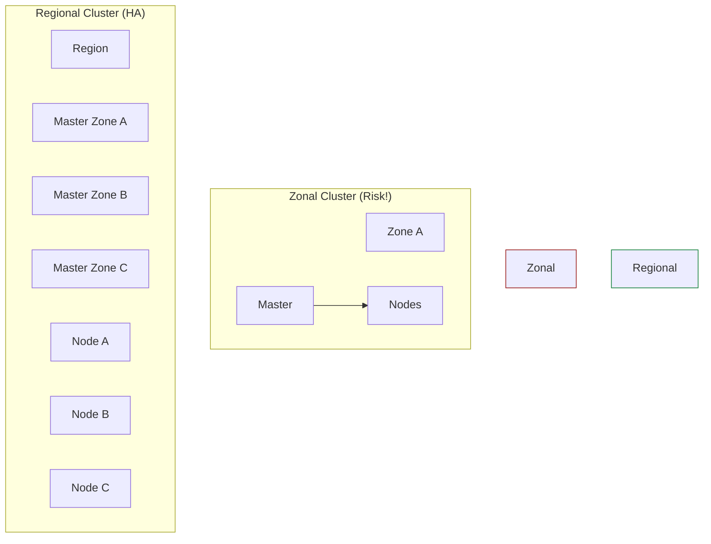

# SECTION 26: GKE Advanced (Autopilot & Security)

> **Official Doc Reference**: [GKE Security](https://cloud.google.com/kubernetes-engine/docs/concepts/security-overview)

## 1️⃣ Overview: Hardening the Cluster
Running "Default" Kubernetes is dangerous. GKE provides advanced tools to lock it down.
*   **Private Clusters:** Nodes have **Internal IPs only**. No public internet exposure.
*   **Authorized Networks:** Only allow `kubectl` access from specific CIDR blocks (e.g., Corporate VPN).

## 2️⃣ Autopilot vs Standard (Deep Dive) 🕵️‍♂️

| Feature | **GKE Standard** | **GKE Autopilot** |
| :--- | :--- | :--- |
| **Node Access** | Full SSH Access. | **No SSH.** (Managed). |
| **Cost** | Pay for Nodes (Idle or Busy). | Pay for **Pods** (CPU/RAM requested). |
| **SLA** | 99.95% (Zonal) or 99.99% (Regional). | **99.9%** (Regional Multi-Zone). |
| **Best For** | Tuning custom kernel flags, GPUs. | 95% of Enterprise workloads. |

## 3️⃣ Cluster Architecture: Regional vs Zonal

*   **Zonal:** If Zone A fails, the Control Plane is dead. You cannot update the cluster.
*   **Regional:** Active-Active Control Plane across 3 zones. Indestructible.

## 4️⃣ Zero-to-Hero: Workload Identity 🛡️
Stop downloading JSON keys for your Pods.
*   **Old Way:** Mount a Secret with `key.json`. (Insecure/Leak risk).
*   **New Way (Workload Identity):**
    *   Map `K8s Service Account (KSA)` -> `Google Service Account (GSA)`.
    *   Pod acts as the GSA automatically.
    *   **No physical keys to manage.**

## 5️⃣ Hands-On Lab: Binary Authorization 👮
**Scenario:** Prevent developers from deploying unverified containers.
1.  **Enable BinAuthz:** On the cluster.
2.  **Policy:** "Only allow images signed by our CI/CD pipeline."
3.  **Result:** If a dev tries `kubectl run nginx`, it fails ("Image not trusted").

## 6️⃣ Exam Traps 🚨
*   **Trap:** "I used GKE Autopilot, but I can't install my monitoring agent that requires DaemonSet privileges."
    *   *Answer:* Autopilot forbids privileged access. You must use the Standard mode or "Partner" solutions.
*   **Trap:** "How do I upgrade the Master Node version?"
    *   *Answer:* In GKE, the Control Plane is auto-upgraded by Google. You configure the **Release Channel** (Rapid, Regular, Stable).
*   **Trap:** "My Pods are stuck in `Pending`. I am using Standard GKE."
    *   *Answer:* You ran out of Node capacity. Enable **Cluster Autoscaler** to add more VMs automatically.

## 7️⃣ Checkpoint Questions (Exam Style)
**Q1. Which GKE mode charges you for the individual Pod resources (CPU/RAM) rather than the underlying VM?**
*   A. Standard
*   B. Autopilot
*   C. Cloud Run
*   D. App Engine
> **Answer: B.** This eliminates "Bin Packing" waste.

**Q2. What is the primary benefit of a Private Cluster?**
*   A. It creates a private VPC.
*   B. Nodes do not have public IP addresses, reducing attack surface.
*   C. It is free.
*   D. It runs on TPU.
> **Answer: B.** Security best practice. Nodes reach the internet via Cloud NAT.

**Q3. How do you grant a specific Pod permission to write to a Cloud Storage bucket securely?**
*   A. Store the API Key in an environment variable.
*   B. Use Workload Identity to map the K8s SA to a Google SA.
*   C. Grant the permission to the entire Node.
*   D. Use a SSH key.
> **Answer: B.** Workload Identity allows granular, per-pod permissioning.
