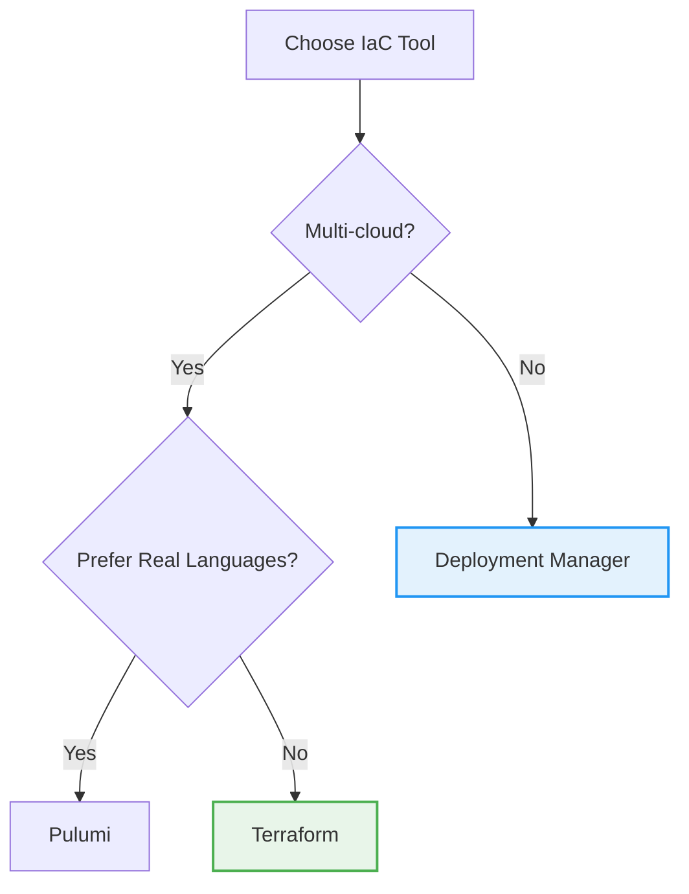
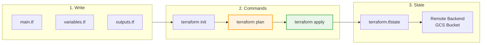

# Day 27: Infrastructure as Code with Terraform

**Duration:** ⏱️ 60 Minutes  
**Level:** Intermediate  
**ACE Exam Weight:** ⭐⭐ Medium (IaC concepts appear in automation questions)

---

## 🎯 Learning Objectives

By the end of this lesson, you will:

*   **Understand** Infrastructure as Code (IaC) principles
*   **Compare** Terraform vs Deployment Manager vs Pulumi
*   **Write** basic Terraform configurations for GCP
*   **Execute** the Terraform workflow: init → plan → apply
*   **Manage** state files and workspaces

---

## 🧠 1. What Is Infrastructure as Code? (Plain-English)

**IaC = Write code to create infrastructure instead of clicking buttons.**

Think of it like a **recipe vs cooking by memory**: A recipe is repeatable, shareable, and version-controlled. Cooking by memory leads to inconsistent results.

### 💡 Real-World Analogy: IKEA Instructions

| Manual Setup | Infrastructure as Code |
|-------------|----------------------|
| Build furniture from memory | Follow IKEA instruction manual |
| Different every time | Identical every time |
| Hard to replicate | Easy to share and repeat |
| No rollback | Version control (git) |
| "Works on my machine" | Works everywhere |

---

## 🔄 2. IaC Tools Comparison

### GCP IaC Options

| Tool | Type | Language | Best For |
|------|------|----------|----------|
| **Terraform** | Multi-cloud | HCL | Most popular, large community |
| **Deployment Manager** | GCP-native | YAML/Jinja2 | Pure GCP, no external tools |
| **Pulumi** | Multi-cloud | Python/TS/Go | Developers who prefer real languages |
| **Config Connector** | Kubernetes-native | YAML | GKE-centric environments |

### Decision Tree



> **🎯 ACE Tip:** For the exam, know that **Terraform is the most common** choice for multi-cloud, and **Deployment Manager is GCP-native**.

---

## 📁 3. Terraform Core Concepts

### The Terraform Workflow



### Key Terms

| Term | Description |
|------|-------------|
| **Provider** | Plugin that talks to cloud APIs (google, aws, azure) |
| **Resource** | Infrastructure object to create (VM, bucket, network) |
| **State** | Terraform's record of what exists (terraform.tfstate) |
| **Plan** | Preview of changes before applying |
| **Module** | Reusable group of resources |

---

## 🛠️ 4. Hands-On Lab: Deploy Your First VM

### Step 1: Project Setup
```bash
# Create project directory
mkdir terraform-gcp-demo && cd terraform-gcp-demo

# Create main configuration file
touch main.tf variables.tf outputs.tf
```

### Step 2: Configure Provider (main.tf)
```hcl
# main.tf

terraform {
  required_providers {
    google = {
      source  = "hashicorp/google"
      version = "~> 5.0"
    }
  }
}

provider "google" {
  project = var.project_id
  region  = var.region
  zone    = var.zone
}

# Create a VPC network
resource "google_compute_network" "vpc" {
  name                    = "terraform-vpc"
  auto_create_subnetworks = false
}

# Create a subnet
resource "google_compute_subnetwork" "subnet" {
  name          = "terraform-subnet"
  ip_cidr_range = "10.0.1.0/24"
  region        = var.region
  network       = google_compute_network.vpc.id
}

# Create a VM instance
resource "google_compute_instance" "vm" {
  name         = "terraform-vm"
  machine_type = "e2-micro"
  zone         = var.zone

  boot_disk {
    initialize_params {
      image = "debian-cloud/debian-11"
    }
  }

  network_interface {
    subnetwork = google_compute_subnetwork.subnet.id
    access_config {
      # Ephemeral public IP
    }
  }

  tags = ["web", "terraform-managed"]

  labels = {
    environment = "dev"
    managed_by  = "terraform"
  }
}

# Create firewall rule
resource "google_compute_firewall" "allow_ssh" {
  name    = "terraform-allow-ssh"
  network = google_compute_network.vpc.name

  allow {
    protocol = "tcp"
    ports    = ["22"]
  }

  source_ranges = ["0.0.0.0/0"]
  target_tags   = ["web"]
}
```

### Step 3: Define Variables (variables.tf)
```hcl
# variables.tf

variable "project_id" {
  description = "GCP Project ID"
  type        = string
}

variable "region" {
  description = "GCP Region"
  type        = string
  default     = "us-central1"
}

variable "zone" {
  description = "GCP Zone"
  type        = string
  default     = "us-central1-a"
}
```

### Step 4: Define Outputs (outputs.tf)
```hcl
# outputs.tf

output "vm_external_ip" {
  description = "External IP of the VM"
  value       = google_compute_instance.vm.network_interface[0].access_config[0].nat_ip
}

output "vpc_name" {
  description = "Name of the VPC"
  value       = google_compute_network.vpc.name
}
```

### Step 5: Execute Terraform
```bash
# Initialize (download provider plugins)
terraform init

# Preview changes
terraform plan -var="project_id=YOUR_PROJECT_ID"

# Apply changes (creates resources)
terraform apply -var="project_id=YOUR_PROJECT_ID"

# Verify in console
gcloud compute instances list
```

### Step 6: Cleanup
```bash
# Destroy all resources
terraform destroy -var="project_id=YOUR_PROJECT_ID"
```

---

## 🔐 5. Remote State Management

### Why Remote State?
- **Collaboration:** Team members share state
- **Locking:** Prevents concurrent modifications
- **Security:** State contains sensitive data

### Configure GCS Backend
```hcl
# backend.tf

terraform {
  backend "gcs" {
    bucket = "my-terraform-state-bucket"
    prefix = "terraform/state"
  }
}
```

```bash
# Create state bucket first
gcloud storage buckets create gs://my-terraform-state-bucket \
    --location=us-central1 \
    --uniform-bucket-level-access

# Re-initialize to migrate state
terraform init -migrate-state
```

---

## ⚠️ 6. Common Pitfalls & Pro Tips

### ❌ Mistakes to Avoid
| Mistake | Problem | Solution |
|---------|---------|----------|
| Committing state files | Exposes secrets | Use remote backend, add to .gitignore |
| No state locking | Concurrent runs corrupt state | Use GCS backend (has locking) |
| Hardcoding values | Not reusable | Use variables for everything |
| Ignoring plan output | Unexpected changes | Always review `terraform plan` |

### ✅ Pro Tips
*   **Use `terraform fmt`** to auto-format code
*   **Use `terraform validate`** before plan
*   **Tag resources** with `managed_by = "terraform"` label
*   **Use modules** for reusable patterns
*   **Store state in GCS** with versioning enabled

---

## 🎯 7. ACE Exam Focus

### Terraform vs Deployment Manager

| Feature | Terraform | Deployment Manager |
|---------|-----------|-------------------|
| Multi-cloud | ✅ Yes | ❌ GCP only |
| Language | HCL | YAML/Jinja2/Python |
| State management | External (GCS) | Managed by GCP |
| Community | Huge | Smaller |
| Exam relevance | High | Medium |

### Exam Traps
*   ⚠️ **State files contain secrets** - never commit to git
*   ⚠️ **`terraform plan` doesn't make changes** - only shows preview
*   ⚠️ **Deployment Manager uses "configurations" and "deployments"**

---

<!-- QUIZ_START -->
## 📝 8. Knowledge Check Quiz

1. **What command shows a preview of Terraform changes without applying them?**
    *   A. `terraform init`
    *   B. **`terraform plan`** ✅
    *   C. `terraform apply --dry-run`
    *   D. `terraform preview`

2. **Where should Terraform state files be stored for team collaboration?**
    *   A. Local filesystem
    *   B. GitHub repository
    *   C. **Remote backend (GCS bucket)** ✅
    *   D. Terraform Cloud only

3. **Which GCP-native IaC tool uses YAML and Jinja2 templates?**
    *   A. Terraform
    *   B. **Deployment Manager** ✅
    *   C. Pulumi
    *   D. Config Connector

4. **What does `terraform init` do?**
    *   A. Creates infrastructure
    *   B. Destroys resources
    *   C. **Downloads provider plugins and initializes backend** ✅
    *   D. Shows resource state

5. **Why should you never commit terraform.tfstate to version control?**
    *   A. It's too large
    *   B. **It contains sensitive data like passwords** ✅
    *   C. It changes too frequently
    *   D. Git doesn't support binary files
<!-- QUIZ_END -->

---

## ✅ Day 27 Checklist

- [ ] Understand IaC principles
- [ ] Write a basic Terraform config
- [ ] Execute init → plan → apply workflow
- [ ] Configure remote state in GCS
- [ ] Destroy resources with `terraform destroy`

---

### 🚀 What's Next?
**Day 28: Week 4 Review**
*   Consolidate Security & IaC knowledge
*   Practice scenario-based questions

<!-- FLASHCARDS
[
  {"term": "Infrastructure as Code", "def": "Managing infrastructure through code files instead of manual processes. Enables version control and repeatability."},
  {"term": "Terraform", "def": "Popular multi-cloud IaC tool using HCL language. Provider-based architecture."},
  {"term": "terraform plan", "def": "Command that shows what changes Terraform will make WITHOUT actually making them."},
  {"term": "terraform.tfstate", "def": "State file tracking what resources Terraform manages. Contains sensitive data."},
  {"term": "Remote Backend", "def": "Storage location for state files. GCS bucket for GCP. Enables team collaboration."},
  {"term": "Deployment Manager", "def": "GCP-native IaC tool. Uses YAML/Jinja2. State managed by Google."}
]
-->
