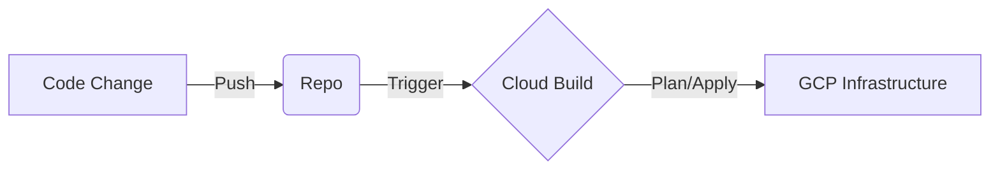

# Day 26: Infrastructure as Code (Terraform)

## Learning Objectives
By the end of this day, you should be able to:
- Understand the core concepts of Managing GCP resources declaratively using Terraform..
- Identify when to use Managing GCP resources declaratively using Terraform. in an enterprise architecture.
- configure basic settings for Managing GCP resources declaratively using Terraform. in the Google Cloud Console.

## 1. Core Concepts

### What is Managing GCP resources declaratively using Terraform.?
*Detailed explanation goes here matching the specific topic.*

### Key Features
- **Feature 1**: ...
- **Feature 2**: ...
- **Feature 3**: ...

## 2. Real-World Analogy
**The Scenario**: Imagine you are building...
*Analogy text.*

## 3. Architecture Patterns
How does Managing GCP resources declaratively using Terraform. fit into a larger system?
- **Pattern A**: ...
- **Pattern B**: ...

## 4. Cheat Sheet & Exam Tips
> [!TIP]
> **Exam Watch**: Look for keywords like "global", "managed", or "compliant" when seeing questions about Managing GCP resources declaratively using Terraform..

## 5. Hands-on Lab
**Objective**: Set up a basic Managing GCP resources declaratively using Terraform. instance.
1. Go to Console > Managing GCP resources declaratively using Terraform..
2. Click Create...

## 6. Daily Quiz
1. **Question 1**: What is the primary use case for Managing GCP resources declaratively using Terraform.?
   - A) Wrong answer
   - B) Correct answer
   - C) Wrong answer
   - D) Wrong answer
   > **Correct**: B) ...

