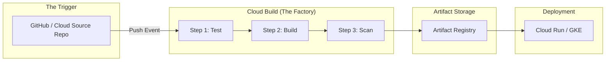

# Day 27: Cloud Build & CI/CD Pipelines

**Duration:** ⏱️ 45 Minutes  
**Level:** Intermediate  
**ACE Exam Weight:** ⭐⭐⭐⭐ High

---

## 🎯 Learning Objectives

By the end of Day 27, you will be able to:
*   **Define** the stages of a Continuous Integration and Continuous Deployment (CI/CD) pipeline.
*   **Construct** a multi-step `cloudbuild.yaml` file using community and custom builders.
*   **Automate** deployments using Git triggers and environment variables.
*   **Architect** private build pipelines using Cloud Build Private Pools.

---

## 🏗️ 1. The Serverless Build Factory

Cloud Build is Google Cloud's serverless CI/CD platform. It abstracts away the management of build servers (like Jenkins) and scales automatically based on your workload.

### The CI/CD Lifecycle



---

## 🛠️ 2. Anatomy of `cloudbuild.yaml`

The `cloudbuild.yaml` file is where you define your "Recipes." Each step runs inside a Docker container.

```yaml
steps:
# 1. Run Unit Tests (using Python)
- name: 'python:3.9-slim'
  entrypoint: 'python'
  args: ['-m', 'pytest']

# 2. Build the Docker Image
- name: 'gcr.io/cloud-builders/docker'
  args: ['build', '-t', 'us-central1-docker.pkg.dev/$PROJECT_ID/my-repo/app:v1', '.']

# 3. Push to Artifact Registry
- name: 'gcr.io/cloud-builders/docker'
  args: ['push', 'us-central1-docker.pkg.dev/$PROJECT_ID/my-repo/app:v1']

images:
- 'us-central1-docker.pkg.dev/$PROJECT_ID/my-repo/app:v1'
```

---

## 🛠️ 3. Hands-On Lab: The "Auto-Build" Workflow

### 🧪 Lab Objective
Submit a manual build to Cloud Build and verify the artifact in Artifact Registry.

### ✅ Steps

1.  **Prepare Artifact Registry**:
    Cloud Build needs a destination.
    ```bash
    gcloud artifacts repositories create my-repo \
      --repository-format=docker \
      --location=us-central1
    ```

2.  **Create a Sample App**:
    ```bash
    echo "FROM nginx:alpine" > Dockerfile
    echo "<h1>V1 Deployed via Cloud Build</h1>" > index.html
    echo "COPY index.html /usr/share/nginx/html/index.html" >> Dockerfile
    ```

3.  **Submit the Build**:
    ```bash
    gcloud builds submit --tag us-central1-docker.pkg.dev/$PROJECT_ID/my-repo/web-app:v1 .
    ```

4.  **Verify History**:
    Go to **Cloud Build > History**. You'll see the logs streaming in real-time. If it's green, your image is ready for deployment to Cloud Run or GKE!

---

## ⚠️ 4. Exam Traps & Best Practices

> [!IMPORTANT]
> **ACE Exam Alert: The Service Account**
> Cloud Build uses a default service account (`[PROJECT_NUMBER]@cloudbuild.gserviceaccount.com`). If your build fails to deploy to GKE or Cloud Run, you usually need to grant that service account the **Cloud Run Admin** or **Kubernetes Engine Developer** role.

> [!TIP]
> **Private VPC Access**: If you need Cloud Build to access assets inside a Private VPC (like a private database), you must use **Cloud Build Private Pools** and set up **VPC Peering**. Standard Cloud Build has no path to private internal IPs.

---

<!-- QUIZ_START -->
## 📝 5. Knowledge Check

1.  **Which file is the primary configuration for defining build steps in Cloud Build?**
    *   A. Dockerfile
    *   B. **cloudbuild.yaml** ✅
    *   C. app.yaml
    *   D. build.sh

2.  **Your build process needs to access a private SQL database that has no public IP address. Which Cloud Build feature do you need?**
    *   A. Cloud Build Public API
    *   B. **Cloud Build Private Pools** ✅
    *   C. Cloud NAT
    *   D. Cloud VPN

3.  **What is the default behavior of Cloud Build after a successful build step that generates an image?**
    *   A. It deletes the image.
    *   B. It deploys it to production.
    *   C. **It can automatically push the image to a registry if specified in the 'images' field.** ✅
    *   D. It emails the developer the raw binary.

4.  **A developer pushes code to a GitHub repository, but the Cloud Build trigger doesn't fire. What is the most likely cause?**
    *   A. GitHub is too slow.
    *   B. **The Cloud Build Service Account lacks permissions or the trigger filter doesn't match the branch.** ✅
    *   C. Cloud Build only works with Google Source Repositories.
    *   D. You can only trigger 1 build per day.

5.  **True or False: Each step in a Cloud Build configuration runs in its own isolated Docker container.**
    *   A. **True** ✅
    *   B. False
<!-- QUIZ_END -->
---

<div class="checklist-card" x-data="{ 
    items: [
        { text: 'I understand the difference between CI and CD.', checked: false },
        { text: 'I can identify the stages of a cloudbuild.yaml file.', checked: false },
        { text: 'I know how to resolve permission errors by checking the Cloud Build Service Account.', checked: false },
        { text: 'I understand when to use Private Pools for internal VPC access.', checked: false }
    ]
}">
    <h3>
        <svg viewBox="0 0 24 24" fill="none" stroke="currentColor" stroke-width="2" stroke-linecap="round" stroke-linejoin="round" class="text-blurple">
            <path d="M22 11.08V12a10 10 0 1 1-5.93-9.14"></path>
            <polyline points="22 4 12 14.01 9 11.01"></polyline>
        </svg>
        Day 27 Mastery Checklist
    </h3>
    <template x-for="(item, index) in items" :key="index">
        <div class="checklist-item" @click="item.checked = !item.checked">
            <div class="checklist-box" :class="{ 'checked': item.checked }">
                <svg viewBox="0 0 24 24" fill="none" stroke="currentColor" stroke-width="3" stroke-linecap="round" stroke-linejoin="round">
                    <polyline points="20 6 9 17 4 12"></polyline>
                </svg>
            </div>
            <span x-text="item.text" :class="{ 'line-through text-slate-400': item.checked }"></span>
        </div>
    </template>
</div>
