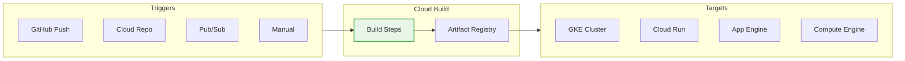

# BONUS: Cloud Build CI/CD Pipelines

**Duration:** ⏱️ 45 Minutes  
**Level:** Intermediate  
**ACE Exam Weight:** ⭐⭐ Medium (DevOps & Automation questions)

---

## 🎯 Learning Objectives

By the end of this lesson, you will:

*   **Understand** CI/CD principles and Cloud Build architecture
*   **Write** cloudbuild.yaml configuration files
*   **Configure** triggers for automated builds
*   **Implement** deployment pipelines to GKE and Cloud Run

---

## 🧠 1. What Is CI/CD? (Plain-English)

**CI/CD = Automate the boring stuff between "git push" and "live in production".**

### 💡 Real-World Analogy: Pizza Delivery

| Manual Deployment | CI/CD Pipeline |
|------------------|----------------|
| Cook makes pizza by hand | Automated pizza-making machine |
| Driver manually finds address | GPS-optimized route |
| Quality check at random | Every pizza inspected |
| 60 min delivery | 15 min delivery |

---

## 🏗️ 2. Cloud Build Architecture



### Key Components

| Component | Purpose |
|-----------|---------|
| **Trigger** | What starts the build (push, PR, schedule) |
| **cloudbuild.yaml** | Pipeline definition |
| **Build Step** | Single action (build, test, push) |
| **Artifact Registry** | Store container images |
| **Substitutions** | Variables like `$PROJECT_ID` |

---

## 🛠️ 3. Hands-On: Build & Deploy Pipeline

### Sample cloudbuild.yaml
```yaml
# cloudbuild.yaml
steps:
  # Step 1: Build Docker image
  - name: 'gcr.io/cloud-builders/docker'
    args: ['build', '-t', 'gcr.io/$PROJECT_ID/my-app:$SHORT_SHA', '.']
  
  # Step 2: Push to Artifact Registry
  - name: 'gcr.io/cloud-builders/docker'
    args: ['push', 'gcr.io/$PROJECT_ID/my-app:$SHORT_SHA']
  
  # Step 3: Deploy to Cloud Run
  - name: 'gcr.io/google.com/cloudsdktool/cloud-sdk'
    entrypoint: 'gcloud'
    args:
      - 'run'
      - 'deploy'
      - 'my-app'
      - '--image=gcr.io/$PROJECT_ID/my-app:$SHORT_SHA'
      - '--region=us-central1'
      - '--platform=managed'

images:
  - 'gcr.io/$PROJECT_ID/my-app:$SHORT_SHA'

options:
  logging: CLOUD_LOGGING_ONLY
```

### Create Trigger
```bash
gcloud builds triggers create github \
    --name="deploy-on-push" \
    --repo-name="my-repo" \
    --repo-owner="my-org" \
    --branch-pattern="^main$" \
    --build-config="cloudbuild.yaml"
```

---

## 🎯 4. ACE Exam Focus

### Cloud Build vs Other Tools

| Tool | Best For |
|------|----------|
| **Cloud Build** | GCP-native CI/CD, container builds |
| **Cloud Deploy** | Managed CD for GKE |
| **Jenkins** | Complex, self-managed pipelines |
| **GitHub Actions** | GitHub-centric workflows |

### Exam Traps
*   ⚠️ **Cloud Build runs in containers** - each step is isolated
*   ⚠️ **Substitutions** use `$VAR` syntax
*   ⚠️ **Private pools** for builds in VPC

---

<!-- QUIZ_START -->
## 📝 5. Knowledge Check Quiz

1. **What file defines Cloud Build pipeline steps?**
    *   A. Dockerfile
    *   B. **cloudbuild.yaml** ✅
    *   C. pipeline.json
    *   D. buildspec.yml

2. **Which built-in substitution contains the short commit SHA?**
    *   A. `$COMMIT_ID`
    *   B. `$GIT_SHA`
    *   C. **`$SHORT_SHA`** ✅
    *   D. `$REVISION`

3. **You need to build containers inside a private VPC. What should you use?**
    *   A. Public workers
    *   B. **Private pools** ✅
    *   C. Compute Engine
    *   D. Cloud Run jobs

4. **What triggers a Cloud Build automatically?**
    *   A. **GitHub push event** ✅
    *   B. Console refresh
    *   C. API Gateway
    *   D. Cloud Scheduler only

5. **Where are built Docker images typically stored?**
    *   A. Cloud Storage
    *   B. **Artifact Registry** ✅
    *   C. Compute Engine
    *   D. Secret Manager
<!-- QUIZ_END -->

---

<!-- FLASHCARDS
[
  {"term": "Cloud Build", "def": "GCP-native CI/CD service. Runs build steps in containers. Integrates with GitHub/GitLab."},
  {"term": "cloudbuild.yaml", "def": "Configuration file defining build steps, images, and substitutions."},
  {"term": "Trigger", "def": "Event that starts a build (push, PR, schedule, manual)."},
  {"term": "Private Pool", "def": "Build workers inside your VPC. For security-sensitive builds."},
  {"term": "Artifact Registry", "def": "Managed storage for container images and packages. Successor to Container Registry."},
  {"term": "$SHORT_SHA", "def": "Built-in substitution for first 7 characters of commit SHA."}
]
-->
