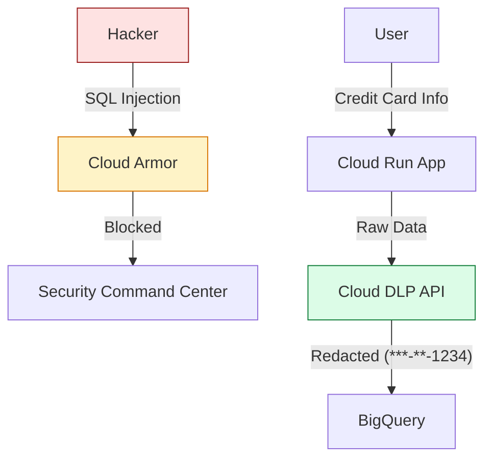

# SECTION 28: Security & Compliance (The Fortress)

> **Official Doc Reference**: [Google Cloud Security](https://cloud.google.com/security)

## 1️⃣ Overview: The Defense in Depth
Security is not one wall. It is an onion.
*   **Layer 1 (Edge):** Cloud Armor (WAF) & DDoS Protection.
*   **Layer 2 (Network):** VPC Firewalls & Private Service Connect.
*   **Layer 3 (Identity):** IAM & BeyondCorp.
*   **Layer 4 (Data):** KMS (Encryption keys) & DLP (Redaction).

## 2️⃣ Architecture Diagram: Securing Sensitive Data

## 3️⃣ Key Tools (Exam Critical 🥇)

| Tool | Purpose | Analogy |
| :--- | :--- | :--- |
| **Cloud Armor** | DDoS protection & WAF (Web Application Firewall). | The Bouncer. Blocks IP addresses. |
| **DLP (Data Loss Prevention)** | Scans and redacts PII (Credit Cards, SSNs). | The Censor. Blacks out secrets. |
| **KMS (Key Management)** | Manage encryption keys (CMEK). | The Keymaster. You hold the encryption key, not Google. |
| **Secret Manager** | Store passwords/API keys securely. | The Safe. |
| **Security Command Center** | Central dashboard for vulnerabilities. | The CCTV Control Room. |

## 4️⃣ Zero-to-Hero: Binary Authorization 👮‍♀️
*   **Concept:** "I only want to run containers that *I signed*."
*   **Workflow:**
    1.  Developer commits code.
    2.  Cloud Build tests it -> Successful -> **Attestor** signs the image.
    3.  GKE tries to pull the image.
    4.  **Binary Authorization** checks signature.
    5.  If unsigned -> **BLOCK**.

## 5️⃣ Hands-On Lab: Redact PII 🕵️‍♂️
**Mission:** You have a text string: "My phone number is 555-555-5555". You want to store it safely.
1.  **Use DLP API (Console Demo):**
2.  **Input:** "My phone is 555-123-4567"
3.  **Config:** Inspect for `PHONE_NUMBER`.
4.  **Transform:** Mask with `*`.
5.  **Output:** "My phone is ***-***-****"

## 6️⃣ Exam Traps 🚨
*   **Trap:** "I need to block traffic from a specific country (Geo-Blocking)."
    *   *Answer:* Use **Cloud Armor** security policies attached to the Load Balancer. Firewall rules are for IP ranges, not countries.
*   **Trap:** "I need to store a database password."
    *   *Answer:* **Secret Manager**. Do NOT use KMS (KMS is for encrypting data keys, not storing passwords directly). Do NOT use Metadata.
*   **Trap:** "I want to manage my own encryption keys because I don't trust Google."
    *   *Answer:* **CMEK (Customer-Managed Encryption Keys)** via Cloud KMS.

## 7️⃣ Checkpoint Questions (Exam Style)
**Q1. Which service automatically discovers and classifies sensitive data (like Credit Cards) in your Cloud Storage buckets?**
*   A. Cloud Armor
*   B. Cloud DLP
*   C. Cloud IAM
*   D. VPC Service Controls
> **Answer: B.** DLP can run "Inspection Jobs" to scan terabytes of storage.

**Q2. You are under a DDoS attack (Layer 7 HTTP Flood). What do you deploy?**
*   A. VPC Firewall Rule.
*   B. Cloud NAT.
*   C. Cloud Armor.
*   D. Identity-Aware Proxy.
> **Answer: C.** Cloud Armor shields the Load Balancer.

**Q3. What is the difference between Google-Managed Keys (Default) and CMEK?**
*   A. Google-Managed are weaker.
*   B. CMEK allows **you** to control the key rotation and revocation (Kill Switch).
*   C. CMEK is free.
*   D. There is no difference.
> **Answer: B.** If you revoke a CMEK key, even Google cannot read your data.
