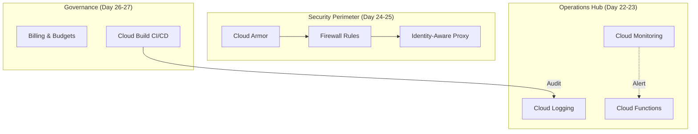

# Day 28: Week 4 Review & Deep Dive

**Level:** Review  
**Milestone:** 🏁 Week 4 Complete! (Ops & Security)

---

## 🔁 1. Week 4 Visual Recap

This week moved from "Building" to "Operating." You learned how to monitor health, secure the perimeter, and manage the organization's resources.

---

## 🎯 2. High-Frequency Exam Scenarios

| Scenario | Recommended Solution | ACE Key Concept |
| :--- | :--- | :--- |
| **"Monitor RAM on a VM"** | Install **Ops Agent**. | Hypervisor Visibility Gap. |
| **"Secure SSH without Public IP"** | Use **IAP Tunneling**. | Identity-based Access. |
| **"Retain logs for 7 years"** | Create a **Log Sink** to GCS. | Compliance Archiving. |
| **"Stop DDoS / SQL Injection"** | Attach **Cloud Armor** to GLB. | Edge-based WAF. |
| **"Predict future costs via SQL"** | Enable **BigQuery Billing Export**. | Cost Analysis. |
| **"Deploying to Private GKE"** | Use **Cloud Build Private Pools**. | VPC Peering. |

---

## ⚠️ 3. Pro Troubleshooting Strategy

### The "Least Privilege" Flowchart
When a build or service fails with a `403 Forbidden` error:
1.  **Identify the Project Number** of your project.
2.  **Locate the Service Account**: It usually follows the pattern `[PROJECT_NUMBER]@cloudbuild.gserviceaccount.com` (for Cloud Build) or `[PROJECT_NUMBER]-compute@developer.gserviceaccount.com` (for GCE).
3.  **Grant the Minimal Role**: Don't give `Owner`. If it's a deployment, give `Cloud Run Admin` or `Kubernetes Engine Developer`.

---

## 🧪 4. Batch 2 Hands-On Review
**Project: The Zero-Trust Bridge**

1.  **Isolation**: Create a VM with no public IP.
2.  **Tunneling**: Allow IAP range (`35.235.240.0/20`) on Port 22.
3.  **Observability**: Install Ops Agent and verify that Memory metrics appear in the Dashboard.
4.  **Audit**: Export the SSH login logs to a specific BigQuery table using a Log Sink.

---

## 🏆 5. Week 4 Mock Exam (ACE Alignment)

<!-- QUIZ_START -->
1.  **You need to ensure that your application's memory usage is being tracked in Cloud Monitoring. After viewing the dashboard, you see 'No Data' for the 'memory/percent_used' metric. What is the first corrective action?**
    *   A. Increase the VM machine type.
    *   B. **Install the Ops Agent on the VM.** ✅
    *   C. Enable the Cloud Monitoring API.
    *   D. Create an Uptime Check.

2.  **A security policy requires that all SSH logins to Compute Engine instances must be authenticated via IAM and occur without exposing Port 22 to the public internet. Which feature should you implement?**
    *   A. Cloud VPN
    *   B. VPC Peering
    *   C. **Identity-Aware Proxy (IAP) Tunneling.** ✅
    *   D. Cloud Armor

3.  **You are managing a multi-project organization. You want to see the total spending of all projects combined into a single, searchable SQL database for the last 6 months. What is the most efficient method?**
    *   A. Download CSVs from each project and merge them.
    *   B. **Configure a Billing Export to BigQuery at the Billing Account level.** ✅
    *   C. Use the Cloud Operations Dashboard.
    *   D. Create a Log Sink to Cloud Storage.

4.  **A Cloud Build pipeline fails to deploy a new container to Cloud Run. The error message is 'Permission denied'. Cloud Build is using the default service account. How do you fix this?**
    *   A. Give the developer the 'Owner' role.
    *   B. **Grant the Cloud Build service account the 'Cloud Run Admin' role.** ✅
    *   C. Open the Cloud Run service to 'allUsers'.
    *   D. Disable the Cloud Run API and re-enable it.

5.  **Which Google Cloud service should be used to block incoming traffic to a specific web application based on the user's geographic location (e.g., blocking all traffic from outside the US)?**
    *   A. VPC Firewall Rules
    *   B. **Cloud Armor.** ✅
    *   C. Cloud NAT
    *   D. Identity-Aware Proxy
<!-- QUIZ_END -->

---

## 🚀 6. Next Steps: Week 5
Congratulations on completing the **Core Infrastructure & Operations** track! 

Next week, we level up to **Week 5: Advanced Architecting**, where we dive into:
- Hybrid Connectivity (VPN/Interconnect Deep Dive).
- Data Analytics Pipelines (BigQuery, Pub/Sub, Dataflow).
- Database Migrations & Modernization.
