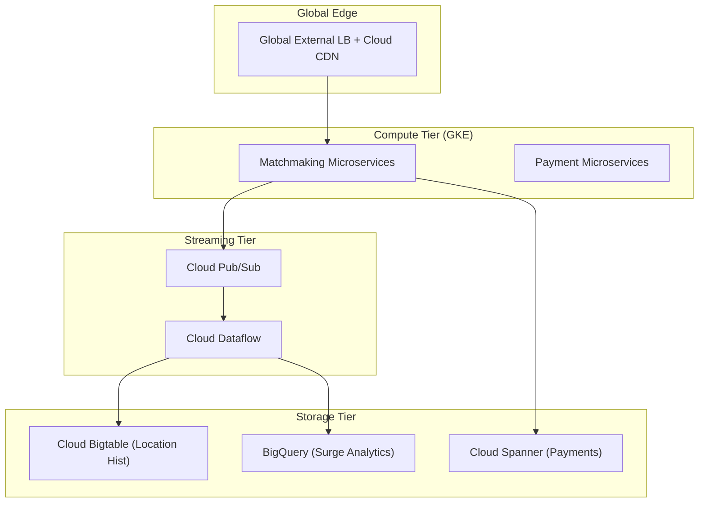
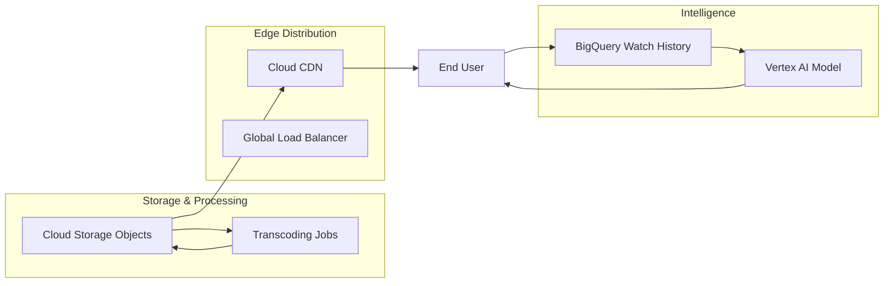
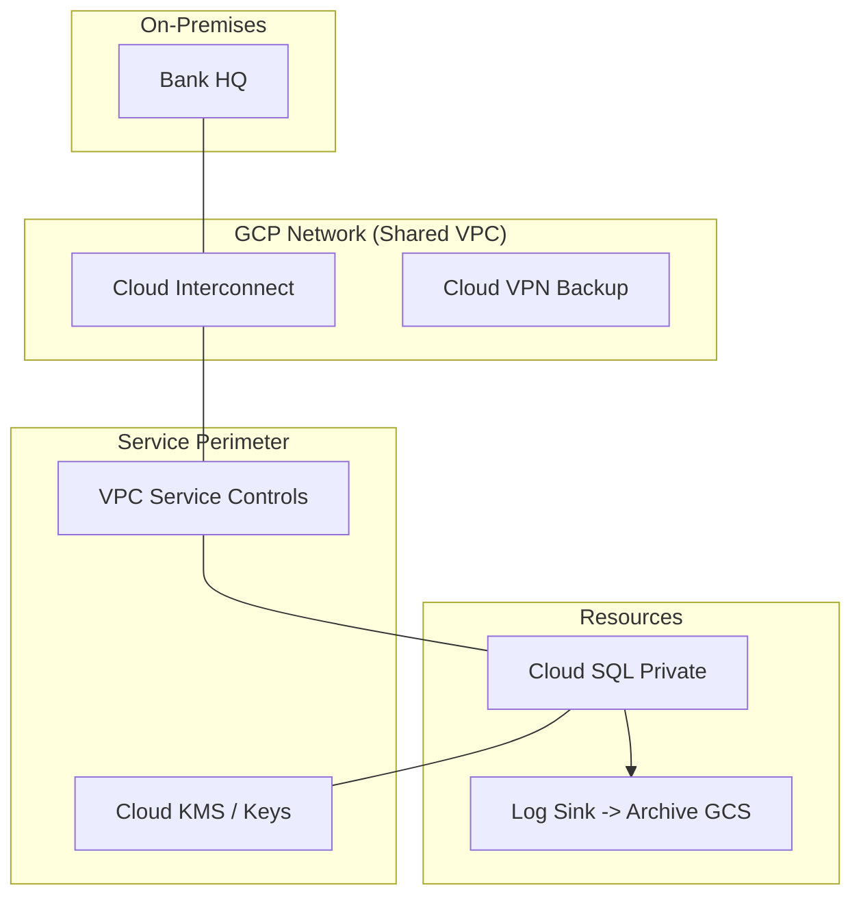

# Day 29: Architect Case Studies (Thinking Like a Pro)

**Duration:** ⏱️ 60 Minutes  
**Level:** Advanced  
**ACE Exam Weight:** ⭐⭐⭐⭐⭐ Critical (The "Synthesis" Day)

---

## 🎯 Learning Objectives

By the end of Day 29, you will be able to:
*   **Deconstruct** complex business requirements into GCP service components.
*   **Apply** architectural patterns for global scale, high availability, and strict compliance.
*   **Evaluate** trade-offs between different compute and storage options in real-world scenarios.
*   **Select** the correct database and messaging patterns for specific workload types (IoT, Payments, Analytics).

---

## 🏗️ 1. Scenario A: The "Uber" Clone (Global Real-Time)

**Requirement:**
*   Global scale with drivers/riders across 3 continents.
*   Real-time location tracking (Driver updates lat/long every 5s).
*   Strongly consistent payment processing (No double-charging).
*   Predictive analytics for surge pricing.

### The Architecture

**Why these choices?**
*   **Cloud Spanner:** The only choice for global SQL consistency across regions for payments.
*   **Bigtable:** Optimized for the millions of low-latency writes required for driver GPS pings.
*   **Dataflow:** Processes the stream from Pub/Sub to calculated surge pricing in real-time.

---

## 🎬 2. Scenario B: The "Netflix" Clone (High Bandwidth)

**Requirement:**
*   Petabytes of video content stored and distributed globally.
*   Personalized recommendations using ML models.
*   Zero buffering for users worldwide.

### The Content Delivery Pipeline

**Why these choices?**
*   **Cloud CDN + GCS:** Massive egress at the edge reduces latency and cost.
*   **Vertex AI:** Seamlessly integrates with BigQuery data to serve one-to-one recommendations.

---

## 🏦 3. Scenario C: The "Regulated Bank" (Zero Trust)

**Requirement:**
*   Absolute network isolation (No egress to the internet).
*   7-year audit log retention for compliance.
*   Encryption keys managed by the bank (CMEK).

### The Zero-Trust Architecture

---

## 🧠 4. The "Decision Matrix" (Cheat Sheet)

| If you need... | Your Primary Choice | The "Why" |
| :--- | :--- | :--- |
| **Global SQL / ACID** | **Cloud Spanner** | Consistency across continents. |
| **High Throughput NoSQL** | **Cloud Bigtable** | Low latency, massive write scale. |
| **Analytical Warehouse** | **BigQuery** | Serverless, petabyte-scale SQL. |
| **Private Internal GCE** | **IAP + Private Access** | SECURE admin access. |
| **Event-Driven Glue** | **Cloud Functions** | Short-lived snippets. |
| **Hybrid Connection** | **Interconnect** | Low latency, high bandwidth (>10Gb). |

---

## 📝 5. Knowledge Check

<!-- QUIZ_START -->
1.  **You are designing a global inventory system that requires strong consistency for stock levels across Asia and the US. Which database should you use?**
    *   A. Cloud SQL with read replicas.
    *   B. **Cloud Spanner.** ✅
    *   C. Cloud Bigtable.
    *   D. BigQuery.

2.  **A media company needs to serve video content to millions of global users with minimum latency. Which combination of services is most effective?**
    *   A. Compute Engine + VPC Peering.
    *   B. **Cloud Storage + Cloud CDN.** ✅
    *   C. Cloud SQL + Cloud Armor.
    *   D. Cloud Build + GKE.

3.  **A bank requires that its data be encrypted with keys that they can rotate and disable at any time. Which management option should you recommend?**
    *   A. Default Google-managed encryption.
    *   B. **Customer-Managed Encryption Keys (CMEK) via Cloud KMS.** ✅
    *   C. Customer-Supplied Encryption Keys (CSEK).
    *   D. IAM Role: Owner.

4.  **You need to process 1 million IoT sensor events per second and store them for long-term analytical trends. What is the best pipeline?**
    *   A. Pub/Sub -> Cloud SQL.
    *   B. **Pub/Sub -> Dataflow -> Bigtable (Real-time) + BigQuery (Long-term).** ✅
    *   C. Cloud Storage -> App Engine.
    *   D. Deployment Manager -> Compute Engine.

5.  **A company wants to connect their data center to GCP with a dedicated, physical 10Gbps connection that does not use the public internet. What is this called?**
    *   A. Cloud VPN.
    *   B. **Dedicated Interconnect.** ✅
    *   C. Partner Interconnect.
    *   D. VPC Peering.
<!-- QUIZ_END -->

---

 Dataflow).', checked: false },
        { text: 'I understand the role of VPC Service Controls in data security.', checked: false }
    ]
}">
    <h3>
        <svg viewBox="0 0 24 24" fill="none" stroke="currentColor" stroke-width="2" stroke-linecap="round" stroke-linejoin="round" width="24" height="24" class="text-blurple">
            <path d="M22 11.08V12a10 10 0 1 1-5.93-9.14"></path>
            <polyline points="22 4 12 14.01 9 11.01"></polyline>
        </svg>
        Day 29 Mastery Checklist
    </h3>
    <template x-for="(item, index) in items" :key="index">
        

            

                <svg viewBox="0 0 24 24" fill="none" stroke="currentColor" stroke-width="3" stroke-linecap="round" stroke-linejoin="round">
                    <polyline points="20 6 9 17 4 12"></polyline>
                </svg>
            

            
        

    </template>

