# SECTION 2: Global Infrastructure & Resource Hierarchy

> **Official Doc Reference**: [Resource Hierarchy](https://cloud.google.com/resource-manager/docs/cloud-platform-resource-hierarchy)

## 1️⃣ The Physical Layer: Regions & Zones 🌍
GCP is a mesh of fiber optic cables connecting data centers around the world.

### The Map
*   **Region:** A specific geographical location (e.g., `us-central1`, `europe-west2`).
*   **Zone:** A deployment area *within* a region (e.g., `us-central1-a`). Think of a Zone as a **Data Center Building**.
*   **Edge PoP (Point of Presence):** Not a data center, but a connection point close to users (for CDN caching).

```mermaid
graph TD
    Geo["🌏 Geography (e.g., US)"] --> Reg["📍 Region: us-central1 (Iowa)"]
    Reg --> Z1["🏢 Zone A (us-central1-a)"]
    Reg --> Z2["🏢 Zone B (us-central1-b)"]
    Reg --> Z3["🏢 Zone C (us-central1-c)"]

    style Geo fill:#f8fafc,stroke:#64748b,stroke-width:2px
    style Reg fill:#e0f2fe,stroke:#0284c7,stroke-width:2px
    style Z1 fill:#f0fdf4,stroke:#16a34a
    style Z2 fill:#f0fdf4,stroke:#16a34a
    style Z3 fill:#f0fdf4,stroke:#16a34a
```

### Design Patterns (Availability)
| Pattern | SLA | Description |
| :--- | :--- | :--- |
| **Zonal** | 99.5% | Single VM. If the zone fails (rare but possible), you are offline. |
| **Regional** | 99.99% | VMs in *different zones* (A and B). App survives a building fire. |
| **Multi-Region** | 99.999% | VMs in *different regions* (US & EU). App survives a catastrophic earthquake. |

---

## 2️⃣ The Logical Layer: Resource Hierarchy 🌳
This is **THE** most important concept in GCP governance. You absolutely must memorize this tree structure.

### The 4 Layers
1.  **Organization Node (Root):**
    *   Represents your company domain (e.g., `google.com`).
    *   *Note:* If you use a personal `@gmail.com`, you **do not** have this. You start at Project.
2.  **Folders:**
    *   Used for grouping (e.g., "HR Dept", "Finance Dept" or "Prod", "Test").
    *   Policies inherit down (e.g., "Allow Admin Access" on the Folder applies to all Projects inside).
3.  **Projects (The Container):**
    *   **Billing lives here.** Every resource MUST belong to a project.
    *   APIs are enabled here.
4.  **Resources:**
    *   The actual stuff: VMs, Buckets, Databases.

---

## 3️⃣ Project Identifiers (Exam Gold 🥇)
Every project has 3 IDs. You will be tested on which one to use when.

| Identifier | Format | Mutability | Used For |
| :--- | :--- | :--- | :--- |
| **Project Name** | "My Cool App" | ✅ Changeable | Human display only. |
| **Project ID** | `my-cool-app-8852` | ❌ **Immutable** | **CLI & Terraform.** Unique across ALL of GCP. |
| **Project Number** | `10384759283` | ❌ **Immutable** | **Internal Google use.** Service Accounts often use this. |

> **Critical Rule:** If a command needs to target a project, use the **Project ID**.

---

## 4️⃣ Organization Policies (Guardrails) 🛡️
Policies control **WHAT** resources can be created. I call them "The Parents Rules".

*   **Difference from IAM:**
    *   **IAM:** "James can create VMs." (Who)
    *   **Org Policy:** "Nobody can create VMs in Australia." (What/Where)
*   **Example Constraints:**
    *   `compute.vmExternalIpAccess = DENY` (No public IPs allowed).
    *   `gcp.resourceLocations = allowed: [us-central1]` (Data residency).

---

## 5️⃣ Hands-On Lab: Identity Check 🕵️
**Mission:** Find your 3 IDs.

1.  Open Cloud Shell.
2.  Run: `gcloud projects list`
    *   *Result:* You will see `PROJECT_ID`, `NAME`, `PROJECT_NUMBER`.
3.  Run: `gcloud config set project [YOUR_PROJECT_ID]`
    *   *Result:* Sets your active terminal context.
4.  Run: `gcloud compute regions list`
    *   *Result:* See all the physical locations you can deploy to.

---

## 6️⃣ Checkpoint Quiz
<form>
  <!-- Q1 -->
  

    
1. Which GCP resource identifier is globally unique, immutable, and used in CLI commands?

    

      <label class="block"><input type="radio" name="q1" value="wrong"> Project Name</label>
      <label class="block"><input type="radio" name="q1" value="correct"> Project ID</label>
      <label class="block"><input type="radio" name="q1" value="wrong"> Project Number</label>
      <label class="block"><input type="radio" name="q1" value="wrong"> Organization Node</label>
    

    

      Correct! Project ID is the technical identifier you must know.
    

  

  <!-- Q2 -->
  

    
2. A startup wants to ensure NO developer can create a VM in the 'asia-east1' region due to data compliance. What tool should they use?

    

      <label class="block"><input type="radio" name="q2" value="wrong"> Identity & Access Management (IAM)</label>
      <label class="block"><input type="radio" name="q2" value="correct"> Organization Policy</label>
      <label class="block"><input type="radio" name="q2" value="wrong"> VPC Firewall Rules</label>
      <label class="block"><input type="radio" name="q2" value="wrong"> Billing Budget</label>
    

    

      Correct! Org Policies restrict resource locations/types. IAM controls "Who".
    

  

  <!-- Q3 -->
  

    
3. You have a personal Gmail account. Which layer of the Resource Hierarchy do you NOT see?

    

      <label class="block"><input type="radio" name="q3" value="wrong"> Project</label>
      <label class="block"><input type="radio" name="q3" value="wrong"> Resource</label>
      <label class="block"><input type="radio" name="q3" value="correct"> Organization Node</label>
      <label class="block"><input type="radio" name="q3" value="wrong"> Billing Account</label>
    

    

      Correct! Org Nodes are only for Google Workspace/Cloud Identity domains.
    

  

</form>

---

### ⚡ Zero-to-Hero: Pro Tips
*   **Latency Matters:** Use sites like [gcping.com](http://www.gcping.com) to find the region closest to you. A 20ms difference feels huge in a terminal.
*   **Inheritance:** Permissions flow DOWN. If you give "Owner" access at the Organization level, that user owns every project in the company. **Be careful.**

---
<!-- FLASHCARDS
[
  {"term": "Project ID", "def": "Immutable, globally unique identifier used for CLI/APIs."},
  {"term": "Project Number", "def": "Immutable numeric ID used internally by Google services."},
  {"term": "Organization Node", "def": "Root node of the hierarchy (Company level)."},
  {"term": "Folder", "def": "Logical grouping of projects (e.g., HR, Dev) to apply policies."},
  {"term": "Org Policy", "def": "Restricts WHAT resources can be created (e.g. data residency)."}
]
-->