# Day 2: Global Infrastructure & Resource Hierarchy

**Duration:** ⏱️ 45 Minutes  
**Level:** Beginner  
**ACE Exam Weight:** ⭐⭐⭐⭐⭐ Critical (Foundational)

---

## 🎯 Learning Objectives

By the end of Day 2, you will be able to:
*   **Differentiate** between physical infrastructure (Regions/Zones) and logical organization.
*   **Master** the GCP Resource Hierarchy (the "Tree of Governance").
*   **Identify** the 3 project identifiers and when to use them.
*   **Understand** how Organization Policies set global guardrails.

---

## 🧠 1. The Physical Layer: Regions & Zones 🌍

GCP isn't just "in the sky"; it's a massive mesh of fiber optic cables and concrete buildings.

### The Breakdown
*   **Region:** A specific geographical location (e.g., `us-central1`, `asia-south1`).
*   **Zone:** A deployment area *within* a region (e.g., `us-central1-a`). Think of a Zone as one or more **Data Center Buildings**.
*   **Edge Points of Presence (PoPs):** These are locations that connect Google's network to the rest of the internet. They host **Cloud CDN** and **Cloud IDS**.

> [!IMPORTANT]
> **High Availability (HA) Rule of Thumb:**
> Always deploy your application across at least **two zones** in a region to survive a data center outage. For legendary reliability, go **Multi-Region**.

```mermaid
graph TD
    subgraph Geography ["🌎 Geography (e.g., Americas)"]
        direction TB
        Region1["📍 Region: us-central1 (Iowa)"]
        Region2["📍 Region: us-east1 (S. Carolina)"]
    end

    subgraph us_central1 ["Building the Infrastructure"]
        direction LR
        ZoneA["🏢 Zone A"]
        ZoneB["🏢 Zone B"]
        ZoneC["🏢 Zone C"]
    end

    Region1 --> ZoneA
    Region1 --> ZoneB
    Region1 --> ZoneC

    style Geography fill:#f8fafc,stroke:#94a3b8,stroke-width:2px
    style us_central1 fill:#f0f9ff,stroke:#0369a1,stroke-width:2px
    style ZoneA fill:#ecfdf5,stroke:#10b981
    style ZoneB fill:#ecfdf5,stroke:#10b981
    style ZoneC fill:#ecfdf5,stroke:#10b981
```



---

## 🌳 2. The Logical Layer: Resource Hierarchy

This is how Google Cloud manages access and billing. It follows a strict **Parent-Child** relationship.

> [!TIP]
> **Inheritance is Power:** If you assign a permission at the Folder level, it "flows down" to all Projects and Resources inside it.

```mermaid
graph TD
    Org["🏢 Organization<br/>(company.com)"]
    
    Folder_Prod["📁 Folder: Production"]
    Folder_Dev["📁 Folder: Development"]
    
    Proj_App["🚀 Project: Web-App-Prod"]
    Proj_DB["💾 Project: SQL-Static"]
    
    Res_VM["🖥️ Compute VM"]
    Res_Bkt["📦 Storage Bucket"]

    Org --> Folder_Prod
    Org --> Folder_Dev
    
    Folder_Prod --> Proj_App
    Folder_Prod --> Proj_DB
    
    Proj_App --> Res_VM
    Proj_App --> Res_Bkt

    style Org fill:#fefce8,stroke:#eab308,stroke-width:2px
    style Folder_Prod fill:#f0f9ff,stroke:#0369a1
    style Folder_Dev fill:#f0f9ff,stroke:#0369a1
    style Proj_App fill:#ecfdf5,stroke:#10b981
```



### The 4 Pillars
1.  **Organization:** The root node (requires Google Workspace or Cloud Identity).
2.  **Folders:** Optional but recommended for team-based isolation (e.g., Apps, Data, Security).
3.  **Projects:** The fundamental "container". **Billing and APIs are managed here.**
4.  **Resources:** The individual services (VMs, Buckets, Pub/Sub topics).

---


## 🆔 3. Project Identifiers (Exam Gold 🥇)

You will be asked which ID to use in different scenarios.

| Identifier | Mutable? | Unique? | Use Case |
| :--- | :--- | :--- | :--- |
| **Project Name** | ✅ Yes | No | Human-friendly name (e.g., "My Demo"). |
| **Project ID** | ❌ **No** | **Globally** | **CLI, Terraform, APIs.** (e.g., `my-project-123`). |
| **Project Number** | ❌ **No** | **Globally** | **Internal Google use.** (e.g., `103948572`). |

> [!CAUTION]
> Once you create a Project ID, you **cannot change it**. Most people append numbers to their desired name to ensure global uniqueness.

---

## 🛡️ 4. Organization Policies (The Guardrails)

Organization Policies give you central control over your cloud environment.

*   **IAM** controls **WHO** can do things.
*   **Org Policy** controls **WHAT** can be done.

> [!WARNING]
> An Organization Policy **overrides** IAM. If an Org Policy says "No Public IPs", even the Project Owner cannot create a VM with a Public IP.

---

## 🛠️ 5. Hands-On Lab: Resource Discovery

**🧪 Lab Objective:** Discover your project's "DNA" and verify regional availability.

1.  **Open Cloud Shell** (The `>_` icon in the top right).
2.  **List your projects:**
    ```bash
    gcloud projects list
    ```
3.  **Find your Project Number:**
    ```bash
    gcloud projects describe $(gcloud config get-value project) --format="value(projectNumber)"
    ```
4.  **Explore Regions:**
    ```bash
    gcloud compute regions list --filter="name~us"
    ```

---

<!-- QUIZ_START -->
## 📝 6. Checkpoint Quiz

1.  **What is a GCP Project?**
    *   A. **Resource container** ✅ (A project is the fundamental unit for organizing resources.)
    *   B. VM only
    *   C. User account
    *   D. Billing
    *   **Explanation:** A project is the fundamental container for all resources in Google Cloud. Billing and APIs are managed at this level.

2.  **What is the top level of the Resource Hierarchy?**
    *   A. **Organization** ✅
    *   B. Folder
    *   C. Project
    *   D. Resource
    *   **Explanation:** The Organization is the root node of the Google Cloud resource hierarchy, typically representing a company.

3.  **What is a Zone in Google Cloud?**
    *   A. A group of regions
    *   B. **A single failure domain (datacenter building)** ✅
    *   C. A region
    *   D. A project
    *   **Explanation:** A zone is a deployment area within a region. Deploying across multiple zones ensures High Availability (HA).

4.  **What is the primary benefit of a Multi-Region deployment?**
    *   A. Low cost
    *   B. **Maximum High Availability** ✅
    *   C. Simplicity
    *   D. Local access
    *   **Explanation:** Multi-region deployments provide the highest level of availability and disaster recovery across geographical distances.

5.  **What does a Region contain?**
    *   A. **Multiple zones** ✅
    *   B. One zone
    *   C. Projects
    *   D. Users
    *   **Explanation:** A region is a geographical location that consists of three or more zones.
<!-- QUIZ_END -->
---

<div class="checklist-card" x-data="{ 
    items: [
        { text: 'I can explain the difference between a Region and a Zone.', checked: false },
        { text: 'I know the 4 layers of the Resource Hierarchy.', checked: false },
        { text: 'I understand when to use Project ID vs Project Number.', checked: false },
        { text: 'I know that Org Policies override IAM permissions.', checked: false }
    ]
}">
    <h3>
        <svg viewBox="0 0 24 24" fill="none" stroke="currentColor" stroke-width="2" stroke-linecap="round" stroke-linejoin="round" width="24" height="24" class="text-blurple">
            <path d="M22 11.08V12a10 10 0 1 1-5.93-9.14"></path>
            <polyline points="22 4 12 14.01 9 11.01"></polyline>
        </svg>
        Day 2 Checklist
    </h3>
    <template x-for="(item, index) in items" :key="index">
        <div class="checklist-item" @click="item.checked = !item.checked">
            <div class="checklist-box" :class="{ 'checked': item.checked }">
                <svg viewBox="0 0 24 24" fill="none" stroke="currentColor" stroke-width="3" stroke-linecap="round" stroke-linejoin="round">
                    <polyline points="20 6 9 17 4 12"></polyline>
                </svg>
            </div>
            <span x-text="item.text" :class="{ 'line-through text-slate-400': item.checked }"></span>
        </div>
    </template>
</div>
