# SECTION 2: Global Infrastructure: Regions & Zones

> **Official Doc Reference**: [Geography and Regions](https://cloud.google.com/about/locations)

## 1️⃣ The Physical Map
GCP is a mesh of fiber optic cables connecting data centers around the world.

```mermaid
graph TD
    Geo["🌏 Geography (e.g., North America)"] --> Reg["📍 Region (e.g., us-central1)"]
    Reg --> Z1["🏢 Zone A (us-central1-a)"]
    Reg --> Z2["🏢 Zone B (us-central1-b)"]
    Reg --> Z3["🏢 Zone C (us-central1-c)"]

    style Geo fill:#f8fafc,stroke:#64748b,stroke-width:2px
    style Reg fill:#e0f2fe,stroke:#0284c7,stroke-width:2px
    style Z1 fill:#f0fdf4,stroke:#16a34a
    style Z2 fill:#f0fdf4,stroke:#16a34a
    style Z3 fill:#f0fdf4,stroke:#16a34a
```

### The Topology

### Key Concepts (The "City" Analogy)
1.  **Region (The Country/State):**
    *   A specific geographical area (e.g., `us-central1` is Iowa).
    *   **Why does it matter?**
        *   **Latency:** Distance = Delay. Pick a region close to your users (e.g., Mumbai for India users).
        *   **Laws:** GDPR requires data to stay in Europe (`europe-west3`).
    *   *Rule:* A region always contains at least 3 Zones.

2.  **Zone (The Data Center Cluster):**
    *   A discrete location within a Region (e.g., `us-central1-a`).
    *   Think of it as a separate **Power Grid** or **Flood Plain**. If Zone A burns down, Zone B is safe 50 miles away.
    *   *Rule:* Zones have high-bandwidth links (microseconds latency) between them.

3.  **Edge Point of Presence (PoP):**
    *   These are not data centers. They are connection points (like airports) where Google's network connects to the public internet.
    *   Used by **Cloud CDN** to cache photos/videos close to users.

## 2️⃣ Design Patterns (Architecture)

### Pattern A: Zonal (Risky)
*   **Setup:** One VM in `us-central1-a`.
*   **SLA:** 99.5%
*   **Risk:** If zone A loses power, you are offline.

### Pattern B: Regional (High Availability)
*   **Setup:** Two VMs. One in `us-central1-a`, One in `us-central1-b`. Behind a Regional Load Balancer.
*   **SLA:** 99.99%
*   **Benefit:** Resilient to single-building failures.

### Pattern C: Multi-Region (Disaster Recovery)
*   **Setup:** App in `us-central1` AND `europe-west1`. Behind a Global Load Balancer.
*   **Benefit:** Resilient to entire City/Region failures (Earthquakes, Floods).

## 3️⃣ Organization Policies (GCP Guardrails)
While IAM controls *Users*, Organization Policies control *Resources*.
*   **Constraint:** A rule you enforce on your Resource Hierarchy.
*   **Common Examples:**
    1.  `constraints/compute.vmExternalIpAccess`: **Deny All**. (Prevents anyone from creating a VM with a Public IP).
    2.  `constraints/iam.disableServiceAccountKeyCreation`: **True**. (Stops JSON key downloads).
    3.  `constraints/gcp.resourceLocations`: **Limit to `europe-west3`**. (Forces data to stay in Germany).

## 4️⃣ Hands-On Lab: Latency Test ⏱️
**Mission:** See which region is closest to you.

1.  Go to [gcping.com](http://www.gcping.com) (Unofficial tool, but perfect for visualization).
2.  It pings all GCP regions from your browser.
3.  **Result:** You will see "Top Region: asia-south1 (Mumbai) - 15ms".
4.  **Action:** This is the region you should choose for your primary VM to get the best console experience.

## 5️⃣ Checkpoint Questions
## 5️⃣ Checkpoint Questions
**Q1. A startup needs to ensure their app stays online even if a massive hurricane destroys the entire US East Coast. What design pattern is required?**
*   A. Zonal
*   B. Regional
*   C. Multi-Regional (Disaster Recovery)
*   D. Edge Cached
> **Answer: C.** Only Multi-Region survives a full regional outage.

**Q2. You want to prevent developers from accidentally creating resources in expensive regions like Australia. What tool do you use?**
*   A. IAM Roles
*   B. Organization Policy (Resource Locations constraint)
*   C. Billing Alerts
*   D. VPC Firewalls
> **Answer: B.** Org Policies restrict *what* and *where* resources can be deployed.

**Q3. True or False: A Region must have at least 3 Zones.**
*   A. True
*   B. False
> **Answer: A.** True, almost all regions have 3 or more zones for HA.

**Q4. What is the lowest latency connection point between GCP and the user?**
*   A. Region
*   B. Zone
*   C. Edge Point of Presence (PoP)
*   D. Subnet
> **Answer: C.** PoPs are close to users (often in local ISPs) for CDN caching.

**Q5. Your application is deployed in `us-central1-a`. You want to increase availability to 99.99%. What should you do?**
*   A. Add more RAM to the VM.
*   B. Deploy a second VM in `us-central1-b` and use a Load Balancer.
*   C. Deploy a second VM in `us-central1-a`.
*   D. Enable Cloud CDN.
> **Answer: B.** Regional redundancy (multiple zones) increases SLA to 99.99%.

<!-- FLASHCARDS
[
  {
    "term": "Region",
    "def": "A geographical location (e.g., Iowa) containing 3+ Zones."
  },
  {
    "term": "Zone",
    "def": "A deployment area within a region (Think: Data Center Building)."
  },
  {
    "term": "Multi-Region",
    "def": "Redundancy across large distances (e.g., US-East + US-West). Survivors disaster."
  },
  {
    "term": "Org Policy",
    "def": "Guardrails that restrict WHAT resources can be created (e.g., No Public IPs)."
  },
  {
    "term": "Low Latency",
    "def": "Choosing a region close to your users to minimize speed."
  }
]
-->