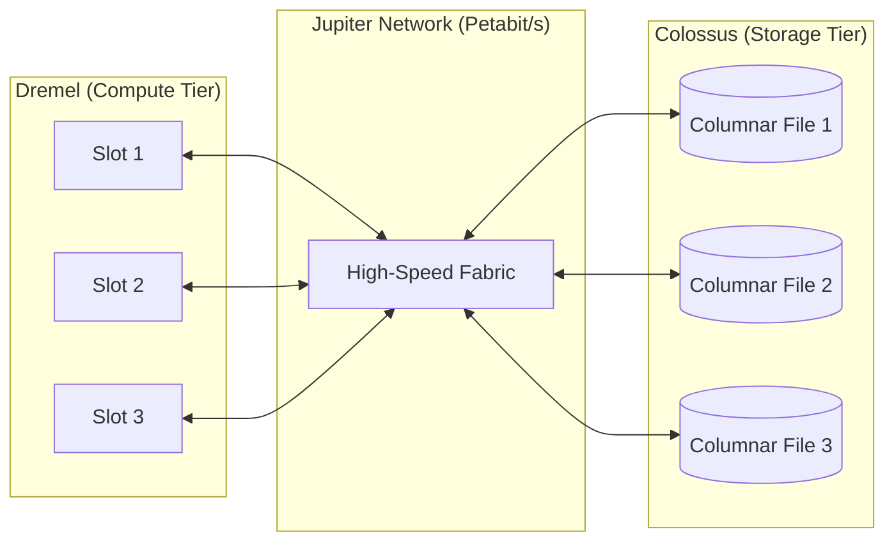

# Day 30: BigQuery & Data Warehousing

**Duration:** ⏱️ 60 Minutes  
**Level:** Intermediate  
**ACE Exam Weight:** ⭐⭐⭐⭐⭐ Critical

---

> [!TIP]
> **TL;DR (BigQuery Cost-Saving Essentials)**  
> BigQuery = Serverless data warehouse. Charged $5 per TB scanned. **LIMIT does NOT reduce cost** (data is scanned before limiting). Use **Partitioning** (skip whole files) and **Clustering** (sort within partitions) to reduce scans. **Colossus** = storage, **Dremel** = compute. Always check the **Query Validator** before running expensive queries.

---

## 🎯 Learning Objectives

| ✅ Skill | Why It Matters |
|---------|----------------|
| **Explain** serverless architecture | Understand Colossus vs Dremel |
| **Execute** queries on public datasets | Hands-on skill |
| **Optimize** with Partitioning/Clustering | Save money on queries |
| **Differentiate** pricing models | On-Demand vs Capacity (Slots) |
| **Implement** data ingestion | Streaming vs Batch |

---

## 🏗️ 1. Architecture: The Power of Separation

BigQuery is not a traditional database. Its performance comes from the total separation of **Compute** and **Storage**, connected by a high-speed "Jupiter" network.



*   **Colossus (Storage):** Stores data in **Capacitor** (columnar) format. Because it's columnar, BigQuery only reads the specific columns your query requests, drastically reducing I/O.
*   **Dremel (Compute):** A massive distributed query engine that compiles your SQL into an execution tree across thousands of "slots" (CPUs).

---

## 💰 2. Cost Management: Avoid the "Bill Shock"

BigQuery charges for two things: **Storage** (very cheap) and **Analysis** (can be expensive).

### Pricing Models
1.  **On-Demand:** $5 per TB scanned. Great for unpredictable workloads.
2.  **Edition Pricing (Slots):** You buy capacity (Autoscaling slots). Best for large enterprises with steady workloads.

### 🛡️ Guardrails
> [!IMPORTANT]
> **ACE Exam Alert: The Validator**
> Before you hit "Run", always check the **Query Validator** in the bottom right of the BigQuery UI. It tells you exactly how many gigabytes or terabytes will be processed. **`LIMIT 10` does NOT reduce cost!** It filters the results *after* the scan is complete.

---

| Technique | How it Works | Analogy | Cost Benefit |
| :--- | :--- | :--- | :--- |
| **Partitioning** | Divides by Date/Integer | Bookshelf sections | 🚀 Huge (Skips whole files) |
| **Clustering** | Sorts within partition | Alphabetical sorting | 📈 Good (Sorts data for faster scan) |

> [!IMPORTANT]
> **Constraint:** You can have up to 4,000 partitions per table. If your data is more granular, use **Clustering** alongside Partitioning.

---

## 🔬 4. Advanced BigQuery (The "Market Best" Edge)

### 🤖 BigQuery ML (SQL + AI)
You don't need Python to build ML models. You can do it in SQL!
```sql
CREATE MODEL `my_dataset.my_model`
OPTIONS(model_type='linear_reg') AS
SELECT label, feature1, feature2 FROM `my_table`;
```

### 🛡️ Data Governance & Security
*   **Column-Level Security:** Restrict access to specific columns (e.g., PII like `ssn`) using Policy Tags.
*   **Data Masking:** Show only the last 4 digits of a credit card to certain users.
*   **Authorized Views:** Share query results with others without giving them access to the underlying table.

### 🌐 BigQuery Omni
Query data residing in **AWS S3** or **Azure Blob Storage** directly from the BigQuery UI without moving the data.

---

## 🛠️ 4. Hands-On Lab: Querying the Planet

### 🧪 Lab Objective
Query a 100GB+ public dataset using partitioning logic to keep costs zero.

### ✅ Steps

1.  **Open BigQuery Console**: Search for "Public Datasets".
2.  **Explore**: Find `bigquery-public-data.ghcn_d` (Global Historical Climatology Network).
3.  **Run an Inefficient Query** (DO NOT actually run, just look at the validator):
    ```sql
    SELECT id, date, element, value 
    FROM `bigquery-public-data.ghcn_d.ghcnd_2024` 
    -- This scans the whole year! (e.g., 80 GB)
    ```
4.  **Run an Optimized Query**:
    ```sql
    SELECT id, element, value 
    FROM `bigquery-public-data.ghcn_d.ghcnd_2024` 
    WHERE date = '2024-06-01'
    -- If partitioned by date, this scans < 1 GB.
    ```

---

<!-- QUIZ_START -->
## 📝 5. Knowledge Check

1.  **You are charged $5,000 for a single query. What is the most likely reason?**
    *   A. You used too many `JOIN` statements.
    *   B. **The query scanned a massive amount of data on a non-partitioned table.** ✅
    *   C. You forgot to use `LIMIT 10`.
    *   D. You streamed the data into the table.

2.  **A company wants a set, predictable monthly bill for their BigQuery usage. Which pricing model should they choose?**
    *   A. On-Demand Pricing.
    *   B. **Capacity Pricing (Slots).** ✅
    *   C. Flat-rate Storage.
    *   D. Bigtable Tiers.

3.  **Which architectural component of BigQuery is responsible for storing data in a columnar format?**
    *   A. Dremel.
    *   B. **Colossus.** ✅
    *   C. Borg.
    *   D. BigTable.

4.  **You need to stream real-time events into BigQuery for immediate analysis. Is it possible?**
    *   A. No, BigQuery only supports batch loading.
    *   B. **Yes, using the Streaming API (via Dataflow or direct API calls).** ✅
    *   C. Yes, but only for tables smaller than 10GB.
    *   D. Yes, by using Cloud SQL as a proxy.

5.  **True or False: Using 'SELECT *' is generally considered a best practice in BigQuery to ensure all data is cached.**
    *   A. True.
    *   B. **False. Only select the columns you need to save on bytes scanned.** ✅
<!-- QUIZ_END -->
---

<div class="checklist-card" x-data="{ 
    items: [
        { text: 'I understand that Compute and Storage are separate in BigQuery.', checked: false },
        { text: 'I know how to use the Query Validator to estimate costs.', checked: false },
        { text: 'I can explain why LIMIT does not save money on scanning costs.', checked: false },
        { text: 'I understand the performance benefits of Clustering.', checked: false }
    ]
}">
    <h3>
        <svg viewBox="0 0 24 24" fill="none" stroke="currentColor" stroke-width="2" stroke-linecap="round" stroke-linejoin="round" class="text-blurple">
            <path d="M22 11.08V12a10 10 0 1 1-5.93-9.14"></path>
            <polyline points="22 4 12 14.01 9 11.01"></polyline>
        </svg>
        Day 30 Mastery Checklist
    </h3>
    <template x-for="(item, index) in items" :key="index">
        <div class="checklist-item" @click="item.checked = !item.checked">
            <div class="checklist-box" :class="{ 'checked': item.checked }">
                <svg viewBox="0 0 24 24" fill="none" stroke="currentColor" stroke-width="3" stroke-linecap="round" stroke-linejoin="round">
                    <polyline points="20 6 9 17 4 12"></polyline>
                </svg>
            </div>
            <span x-text="item.text" :class="{ 'line-through text-slate-400': item.checked }"></span>
        </div>
    </template>
</div>
