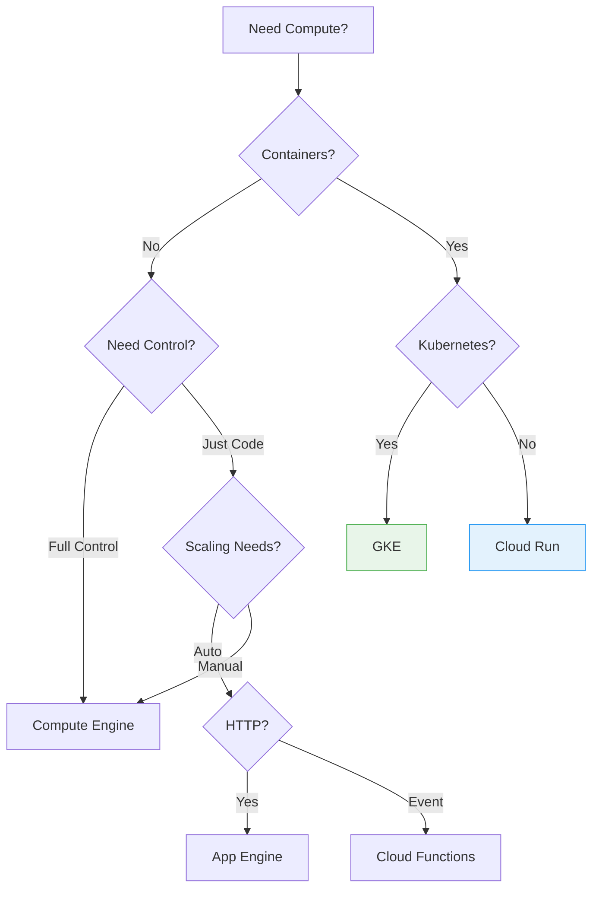
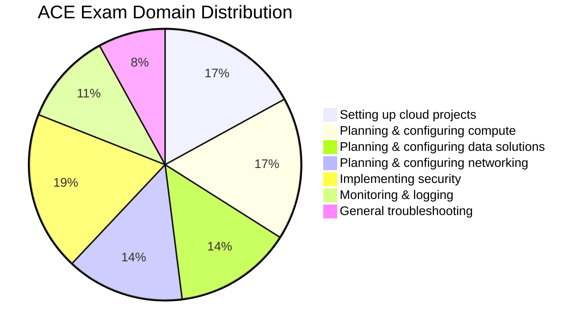

# Day 30: Final Exam Readiness - The Complete Strategy Guide

**Duration:** ⏱️ 60 Minutes  
**Level:** All Levels  
**Purpose:** Exam preparation and strategy

---

## 🏁 The Final Stretch

You've completed 29 days of intense study. You built VPCs, deployed Kubernetes clusters, optimized BigQuery tables, and secured IAM policies. **You are ready.**

---

## 🏆 1. The "Golden Rules" of GCP Exams

### Rule #1: Business Constraints Dictate Answers
Google exams test **architectural thinking**, not command memorization.

| Question Pattern | Look For | Answer |
|-----------------|----------|--------|
| "Store data with sub-ms latency" | Low latency requirement | Memorystore (Redis) |
| "Query with SQL" | SQL requirement | Cloud SQL or Spanner |
| "Store cheaply for 7 years" | Long retention | Archive Storage |
| "Global users, ACID transactions" | Global + consistency | Cloud Spanner |
| "Process petabytes of data" | Big data analytics | BigQuery |

### Rule #2: The 50/50 Elimination
Usually 2 answers are obviously wrong. Identify them first to double your odds.

### Rule #3: Watch for "Minimal Effort" Keywords
When you see "minimum operational overhead" or "least administrative effort":
- Prefer **managed services** over self-managed
- Prefer **serverless** over provisioned
- Prefer **Autopilot** over Standard GKE

---

## 📋 2. Top 10 "Must Know" Topics

If you have 24 hours before the exam, focus on these:

### Compute Services Decision Tree


### Quick Reference Table

| Topic | Key Facts |
|-------|-----------|
| **IAM** | Identity → Role → Resource. Least privilege. Service accounts for apps. |
| **VPC** | VPCs are global, Subnets are regional. Firewall rules are stateful. |
| **Compute** | CE (VMs) < App Engine (PaaS) < Cloud Run (containers) < Functions (events) |
| **Storage Classes** | Standard → Nearline (30d) → Coldline (90d) → Archive (365d) |
| **Databases** | SQL (Cloud SQL), Global (Spanner), NoSQL (Bigtable), Analytics (BigQuery) |
| **Load Balancing** | HTTP(S) is global, Network LB is regional. |
| **Interconnect** | VPN (cheap, encrypted) vs Dedicated (fast, not encrypted by default) |
| **GKE** | Autopilot (Google manages nodes) vs Standard (you manage) |
| **Ops Suite** | Logging (what happened) vs Monitoring (how it's doing) vs Trace (latency) |
| **Billing** | SUDs (auto), CUDs (committed), Spot VMs (cheapest, interruptible) |

---

## 🧠 3. Exam Day Strategy

### Time Management
| Action | When |
|--------|------|
| First pass | 0-60 min: Answer confident questions |
| Mark & skip | If >60 sec: Mark for review, move on |
| Second pass | 60-90 min: Return to marked questions |
| Final review | 90-120 min: Double-check flagged answers |

### Question Analysis Framework
```
1. Read the LAST sentence first (what are they asking?)
2. Identify the CONSTRAINT (cost? latency? compliance?)
3. Eliminate 2 obviously wrong answers
4. Choose between remaining 2 based on constraint
```

### Red Flags in Wrong Answers
*   ❌ "Create your own..." (usually too much effort)
*   ❌ "Use third-party..." (usually unnecessary)
*   ❌ "Modify source code..." (usually not needed)
*   ❌ "Install on VMs..." (usually a managed service exists)

---

## 📊 4. ACE Exam Domain Weight



### Domain-Specific Tips

| Domain | Focus Areas |
|--------|-------------|
| **Security (19%)** | IAM, service accounts, VPC firewalls, Cloud Armor |
| **Compute (17%)** | When to use CE vs GKE vs Cloud Run |
| **Projects (17%)** | Hierarchy, billing, quotas, labels |
| **Data (14%)** | Database selection, BigQuery optimization |
| **Networking (14%)** | VPCs, subnets, load balancing, VPN |
| **Monitoring (11%)** | Logging, alerting, dashboards |

---

## ✅ 5. Pre-Exam Checklist

### One Week Before
- [ ] Complete all practice exams
- [ ] Review weak areas from practice results
- [ ] Re-read exam guide domains

### One Day Before
- [ ] Review the Top 10 topics above
- [ ] Get good sleep (seriously!)
- [ ] Prepare ID and test environment

### Exam Day
- [ ] Arrive 15 minutes early
- [ ] Use the whiteboard/notepad for notes
- [ ] Take a break mid-exam if needed
- [ ] Don't change answers unless certain

---

## 🎯 6. Quick Decision Cheatsheet

| When They Say... | Answer Is Usually... |
|-----------------|---------------------|
| "Minimum cost" | Preemptible/Spot VMs, smaller machine types |
| "High availability" | Multi-zone, regional resources |
| "Disaster recovery" | Multi-region, cross-region replication |
| "Real-time analytics" | BigQuery streaming, Pub/Sub + Dataflow |
| "Batch processing" | Dataproc, Batch, Cloud Functions |
| "Mobile/web backend" | Firebase, Firestore, Cloud Run |
| "API management" | Cloud Endpoints, API Gateway |
| "Sensitive data" | VPC Service Controls, DLP, KMS |

---

## 🚀 7. You Are Ready!

Take a deep breath. You didn't just read about the cloud—**you built it**.

### Final Words of Wisdom
*   Trust your preparation
*   Don't second-guess too much
*   If unsure, go with "managed" over "manual"
*   Remember: 70% to pass, not 100%

---

<!-- QUIZ_START -->
## 📝 Final Readiness Quiz

1. **A question asks for "minimum operational overhead." What approach should you prefer?**
    *   A. Install on Compute Engine VMs
    *   B. **Use a managed GCP service** ✅
    *   C. Build a custom solution
    *   D. Use third-party tools

2. **When you see "global users with ACID transactions," which database is the answer?**
    *   A. Cloud SQL
    *   B. Bigtable
    *   C. **Cloud Spanner** ✅
    *   D. Firestore

3. **What's the best strategy when a question takes more than 60 seconds?**
    *   A. Keep thinking until solved
    *   B. **Mark for review and move on** ✅
    *   C. Guess randomly
    *   D. Skip permanently

4. **Which exam domain has the highest weight (19%)?**
    *   A. Compute resources
    *   B. **Security** ✅
    *   C. Networking
    *   D. Data solutions

5. **The question says "cost-effective" and "fault-tolerant batch job." What's likely the answer?**
    *   A. Standard VMs with SSD
    *   B. **Spot/Preemptible VMs** ✅
    *   C. Bare Metal Solution
    *   D. Cloud SQL
<!-- QUIZ_END -->

---

### Good Luck! 🍀

You've put in the work. Now go show them what you know.

<!-- FLASHCARDS
[
  {"term": "50/50 Rule", "def": "Eliminate 2 obviously wrong answers first to double your odds on tough questions."},
  {"term": "Business Constraint", "def": "The key requirement in a question (cost, latency, compliance) that dictates the answer."},
  {"term": "Managed Service", "def": "Always prefer managed GCP services over DIY when asked for 'minimum effort'."},
  {"term": "Mark for Review", "def": "If a question takes >60 seconds, flag it and return later."},
  {"term": "Security Domain", "def": "Largest exam domain at 19%. Focus on IAM, firewalls, service accounts."},
  {"term": "Pass Threshold", "def": "70% to pass. You don't need to be perfect."}
]
-->
