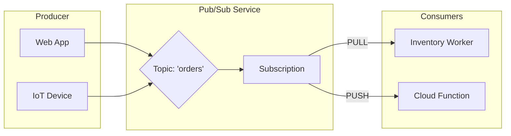

# Day 31: Pub/Sub & Asynchronous Messaging

**Duration:** ⏱️ 60 Minutes  
**Level:** Intermediate  
**ACE Exam Weight:** ⭐⭐⭐⭐⭐ Critical

---

## 🎯 Learning Objectives

By the end of Day 31, you will be able to:
*   **Design** decoupled architectures using the Publisher-Subscriber pattern.
*   **Differentiate** between Push and Pull delivery mechanisms.
*   **Implement** reliability patterns like Dead Letter Queues (DLQ) and Exponential Backoff.
*   **Configure** message ordering and understand Exactly-Once delivery.

---

## 🏗️ 1. Why Decouple? The Silent Hero

In a synchronous system, a failure in the database crashes the frontend. In an **asynchronous** system, Pub/Sub acts as a persistent buffer, absorbing spikes and ensuring no data is lost during downstream outages.

### Messaging Lifecycle



---

## 🛠️ 2. Core Patterns: Push vs. Pull

| Feature | **Pull** (Standard) | **Push** (Webhooks) |
| :--- | :--- | :--- |
| **How it works** | Subscriber asks BQ: "Any messages?" | Pub/Sub sends HTTP POST to your app. |
| **Best for** | High-throughput batch processing. | Low-latency, event-driven (Cloud Run/Functions). |
| **Scaling** | You control the rate (throttling). | Pub/Sub scales as fast as your endpoint allows. |
| **Network** | Behind firewall (outbound only). | Requires a public endpoint or IAP. |

---

## 🛡️ 3. Reliability & "The Graveyard"

Redundant delivery is part of the job. You must handle failures gracefully.

1.  **Dead Letter Queues (DLQ):** If a message fails to be acknowledged (NACKed) after $N$ attempts, it is moved to a separate topic. This prevents "poison messages" from crashing your workers in a loop.
2.  **Exactly-Once Delivery:** A premium feature that suppresses duplicates at the regional level, ensuring your code doesn't process the same order twice.
3.  **Ack Deadline:** The amount of time Pub/Sub waits for a "success" signal before redelivering the message.

---

## 🧪 4. Hands-On Lab: Building a Reliable Pipeline

### 🧪 Lab Objective
Create a topic, a pull subscription with a DLQ, and test message lifecycle.

### ✅ Steps

1.  **Initialize Topics**:
    ```bash
    # Create the main topic and the graveyard
    gcloud pubsub topics create order-processing
    gcloud pubsub topics create order-dead-letter
    ```

2.  **Create Subscription with DLQ**:
    ```bash
    gcloud pubsub subscriptions create order-sub \
        --topic=order-processing \
        --dead-letter-topic=order-dead-letter \
        --max-delivery-attempts=5 \
        --ack-deadline=30
    ```

3.  **Publish a Trial Message**:
    ```bash
    gcloud pubsub topics publish order-processing --message='{"id": 123, "item": "Cloud-Guru-Shirt"}'
    ```

4.  **Pull and Acknowledge**:
    ```bash
    gcloud pubsub subscriptions pull order-sub --auto-ack
    ```

---

## 📝 5. Knowledge Check

<!-- QUIZ_START -->
1.  **Your application processes payments. You need to ensure that even if the network fails, an order is never processed twice. Which Pub/Sub feature is most helpful?**
    *   A. Message Storage.
    *   B. **Exactly-Once Delivery.** ✅
    *   C. Push Subscriptions.
    *   D. Cloud Logging.

2.  **A specific message keeps causing your subscriber to crash. After 5 retries, you want to stop processing it and move it aside for review. What should you configure?**
    *   A. An Uptime Check.
    *   B. **A Dead Letter Queue (DLQ).** ✅
    *   C. A Larger Timeout.
    *   D. A different Region.

3.  **What is the default delivery guarantee of Cloud Pub/Sub?**
    *   A. Exactly-Once.
    *   B. **At-Least-Once.** ✅
    *   C. Best-Effort (No guarantee).
    *   D. Synchronous.

4.  **You want to trigger a Cloud Function every time a new image is uploaded to a bucket. What is the most decoupled way to do this?**
    *   A. Use a Cron job.
    *   B. **Use Pub/Sub Notifications for Cloud Storage.** ✅
    *   C. Hardcode the function call in the frontend.
    *   D. Use Cloud Interconnect.

5.  **True or False: Pub/Sub topics are regional resources and data cannot be sent from one region to a topic in another.**
    *   A. True.
    *   B. **False. Pub/Sub is a Global service with regional endpoints for performance.** ✅
<!-- QUIZ_END -->

---

<div class="checklist-card" x-data="{ 
    items: [
        { text: 'I understand the Publish-Subscribe model.', checked: false },
        { text: 'I can explain the difference between Push and Pull.', checked: false },
        { text: 'I know when to use a Dead Letter Queue.', checked: false },
        { text: 'I understand the impact of Ack Deadlines on redelivery.', checked: false }
    ]
}">
    <h3>
        <svg viewBox="0 0 24 24" fill="none" stroke="currentColor" stroke-width="2" stroke-linecap="round" stroke-linejoin="round" class="text-blurple">
            <path d="M22 11.08V12a10 10 0 1 1-5.93-9.14"></path>
            <polyline points="22 4 12 14.01 9 11.01"></polyline>
        </svg>
        Day 31 Mastery Checklist
    </h3>
    <template x-for="(item, index) in items" :key="index">
        <div class="checklist-item" @click="item.checked = !item.checked">
            <div class="checklist-box" :class="{ 'checked': item.checked }">
                <svg viewBox="0 0 24 24" fill="none" stroke="currentColor" stroke-width="3" stroke-linecap="round" stroke-linejoin="round">
                    <polyline points="20 6 9 17 4 12"></polyline>
                </svg>
            </div>
            <span x-text="item.text" :class="{ 'line-through text-slate-400': item.checked }"></span>
        </div>
    </template>
</div>
