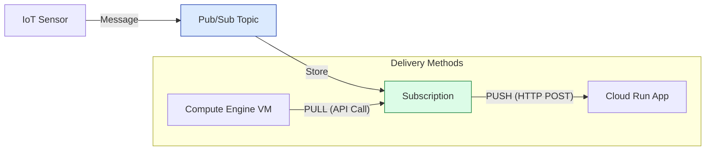

# SECTION 24: Pub/Sub & Data Pipelines

> **Official Doc Reference**: [Pub/Sub Documentation](https://cloud.google.com/pubsub/docs)

## 1️⃣ Overview: The Decoupler
*   **The Problem:** System A (Fast) talks to System B (Slow). If A sends too fast, B crashes.
*   **The Solution:** Put a buffer in the middle. System A talks to **Pub/Sub**. System B reads from Pub/Sub at its own pace.
*   **Analogy:** YouTube Uploads. You upload (Publish). The Processing server (Subscriber) picks it up when ready.

## 2️⃣ Architecture: Push vs Pull

## 3️⃣ Delivery Guarantees (The "At-Least-Once" Rule)
*   **Guarantee:** Pub/Sub guarantees it will deliver the message at least once.
*   **Caveat:** It *might* deliver it twice (Network burp, Ack failure).
*   **Ordering:** By default, **No Ordering**. (Msg 2 might arrive before Msg 1). *Note: You CAN enable ordering with an Ordering Key.*

## 4️⃣ Zero-to-Hero: Dead Letter Queues (DLQ) 💀
*   **Scenario:** A message is "poison". It crashes your app every time you try to process it.
*   **Result:** Infinite loop. App crashes -> Pub/Sub redelivers -> App crashes.
*   **Fix:** Configure a **Dead Letter Queue**.
    *   *Logic:* "If delivery fails 5 times, move this message to a separate 'Graveyard' topic for human inspection."

## 5️⃣ Hands-On Lab: Send a Message 📨
1.  **Create Topic:**
    `gcloud pubsub topics create my-news`
2.  **Create Subscription (Pull):**
    `gcloud pubsub subscriptions create my-reader --topic=my-news`
3.  **Publish:**
    `gcloud pubsub topics publish my-news --message="Hello World"`
4.  **Pull (Read):**
    `gcloud pubsub subscriptions pull my-reader --auto-ack`

## 6️⃣ Exam Traps 🚨
*   **Trap:** "I need strictly FIFO (First-In, First-Out) processing for my banking ledger."
    *   *Answer:* Use Pub/Sub with **Ordering Keys** enabled. (Standard Pub/Sub does not guarantee order).
*   **Trap:** "I have 1 million IoT devices sending data. How do I scale Pub/Sub?"
    *   *Answer:* You don't. Pub/Sub is **Global** and **Serverless**. It scales automatically to 500 million+ messages/sec.
*   **Trap:** "My subscriber is too slow. The queue is growing."
    *   *Answer:* Add more subscriber instances (Horizontal Scaling). Pub/Sub handles the fan-out.

## 7️⃣ Checkpoint Questions (Exam Style)
<!--
**Q1. What happens if a subscriber fails to acknowledge (ACK) a message within the deadline?**
*   A. The message is deleted.
*   B. The message is redelivered.
*   C. The message is archived.
*   D. The entire queue pauses.
> **Answer: B.** Pub/Sub assumes the worker died and gives the work to someone else.

**Q2. Which architectural pattern does Pub/Sub enable?**
*   A. Monolithic
*   B. Tightly Coupled
*   C. Decoupled (Asynchronous)
*   D. Synchronous Blocking
> **Answer: C.** Decoupling allows independent scaling of producers and consumers.

**Q3. How long does Pub/Sub store a message if no one picks it up (Retention)?**
*   A. 1 Hour
*   B. 7 Days (Default, configurable up to 31)
*   C. Forever
*   D. Until restart
> **Answer: B.** It is a durable buffer, not a permanent archive.
-->
