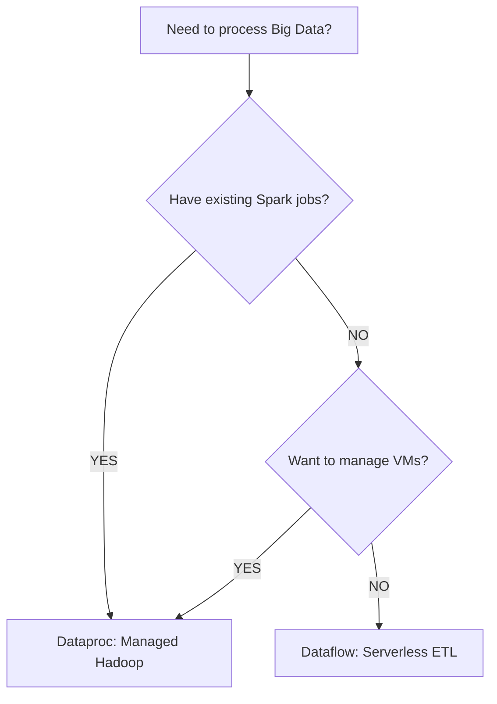

# Day 32: Dataflow & Dataproc (Massive Scale ETL)

**Duration:** ⏱️ 60 Minutes  
**Level:** Intermediate/Advanced  
**ACE Exam Weight:** ⭐⭐⭐⭐ High

---

## 🎯 Learning Objectives

By the end of Day 32, you will be able to:
*   **Select** between Dataflow and Dataproc based on workload source and legacy requirements.
*   **Architect** an ETL pipeline using Apache Beam for unified batch and stream processing.
*   **Manage** Big Data clusters using Dataproc's ephemeral infrastructure.
*   **Implement** reliability concepts like Windowing and Watermarks in streaming pipelines.

---

## 🏗️ 1. The Big Data Choice (Memorize This)

The ACE exam frequently tests your ability to choose the right processing engine. The decision usually boils down to **Scale vs. Legacy**.

| Feature | **Dataflow** | **Dataproc** |
| :--- | :--- | :--- |
| **Model** | Serverless / NoOps | Managed Hadoop/Spark Clusters |
| **Programming** | Apache Beam (Unified) | Spark, Hive, Pig, Flink |
| **Ideal Use Case** | New, Green-field development | Moving existing Spark/Hadoop to GCP |
| **Streaming** | Native and Powerful | Spark Streaming (Micro-batch) |
| **Autoscaling** | **Vertical** (RAM/CPU) + Horizontal | Horizontal only |

### The "New vs. Old" Flowchart

---

## 🚀 2. Dataflow: The Beam Advantage

Dataflow runs **Apache Beam**. The "Beam" name comes from **B**atch + str**EAM**, meaning you write one piece of code that handles both history and real-time data.

### Key Streaming Concepts
*   **Windowing:** Slicing a continuous stream into chunks (e.g., "Sum clicks every 60 seconds").
*   **Watermarks:** The system's "notion of time." It allows Dataflow to handle **Late Data** (e.g., a phone that was offline for 10 minutes then sends a burst of data).
*   **Dataflow Prime:** A newer version that uses **Vertical Autoscaling** to dynamically add RAM/CPU to workers when they hit "Out of Memory" errors.

---

## 🐘 3. Dataproc: The Cloud-Native Hadoop

Dataproc is for when you want the power of the Open Source ecosystem (Spark/Hadoop) without the pain of managing hardware.

> [!TIP]
> **FinOps Pro Tip: Ephemeral Clusters**
> Never leave a Dataproc cluster running 24/7. Use the "Job-scoped" cluster pattern: Spin up -> Run Spark Job -> Self-Delete. This ensures you only pay for the exact compute time of the processing.

---

## 🧪 4. Hands-On Lab: Google-Scale Processing

### 🧪 Lab Objective
Run a serverless Dataflow job to process a 100MB+ dataset from Cloud Storage into BigQuery.

### ✅ Steps

1.  **Open Dataflow Console**: Click "Create Job from Template."
2.  **Select Template**: "Text Files on Cloud Storage to BigQuery."
3.  **Configure Parameters**:
    *   **Input GCS File**: `gs://cloud-samples-data/weather/weather.csv`
    *   **Output Table**: `your_project:your_dataset.weather_results`
    *   **Temporary Location**: `gs://your-bucket/temp/`
4.  **Execute**: Click **Run Job**.
5.  **Monitor**: Switch to the **Execution Graph** view. Note how Dataflow automatically partitions the work across multiple workers.

---

## 📝 5. Knowledge Check

<!-- QUIZ_START -->
1.  **You have a team of developers who are experts in Apache Spark. They need to move their 50 existing processing jobs to GCP with minimal code changes. What should you recommend?**
    *   A. **Cloud Dataproc.** ✅
    *   B. Cloud Dataflow.
    *   C. Compute Engine with manual installs.
    *   D. BigQuery ML.

2.  **Which Dataflow feature allows the system to handle data that arrives late due to network latency on mobile devices?**
    *   A. Windowing.
    *   B. **Watermarks.** ✅
    *   C. PCollections.
    *   D. Cloud Pub/Sub.

3.  **What is the primary benefit of Dataflow being 'Serverless'?**
    *   A. It's free.
    *   B. It doesn't use VMs.
    *   C. **You don't need to manage clusters, patching, or scaling workers manually.** ✅
    *   D. It only works for Batch data.

4.  **A company wants to reduce costs for their Dataproc workloads. What is the most effective strategy?**
    *   A. Run clusters 24/7.
    *   B. **Use Ephemeral Clusters (Create -> Run -> Delete).** ✅
    *   C. Use only 1 node clusters.
    *   D. Disable Cloud Logging.

5.  **True or False: Apache Beam allows you to use the same code logic for both batch and streaming data processing.**
    *   A. **True.** ✅
    *   B. False.
<!-- QUIZ_END -->

---

    <h3>
        <svg viewBox="0 0 24 24" fill="none" stroke="currentColor" stroke-width="2" stroke-linecap="round" stroke-linejoin="round" class="text-blurple">
            <path d="M22 11.08V12a10 10 0 1 1-5.93-9.14"></path>
            <polyline points="22 4 12 14.01 9 11.01"></polyline>
        </svg>
        Day 32 Mastery Checklist
    </h3>
    <template x-for="(item, index) in items" :key="index">
        

            

                <svg viewBox="0 0 24 24" fill="none" stroke="currentColor" stroke-width="3" stroke-linecap="round" stroke-linejoin="round">
                    <polyline points="20 6 9 17 4 12"></polyline>
                </svg>
            

            
        

    </template>

