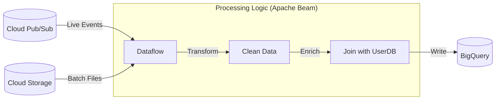

# SECTION 32: Data Pipelines: Dataflow vs Dataproc

> **Official Doc Reference**: [Dataflow](https://cloud.google.com/dataflow/docs)

## 1️⃣ Overview
You have raw data. You need to clean it, aggregate it, and load it into BigQuery. Who does the work?

## 2️⃣ The Decision Matrix (Memorize This)

| Feature | **Dataflow** | **Dataproc** |
| :--- | :--- | :--- |
| **Core Engine** | **Apache Beam** | **Apache Hadoop / Spark** |
| **Philosophy** | Serverless / NoOps | Managed Cluster (SaaS) |
| **Best For** | **New** pipelines, Streaming | **Migrating** existing Legacy Spark jobs |
| **Batch/Stream** | Unified (Same code for both) | Separate setups |
| **Autoscaling** | Horizontal & **Vertical** (Prime) | Horizontal only |

## 3️⃣ Architecture Diagram: The ETL Pipeline

## 4️⃣ Dataflow Key Concepts
*   **Windowing**: "Process data in 5-minute chunks." Essential for streaming.
*   **Watermarks**: Handling "Late Data". (e.g., A mobile phone sends data from 10:00 AM at 10:05 AM because it lost signal). Dataflow knows how to handle this correctly.
*   **Flex Templates**: You write the code, build a Docker image, and give it to a business analyst. They just click "Run" in the UI without seeing code.

## 5️⃣ Dataproc Key Concepts
*   **Ephemeral Clusters**: Spin up a cluster -> Run Job -> Delete Cluster. (Saves massive money vs running 24/7).
*   **PIG/HIVE**: Supports the entire Hadoop ecosystem tools.

## 6️⃣ Hands-On Lab: Run a Template 🏃
**Mission:** Read a CSV from Storage and write to BigQuery.
1.  **Go to:** Dataflow > Create Job from Template.
2.  **Template:** "Text Files on Cloud Storage to BigQuery".
3.  **Input:** `gs://cloud-samples-data/weather/weather.csv`
4.  **Output:** Your BigQuery Dataset.
5.  **Run:** Watch as it spins up workers, processes the graph, and shuts down.

## 7️⃣ Interview-Ready Q&A
**Q: "I need to process data exactly once, ensuring no duplicates. Which tool?"**
*   **A:** **Dataflow**. It guarantees "Exactly-Once" processing semantics, even in streaming mode.

**Q: "We have a team of Spark experts. Should we learn Beam?"**
*   **A:** No. Use **Dataproc**. Leverage their existing skills.

## 💡 One-Line Summary
> Use **Dataproc** for legacy Spark/Hadoop migrations; use **Dataflow** for all new, serverless, or streaming pipelines.

## 🚨 Checkpoint Questions
1.  **Which service supports "Vertical Autoscaling" (Dataflow Prime)?**
    *   *Answer: Dataflow.*
2.  **Does Dataproc use VMs?**
    *   *Answer: Yes. You can see the Compute Engine instances in your console.*
3.  **What is the programming model for Dataflow?**
    *   *Answer: Apache Beam (Batch + Stream).*
