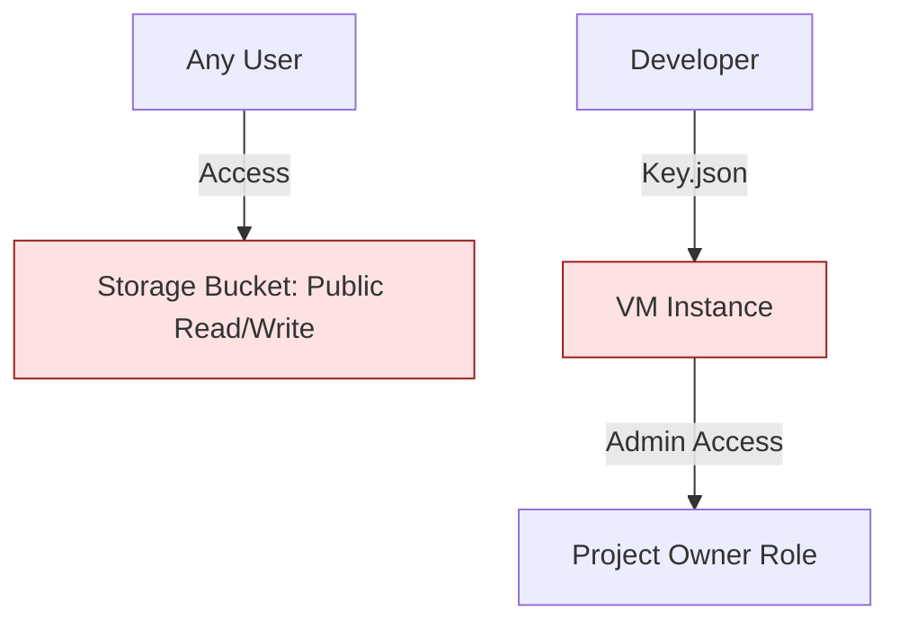

# SECTION 32: Security Capstone (Red Team Audit)

## 🕵️‍♂️ The Scenario
You are a Security Engineer auditing a "Shadow IT" project created by a junior developer.
The project is "Working", but it is a **Security Nightmare**.

## 1️⃣ The "Bad" Architecture

## 2️⃣ The Objectives
1.  **Identify:** Find 3 Critical Vulnerabilities.
2.  **Remediate:** Lock them down using CLI.
3.  **Verify:** Confirm access is Denied for unauthorized users.

## 3️⃣ Lab Steps (Guided) 🛠️

### Step 1: Reconnaissance
Run these commands to find the holes.
1.  `gcloud projects get-iam-policy [PROJECT_ID]`
    *   *Look for:* `roles/owner` on a Service Account.
    *   *Look for:* `keys` downloaded to local machines (simulated).
2.  `gcloud storage buckets get-iam-policy gs://[BUCKET_NAME]`
    *   *Look for:* `allUsers` having `roles/storage.objectAdmin`.

### Step 2: The Fixes 🛡️
*   **Fix 1: Bucket Public Access**
    *   *Command:* `gcloud storage buckets remove-iam-policy-binding gs://my-bucket --member=allUsers --role=roles/storage.objectAdmin`
    *   *Better:* Enable **Public Access Prevention** (PAP) on the bucket.
*   **Fix 2: Overprivileged Service Account**
    *   *Task:* Downgrade the VM's Service Account from `Owner` to `Storage Object Viewer` + `Metric Writer`.
*   **Fix 3: Firewall Open Ports**
    *   *Task:* Delete the `0.0.0.0/0` SSH allow rule. Use **IAP (Identity-Aware Proxy)** instead.

## 4️⃣ Checkpoint Questions
**Q1. You see a bucket policy granting `roles/storage.objectViewer` to `allUsers`. What does this mean?**
*   A. Only authenticated Google users can view.
*   B. Only users in your organization can view.
*   C. Anyone on the entire internet can view.
*   D. It is disabled.
> **Answer: C.** "allUsers" = The Public Internet.

**Q2. Why is granting `roles/owner` to a VM Service Account bad?**
*   A. It costs more money.
*   B. If the VM is hacked, the attacker owns the entire project (can delete everything).
*   C. It slows down the VM.
*   D. It works fine.
> **Answer: B.** Blast Radius. Always use Least Privilege.

**Q3. How do you SSH into a VM without opening Port 22 to the world?**
*   A. Use a VPN.
*   B. Use IAP (Identity-Aware Proxy).
*   C. Use RDP.
*   D. Use Telnet.
> **Answer: B.** IAP tunnels traffic through Google's HTTPS load balancers, authenticating you before you reach the VM.
