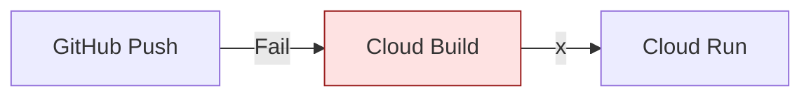

# SECTION 33: DevOps Capstone (The Broken Pipeline)

## 🕵️‍♂️ The Scenario
The Lead DevOps engineer quit yesterday.
He left a half-finished **Cloud Build** pipeline that fails 100% of the time.
You need to fix it and deploy the app to **Cloud Run**.

## 1️⃣ The "Bad" Pipeline

**Error Logs:**
1.  `Error: step 'pytest' failed. requirements.txt not found.`
2.  `Error: 403 Permission Denied. Service Account cannot deploy to Cloud Run.`

## 2️⃣ The Objectives
1.  **Debug:** Analyze the `cloudbuild.yaml` and IAM permissions.
2.  **Fix Code:** Add the missing file.
3.  **Fix IAM:** Grant the Cloud Build Service Account the right roles.
4.  **Verify:** A green Checkmark ✅ on the build.

## 3️⃣ Lab Steps (Guided) 🛠️

### Step 1: Fix the Container
*   *Issue:* The build fails because `pip install` cannot find `requirements.txt`.
*   *Task:* Create a dummy `requirements.txt` in your repo:
    ```text
    Flask==2.0.0
    gunicorn==20.1.0
    ```

### Step 2: Fix the Permissions (The main exam topic) 🔑
*   *Issue:* Cloud Build uses the default service account: `[PROJECT_NUMBER]@cloudbuild.gserviceaccount.com`.
*   By default, **it does not have permission to deploy to Cloud Run**.
*   *Task:* Go to IAM. Find the Cloud Build Service Account. Grant it:
    *   `Cloud Run Admin`
    *   `Service Account User` (to act as the runtime identity).

### Step 3: Trigger the Build 🚀
```bash
gcloud builds submit --config=cloudbuild.yaml .
```

## 4️⃣ Checkpoint Questions
**Q1. You get a "Permission Denied" error when Cloud Build tries to deploy to Cloud Run. What is missing?**
*   A. The developer is banned.
*   B. The `Cloud Run Admin` role on the Cloud Build Service Account.
*   C. The API is down.
*   D. You need to use Jenkins.
> **Answer: B.** Cloud Build is a robot. It needs explicit permission to "touch" Cloud Run.

**Q2. Your build passes, but the app crashes on startup with "ModuleNotFound". Where should you look first?**
*   A. Cloud Build logs.
*   B. Cloud Run logs.
*   C. VPC logs.
*   D. Billing console.
> **Answer: B.** If the build passes, the artifact is good. If startup fails, the runtime environment (Cloud Run) will show why (e.g. missing dependency).

**Q3. How do you automate this pipeline to run on every Git Push?**
*   A. Use a Cron Job.
*   B. Create a **Cloud Build Trigger**.
*   C. Use a Webhook manually.
*   D. It happens automatically.
> **Answer: B.** Triggers connect the Git Provider (GitHub) to the Build Service.
