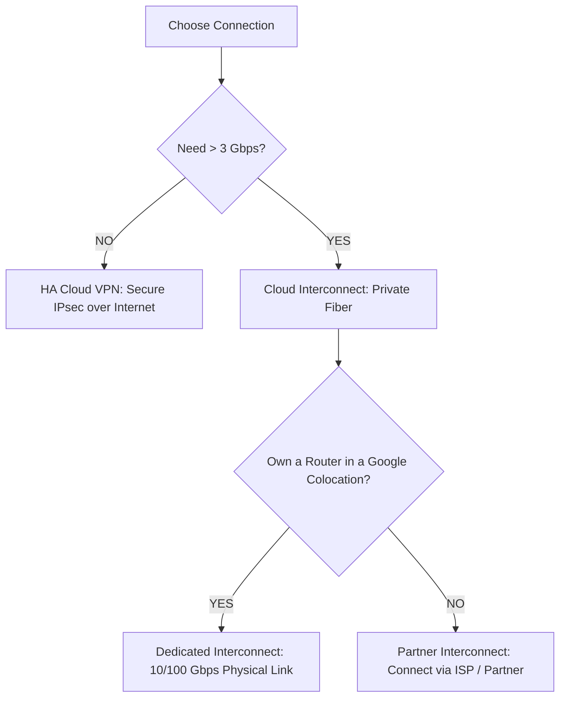

# Day 33: Hybrid Connectivity (VPN & Interconnect)

**Duration:** ⏱️ 60 Minutes  
**Level:** Intermediate  
**ACE Exam Weight:** ⭐⭐⭐⭐ High

---

## 🎯 Learning Objectives

By the end of Day 31, you will be able to:
*   **Design** secure bridges between On-Premises data centers and Google Cloud.
*   **Evaluate** the trade-offs between Cloud VPN, Partner Interconnect, and Dedicated Interconnect.
*   **Configure** High-Availability (HA) VPN with BGP dynamic routing.
*   **Identify** use cases for Direct Peering and Carrier Peering.

---

## 🏗️ 1. The Global Connectivity Spectrum

Bridging an on-premises network to GCP requires choosing between the **Public Internet** (VPN) and **Private Fiber** (Interconnect).

### Connectivity Selection Model



| Method | Bandwidth | Typical SLA | ACE Exam Target |
| :--- | :--- | :--- | :--- |
| **HA VPN** | Up to 3 Gbps | 99.99% | Budget-friendly, encrypted, quick setup. |
| **Partner Interconnect** | 50Mbps - 10Gbps | 99.99% | No physical facility presence, flexible speed. |
| **Dedicated Interconnect** | 10Gbps - 200Gbps | 99.99% | Highest volume, lowest latency, physical fiber. |

---

## 🛡️ 2. Cloud VPN: The Secure Tunnel

Cloud VPN uses **IPsec** to create an encrypted tunnel over the public internet.

*   **HA VPN (Recommended):** Uses two external IP addresses and two tunnels from different Google edge devices. Requires **Cloud Router** and **BGP** (Border Gateway Protocol) for dynamic routing.
*   **Security:** Traffic is encrypted at the source (On-prem) and decrypted at the destination (VPC).

> [!IMPORTANT]
> **ACE Exam Alert: The BGP Rule**
> HA VPN *requires* **Cloud Router**. You cannot use static routing and achieve the 99.99% SLA. Cloud Router exchanges IP ranges automatically using BGP.

---

## 🚄 3. Cloud Interconnect: The Private Wire

Interconnect provides a private, physical connection that does not traverse the public internet.

*   **Dedicated Interconnect:** You physically connect your router to Google's router in a colocation facility.
*   **Partner Interconnect:** You connect to a partner (like Equinix or AT&T), and they connect you to Google.
*   **Direct Peering:** Connecting to Google's public IP range (not for VPC traffic—mostly for GWS/YouTube).

> [!WARNING]
> **Encryption Note:** Cloud Interconnect is **NOT** encrypted by default. It is a private wire. If your compliance requires encryption over fiber, you must use **MACsec** (for Dedicated) or layer an **HA VPN over Interconnect**.

---

## 🧪 4. Hands-On Lab: Simulating a Hybrid Bridge

### 🧪 Lab Objective
Configure a virtual "On-Prem" to "Cloud" bridge using two VPCs and HA VPN.

### ✅ Steps

1.  **Prepare Networks**:
    *   Create VPC `on-prem-network` (Subnet: `10.1.0.0/24`).
    *   Create VPC `gcp-network` (Subnet: `192.168.1.0/24`).

2.  **Create HA VPN Gateway**:
    *   Initialize the gateway in `gcp-network`. Note the two interface IPs Google provides.

3.  **Configure Cloud Router**:
    *   Create a Cloud Router in each VPC.
    *   Assign an **ASN** (Autonomous System Number). Use `64512` for GCP and `64513` for "On-Prem".

4.  **Establish BGP Sessions**:
    *   Configure the tunnels to "talk." Once BGP status is green, you will see the `10.1.0.0/24` route appear in your `gcp-network` routing table automatically.

---

<!-- QUIZ_START -->
## 📝 5. Knowledge Check

1.  **A company needs to transfer 50TB of data every night from their data center to BigQuery. They require a 99.99% SLA and consistent sub-10ms latency. What should they use?**
    *   A. Cloud VPN.
    *   B. **Dedicated Interconnect.** ✅
    *   C. VPC Peering.
    *   D. Cloud Storage Transfer Service over Internet.

2.  **You are setting up an HA VPN. How many tunnels are required to meet the 99.99% SLA?**
    *   A. 1.
    *   B. **2 (from two different Google edge interfaces).** ✅
    *   C. 4.
    *   D. No tunnels, just an IP address.

3.  **Which routing protocol is mandatory when configuring Cloud Router for an HA VPN?**
    *   A. OSPF.
    *   B. **BGP.** ✅
    *   C. RIP.
    *   D. Static local routes.

4.  **True or False: Dedicated Interconnect traffic is encrypted by default using IPsec.**
    *   A. True.
    *   B. **False. It is a private line, but unencrypted unless MACsec or VPN-over-Interconnect is added.** ✅

5.  **Your company does not have a router in a Google Colocation facility but wants a private connection. Which service should you choose?**
    *   A. Dedicated Interconnect.
    *   B. **Partner Interconnect.** ✅
    *   C. Classic VPN.
    *   D. Cloud NAT.
<!-- QUIZ_END -->
---

<div class="checklist-card" x-data="{ 
    items: [
        { text: 'I understand when to choose VPN over Interconnect.', checked: false },
        { text: 'I know that HA VPN requires Cloud Router and BGP.', checked: false },
        { text: 'I can explain the difference between Dedicated and Partner Interconnect.', checked: false },
        { text: 'I understand that Interconnect is private but NOT encrypted by default.', checked: false }
    ]
}">
    <h3>
        <svg viewBox="0 0 24 24" fill="none" stroke="currentColor" stroke-width="2" stroke-linecap="round" stroke-linejoin="round" class="text-blurple">
            <path d="M22 11.08V12a10 10 0 1 1-5.93-9.14"></path>
            <polyline points="22 4 12 14.01 9 11.01"></polyline>
        </svg>
        Day 33 Mastery Checklist
    </h3>
    <template x-for="(item, index) in items" :key="index">
        <div class="checklist-item" @click="item.checked = !item.checked">
            <div class="checklist-box" :class="{ 'checked': item.checked }">
                <svg viewBox="0 0 24 24" fill="none" stroke="currentColor" stroke-width="3" stroke-linecap="round" stroke-linejoin="round">
                    <polyline points="20 6 9 17 4 12"></polyline>
                </svg>
            </div>
            <span x-text="item.text" :class="{ 'line-through text-slate-400': item.checked }"></span>
        </div>
    </template>
</div>

---

### 🗑️ Lab Cleanup (Mandatory)

> **⚠️ Critical:** Delete resources to avoid unecessary billing!

1.  **Delete Project:** (Fastest way)
    ```bash
    gcloud projects delete $PROJECT_ID
    ```
2.  **Or Delete Resources Individually:**
    ```bash
    # Example commands (verify before running)
    gcloud compute instances delete [INSTANCE_NAME] --quiet
    gcloud storage rm -r gs://[BUCKET_NAME]
    ```
