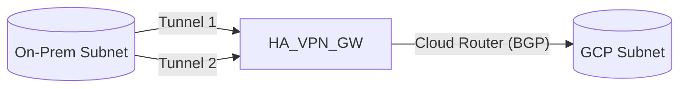

# SECTION 33: Hybrid Connectivity (VPN & Interconnect)

> **Official Doc Reference**: [Cloud VPN](https://cloud.google.com/network-connectivity/docs/vpn/concepts/overview) | [Cloud Interconnect](https://cloud.google.com/network-connectivity/docs/interconnect/concepts/overview)

## 1️⃣ The "Bridge" Problem
You have a data center (On-Prem). You have Google Cloud (VPC).
How do you connect them securely? You can't just send private traffic over the public internet without encryption.

## 2️⃣ The 3 Ways to Connect

| Method | Speed | SLA | Encryption | Cost | Best For |
| :--- | :--- | :--- | :--- | :--- | :--- |
| **Cloud VPN** | Up to 3 Gbps (HA) | 99.99% | **IPsec** (Encrypted) | Low | Small/Medium data, start-ups, backup. |
| **Partner Interconnect** | 50 Mbps - 10 Gbps | 99.99% | No (Private fiber) | Medium | Companies without a router in a Google Colocation facility. |
| **Dedicated Interconnect** | 10 Gbps - 100 Gbps | 99.99% | No (Private fiber) | High | Massive scale, huge data transfer. Physical cable requirements. |

## 3️⃣ Cloud VPN Deep Dive 🔒
It uses the public internet but creates an encrypted tunnel (IPsec).
*   **HA VPN (High Availability):** The standard. Uses 2 tunnels. If one fails, the other takes over (99.99% SLA).
*   **Classic VPN:** Retired. Don't use it.

## 4️⃣ Architecture: HA VPN

## 5️⃣ Real-World Analogy: The Tunnel vs The Train
*   **Cloud VPN** = **Armored Truck**.
    *   It drives on public roads (Internet).
    *   It is locked and safe (Encrypted).
    *   Traffic jams (Network congestion) can slow it down.
*   **Interconnect** = **Private Subway Line**.
    *   You dig a dedicated tunnel.
    *   Nobody else works there. It is yours.
    *   Guaranteed speed. Expensive to build.

## 6️⃣ Hands-On Lab: Set up a VPN (Simulation) 🛠️
*Since we don't have a real on-prem router, we will stimulate it using 2 GCP regions.*

1.  **VPC 1 (On-Prem):** Create VPC `on-prem` in `us-east1`.
2.  **VPC 2 (Cloud):** Create VPC `cloud` in `us-west1`.
3.  **Create VPN Gateway:**
    *   Go to **Hybrid Connectivity** > **VPN**.
    *   Create HA VPN in `cloud` linked to `on-prem`.
4.  **BGP Session:** Google uses BGP (Border Gateway Protocol) to exchange routes dynamically. "I have 10.0.1.0/24 here!"

## 7️⃣ Checkpoint Questions
**Q1. You need to transfer 20TB of data daily. Latency must be consistent. VPN is too variable. What do you choose?**
*   A. Cloud VPN
*   B. **Dedicated Interconnect**
*   C. VPC Peering
> **Answer: B.** Consistent low latency + High bandwidth = Interconnect.

**Q2. Does Dedicated Interconnect encrypt traffic by default?**
*   A. Yes.
*   B. **No.**
> **Answer within Answer:** It is a private wire, so it's "safe", but not "encrypted". If you need encryption over Interconnect, you must layer **MACsec** on top.

**Q3. Which protocol is required for HA VPN to share routes dynamically?**
*   A. OSPF
*   B. RIP
*   C. **BGP (Border Gateway Protocol)**
> **Answer: C.** Cloud Router requires BGP.

## ✅ Day 33 Checklist

    <h3>
        <svg viewBox="0 0 24 24" fill="none" stroke="currentColor" stroke-width="2" stroke-linecap="round" stroke-linejoin="round" width="24" height="24" class="text-blurple">
            <path d="M22 11.08V12a10 10 0 1 1-5.93-9.14"></path>
            <polyline points="22 4 12 14.01 9 11.01"></polyline>
        </svg>
        Day 33 Checklist
    </h3>
    <template x-for="(item, index) in items" :key="index">
        

            

                <svg viewBox="0 0 24 24" fill="none" stroke="currentColor" stroke-width="3" stroke-linecap="round" stroke-linejoin="round">
                    <polyline points="20 6 9 17 4 12"></polyline>
                </svg>
            

            
        

    </template>

