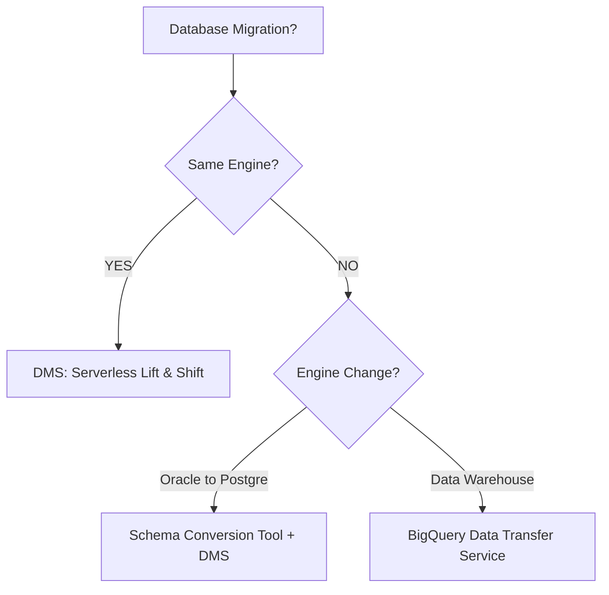

# Day 34: Database Migration Strategies

**Duration:** ⏱️ 60 Minutes  
**Level:** Intermediate  
**ACE Exam Weight:** ⭐⭐⭐⭐ High

---

## 🎯 Learning Objectives

By the end of Day 34, you will be able to:
*   **Execute** zero-downtime migrations using Database Migration Service (DMS).
*   **Plan** heterogeneous migrations (e.g., Oracle to PostgreSQL) using Schema Conversion tools.
*   **Automate** data ingestion into BigQuery using the Data Transfer Service.
*   **Differentiate** between Homogeneous and Heterogeneous migration paths.

---

## 🚚 1. The Migration Continuum

Moving a database is not a simple "copy-paste." It requires careful planning of the source, destination, and the "Change Data Capture" (CDC) method.

### Migration Decision Matrix

| Type | Examples | Best Tool | Complexity |
| :--- | :--- | :--- | :--- |
| **Homogeneous** | MySQL to Cloud SQL (MySQL) | **DMS** | 🟢 Low |
| **Heterogeneous** | SQL Server to PostgreSQL | **SCT + DMS** | 🔴 High |
| **Data Warehouse** | Teradata/S3 to BigQuery | **BQ Data Transfer** | 🟡 Medium |

---

## 🛠️ 2. Database Migration Service (DMS)

DMS is Google’s serverless tool for moving data into **Cloud SQL** and **AlloyDB**.

*   **Serverless Logic:** Google manages the migration instances; you only pay for the target database.
*   **Continuous Sync:** Uses source logs (like MySQL binary logs) to replicate every single write in real-time.
*   **Cutover:** Once the destination reflects the source, you perform a brief "cutover" (changing the app connection string), resulting in seconds of downtime instead of hours.

> [!IMPORTANT]
> **ACE Exam Alert: Connectivity**
> For DMS to work with an on-premises database, you must establish a path. The exam favorite is the **Reverse SSH Tunnel**—it's secure and doesn't require complex corporate firewall changes.

---

## 📦 3. BigQuery Data Transfer Service

If your goal is **Analytics**, you don't need DMS. You need the Data Transfer Service.

*   **Managed Connectors:** Built-in support for Google Ads, YouTube Analytics, AWS S3, and Azure Blob Storage.
*   **Scheduling:** Set it to run every hour, day, or week.
*   **Serverless:** No code needed. Just point-and-click configuration in the console.

---

## 🧪 4. Hands-On Lab: AWS to GCP Migration

### 🧪 Lab Objective
Configure a migration job that mocks moving an Amazon RDS (MySQL) instance to Cloud SQL.

### ✅ Steps

1.  **Initialize DMS**: Go to **Database Migration** > **Migration Jobs** > **Create Job**.
2.  **Define Source**:
    *   Set Source Type to **Amazon RDS for MySQL**.
    *   Enter the "RDS Endpoint" and credential details.
3.  **Define Destination**:
    *   Create a new Cloud SQL (MySQL) instance as the target.
4.  **Connectivity Method**:
    *   Choose **VPC Peering** (if connecting from another VPC) or **IP Allowlist**.
5.  **Validation**: Click **Verify**. DMS will check if it can read the source bins logs.
6.  **Execute**: Start the migration. Monitor the "Full Dump" vs. "Incremental" phases.

---

<!-- QUIZ_START -->
## 📝 5. Knowledge Check

1.  **You need to migrate a 500GB production PostgreSQL database from On-Premises to AlloyDB. You can only afford 30 seconds of downtime. What is the best strategy?**
    *   A. Export to SQL dump, upload to GCS, import to AlloyDB.
    *   B. **Use Database Migration Service (DMS) with continuous replication.** ✅
    *   C. Use gsutil cp to move the data files.
    *   D. Manual SQL copy-paste.

2.  **Which tool should you use to automatically import daily sales data from Amazon S3 into BigQuery for analysis?**
    *   A. Cloud Dataflow.
    *   B. **BigQuery Data Transfer Service.** ✅
    *   C. Cloud Pub/Sub.
    *   D. VPC Peering.

3.  **You want to migrate an Oracle database to Cloud SQL for PostgreSQL. Why can't you use DMS by itself?**
    *   A. DMS is only for small databases.
    *   B. **Oracle and PostgreSQL use different schemas and dialects; you need a Schema Conversion Tool first.** ✅
    *   C. Google doesn't support PostgreSQL.
    *   D. Oracle only works on-premises.

4.  **What is a common connectivity method used by DMS to securely connect to an on-premises database through a firewall?**
    *   A. Public Internet.
    *   B. **Reverse SSH Tunnel.** ✅
    *   C. ICMP Pings.
    *   D. FTP.

5.  **True or False: BigQuery Data Transfer Service requires you to write custom Python scripts to move data from YouTube Analytics.**
    *   A. True.
    *   B. **False. It is a managed, configuration-based service.** ✅
<!-- QUIZ_END -->
---

    <h3>
        <svg viewBox="0 0 24 24" fill="none" stroke="currentColor" stroke-width="2" stroke-linecap="round" stroke-linejoin="round" class="text-blurple">
            <path d="M22 11.08V12a10 10 0 1 1-5.93-9.14"></path>
            <polyline points="22 4 12 14.01 9 11.01"></polyline>
        </svg>
        Day 34 Mastery Checklist
    </h3>
    <template x-for="(item, index) in items" :key="index">
        

            

                <svg viewBox="0 0 24 24" fill="none" stroke="currentColor" stroke-width="3" stroke-linecap="round" stroke-linejoin="round">
                    <polyline points="20 6 9 17 4 12"></polyline>
                </svg>
            

            
        

    </template>

