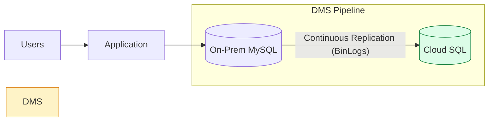

# SECTION 35: Database Migration Strategies

> **Official Doc Reference**: [Database Migration Service](https://cloud.google.com/database-migration) | [BigQuery Data Transfer](https://cloud.google.com/bigquery/docs/transfer-service-overview)

## 1️⃣ Overview: The Migration Journey 🚚
Migration isn't just "copy-paste". It's about moving data safely with minimal downtime.
*   **Homogeneous:** Same engine (MySQL -> Cloud SQL for MySQL). *Easy.*
*   **Heterogeneous:** Different engine (Oracle -> PostgreSQL). *Hard.*

## 2️⃣ Database Migration Service (DMS) 🛠️
DMS is the "Easy Button" for **Lift and Shift** to Cloud SQL or AlloyDB.

### Core Features
*   **Serverless:** No migration instanced to manage.
*   **Continuous Replication:** Keeps source and destination in sync using **CDC (Change Data Capture)** until you flip the switch.
*   **Minimal Downtime:** You only stop the app for seconds to change the database IP.

### Architecture Diagram: Zero-Downtime Migration

## 3️⃣ Homogeneous vs Heterogeneous (Exam Gold 🥇)

| Scenario | Source | Destination | Difficulty | Best Tool |
| :--- | :--- | :--- | :--- | :--- |
| **Homogeneous** | AWS RDS (MySQL) | Cloud SQL (MySQL) | 🟢 Easy | **DMS** |
| **Homogeneous** | On-Prem PostgreSQL | AlloyDB | 🟢 Easy | **DMS** |
| **Heterogeneous** | Oracle (PL/SQL) | Cloud SQL (Postgre) | 🔴 Hard | **Schema Conversion Tool + Datastream** |
| **Data Warehouse** | Teradata / S3 | BigQuery | 🟡 Medium | **BigQuery Data Transfer Service** |

## 4️⃣ BigQuery Data Transfer Service 📦
Focused on moving **Analytics Data** into BigQuery.
*   **Sources:** Google Ads, Youtube, AWS S3, Azure Blob, Teradata, Redshift.
*   **Schedule:** "Run this transfer every night at 2 AM."

## 5️⃣ Exam Traps 🚨
*   **Trap:** "I need to migrate Oracle to Cloud SQL. Can I use DMS directly?"
    *   *Answer:* **No.** DMS handles the *data*, but schemas are different. You need a **Schema Conversion Tool** first to fix the PL/SQL vs T-SQL incompatibility.
*   **Trap:** "I want to move 100TB of minimal-downtime data from On-Prem. Bandwidth is low."
    *   *Answer:* Use **Transfer Appliance** (Ship hard drives) for the bulk, then use DMS/Replication for the "catch up" sync.
*   **Trap:** "Should I use `gsutil cp` for my database backup?"
    *   *Answer:* For a consistent snapshot, NO. Stop writes first or use a native dump tool (mysqldump) while the DB is locked, *then* `gsutil cp`.

## 6️⃣ Hands-On Lab: Mock a Migration 🧪
1.  **Go to:** Database Migration > Migration Jobs.
2.  **Create Job:** "Migrate AWS to GCP".
3.  **Source:** Amazon RDS (MySQL).
4.  **Destination:** Cloud SQL (MySQL).
5.  **Connectivity:** Choose "VPC Peering" or "Reverse SSH Tunnel" (DMS requires a path back to the source!).
6.  **Define:** It will ask for the source hostname/IP and credentials.

> **Pro Tip:** In the exam, if connectivity is tricky, look for **Reverse SSH Tunnel** as the "safe" way to connect on-prem DBs without opening firewall ports globally.

## 7️⃣ Checkpoint Questions
<!--
**Q1. You are migrating an On-Prem MySQL DB to Cloud SQL. You cannot afford more than 5 minutes of downtime.**
*   A. Export data to CSV, upload to GCS, import to Cloud SQL.
*   B. Use `mysqldump` and restore.
*   C. Use **Database Migration Service (DMS)** with continuous replication.
*   D. Use BigQuery Data Transfer Service.
> **Answer: C.** DMS replicates data in real-time. You only effectively down the app when you switch the connection string.

**Q2. Which tool is best for moving data from Google Ads and YouTube Analytics into BigQuery?**
*   A. Cloud Dataflow
*   B. **BigQuery Data Transfer Service**
*   C. Cloud Pub/Sub
*   D. Dataprep
> **Answer: B.** It has built-in connectors for SaaS platforms (Ads, YouTube, S3).
-->
