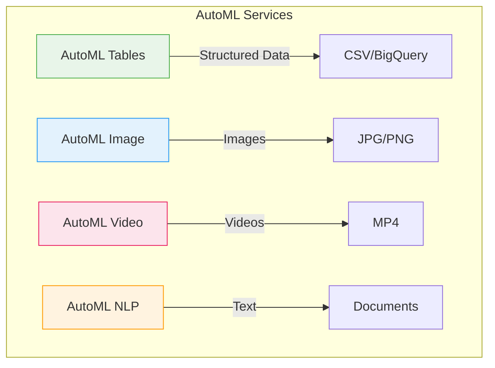
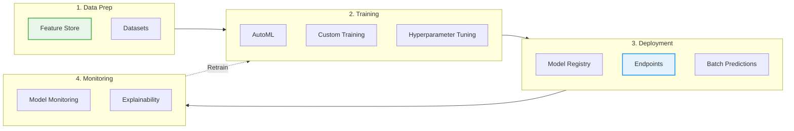
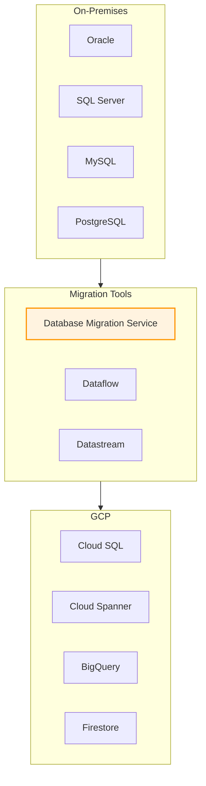
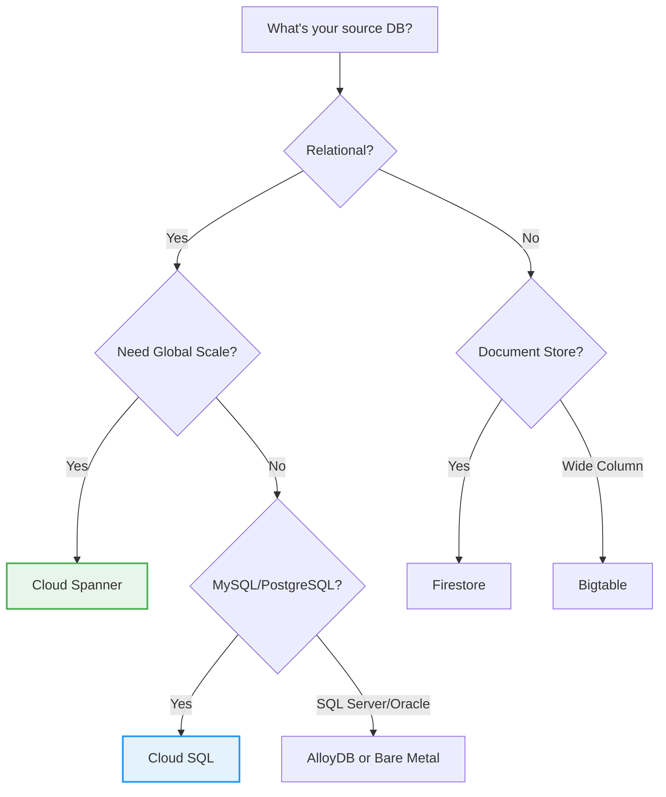

# Day 34: Database Modernization & AI/ML Integration

**Duration:** ⏱️ 60 Minutes  
**Level:** Intermediate to Advanced  
**ACE Exam Weight:** ⭐⭐ Medium (Migration & AI basics appear in scenario questions)

---

> [!TIP]
> **TL;DR (AI/ML & Migration Quick Reference)**  
> **AutoML** = No-code ML (upload data, get model). **Custom Training** = Bring your own TensorFlow/PyTorch. **Database Migration Service (DMS)** = Minimal-downtime migrations to Cloud SQL. **Feature Store** = Share reusable ML features. For exam: "Build model without coding" = AutoML, "Migrate MySQL" = DMS.

---

## 🎯 Learning Objectives

| ✅ Skill | Why It Matters |
|---------|----------------|
| **Understand** Vertex AI platform | Unified ML platform for all skill levels |
| **Compare** AutoML vs Custom Training | Pick the right approach for the team |
| **Design** database migration strategies | Move legacy DBs to GCP |
| **Apply** modernization best practices | Avoid common migration pitfalls |
| **Identify** the right AI/ML service | Match service to use case |

---

## 🧠 1. Vertex AI: The Unified ML Platform (Plain-English)

**Vertex AI = One-stop shop for all ML needs.**

Think of it like a **car factory**: You can either buy a pre-built car (AutoML) or bring your own design and use their manufacturing equipment (Custom Training).

### 💡 Real-World Analogy: Restaurant Kitchen

| Approach | Restaurant Analogy | Vertex AI Equivalent |
|----------|-------------------|---------------------|
| **No ML Experience** | Order from menu | AutoML (data in, model out) |
| **Some Experience** | Customize existing dish | AutoML with tuning |
| **Expert Chef** | Create your own recipe | Custom Training (TensorFlow/PyTorch) |
| **Restaurant Chain** | Standardized recipes everywhere | Feature Store + Model Registry |

---

## 🤖 2. AutoML vs Custom Training

### Decision Matrix

| Factor | AutoML | Custom Training |
|--------|--------|-----------------|
| **Coding Required** | ❌ No code | ✅ Python/TensorFlow/PyTorch |
| **Time to First Model** | Hours | Days to Weeks |
| **Data Required** | Minimum samples | Large datasets |
| **Customization** | Limited | Full control |
| **Cost** | Higher per prediction | Lower at scale |
| **Best For** | POCs, business users | Production ML teams |

### Supported Data Types



---

## 🔄 3. Vertex AI Components

### The ML Lifecycle in Vertex AI



### Key Components Explained

| Component | Purpose | ACE Exam Relevance |
|-----------|---------|-------------------|
| **Feature Store** | Share ML features across teams | "Reuse features" questions |
| **Workbench** | Managed Jupyter notebooks | "Data scientist environment" |
| **Pipelines** | Orchestrate ML workflows | Similar to Cloud Composer |
| **Model Registry** | Version control for models | "Model governance" |
| **Endpoints** | Real-time predictions | "Low latency inference" |
| **Batch Predictions** | Large-scale offline scoring | "Process millions of records" |

---

## 📊 4. Database Modernization Strategies

### Migration Approaches



### Database Migration Service (DMS)

**DMS = Managed, minimal-downtime migrations.**

| Feature | Description |
|---------|-------------|
| **Supported Sources** | MySQL, PostgreSQL, SQL Server, Oracle |
| **Supported Targets** | Cloud SQL, AlloyDB |
| **Migration Type** | Continuous replication (near-zero downtime) |
| **Security** | Private IP, Cloud KMS encryption |

### Migration Decision Tree



---

## 🛠️ 5. Hands-On Lab: Train an AutoML Model

**Mission:** Build a customer churn prediction model without writing code.

### Step 1: Prepare Data
```bash
# Download sample dataset
curl -O https://storage.googleapis.com/cloud-samples-data/ai-platform/census/adult.csv

# Upload to Cloud Storage
gsutil cp adult.csv gs://YOUR_BUCKET/data/
```

### Step 2: Create Dataset in Vertex AI
1. Go to **Vertex AI** > **Datasets**
2. Click **Create Dataset**
3. Select **Tabular** > **Regression/Classification**
4. Import from Cloud Storage: `gs://YOUR_BUCKET/data/adult.csv`

### Step 3: Train AutoML Model
1. Go to **Training** > **Train New Model**
2. Select your dataset
3. Choose target column: `income` (>50K or <=50K)
4. Set training budget: **1 node hour** (for testing)
5. Click **Start Training**

### Step 4: Deploy & Predict
```bash
# Get predictions using REST API
curl -X POST \
  -H "Authorization: Bearer $(gcloud auth print-access-token)" \
  -H "Content-Type: application/json" \
  "https://us-central1-aiplatform.googleapis.com/v1/projects/PROJECT_ID/locations/us-central1/endpoints/ENDPOINT_ID:predict" \
  -d '{
    "instances": [
      {"age": 35, "workclass": "Private", "education": "Bachelors"}
    ]
  }'
```

---

## ⚠️ 6. Common Pitfalls & Pro Tips

### ❌ Migration Mistakes
| Mistake | Problem | Solution |
|---------|---------|----------|
| Big-bang migration | High risk, long downtime | Use phased approach with DMS |
| Ignoring schema differences | Oracle → PostgreSQL issues | Run schema conversion first |
| No testing environment | Production surprises | Always create staging replica |

### ✅ Pro Tips
*   **Use Datastream** for change data capture (CDC) to BigQuery
*   **Feature Store** prevents recomputing the same features
*   **AutoML is expensive** for high-volume predictions—consider exporting to TensorFlow Lite
*   **Monitor model drift** with Vertex AI Model Monitoring

---

## 🎯 7. ACE Exam Focus

### Service Selection Matrix

| Scenario | Best Service |
|----------|-------------|
| "Build ML model without coding" | **AutoML** |
| "Train custom TensorFlow model" | **Custom Training** |
| "Migrate MySQL with minimal downtime" | **Database Migration Service** |
| "Share features between ML teams" | **Feature Store** |
| "Real-time predictions at scale" | **Vertex AI Endpoints** |
| "Batch process millions of records" | **Batch Predictions** |

### Exam Traps
*   ⚠️ **AutoML ≠ Free**: Training costs node-hours
*   ⚠️ **DMS only supports certain databases**: Check compatibility
*   ⚠️ **Feature Store is for ML features**, not general caching

---

<!-- QUIZ_START -->
## 📝 8. Knowledge Check Quiz

1. **Which Vertex AI feature allows business users to build ML models without coding?**
    *   A. Custom Training
    *   B. **AutoML** ✅
    *   C. Feature Store
    *   D. Workbench

2. **What is the purpose of Vertex AI Feature Store?**
    *   A. Store training datasets
    *   B. **Share reusable ML features across teams** ✅
    *   C. Deploy models to production
    *   D. Monitor model performance

3. **Which service provides minimal-downtime database migration to Cloud SQL?**
    *   A. Dataflow
    *   B. Transfer Service
    *   C. **Database Migration Service** ✅
    *   D. Cloud Composer

4. **You need to migrate an Oracle database to GCP with the least operational overhead. What should you use?**
    *   A. Lift and shift to Compute Engine
    *   B. **AlloyDB or Bare Metal Solution** ✅
    *   C. Cloud Spanner
    *   D. Firestore

5. **Which Vertex AI component is used for real-time, low-latency predictions?**
    *   A. Batch Predictions
    *   B. Pipelines
    *   C. **Endpoints** ✅
    *   D. Workbench
<!-- QUIZ_END -->

---

## ✅ Day 34 Checklist

- [ ] Understand AutoML vs Custom Training trade-offs
- [ ] Know Vertex AI component purposes
- [ ] Understand database migration options
- [ ] Complete the AutoML hands-on lab
- [ ] Pass the quiz with 80%+

---

### 🚀 What's Next?
**Day 35: Week 5 Review**
*   Consolidate Data & Hybrid knowledge
*   Practice scenario-based questions
*   Review migration patterns

<!-- FLASHCARDS
[
  {"term": "Vertex AI", "def": "Unified ML platform. Combines AutoML, Custom Training, and MLOps tools."},
  {"term": "AutoML", "def": "No-code ML. Upload data, get a trained model. Best for POCs and business users."},
  {"term": "Custom Training", "def": "Bring your own code (TensorFlow/PyTorch). Full control over model architecture."},
  {"term": "Feature Store", "def": "Centralized repository for ML features. Prevents duplicate feature engineering."},
  {"term": "Database Migration Service", "def": "Managed service for near-zero downtime database migrations to Cloud SQL."},
  {"term": "Endpoints", "def": "Managed infrastructure for real-time model predictions. Auto-scales based on traffic."}
]
-->

---

### 🗑️ Lab Cleanup (Mandatory)

> **⚠️ Critical:** Delete resources to avoid unecessary billing!

1.  **Delete Project:** (Fastest way)
    ```bash
    gcloud projects delete $PROJECT_ID
    ```
2.  **Or Delete Resources Individually:**
    ```bash
    # Example commands (verify before running)
    gcloud compute instances delete [INSTANCE_NAME] --quiet
    gcloud storage rm -r gs://[BUCKET_NAME]
    ```
