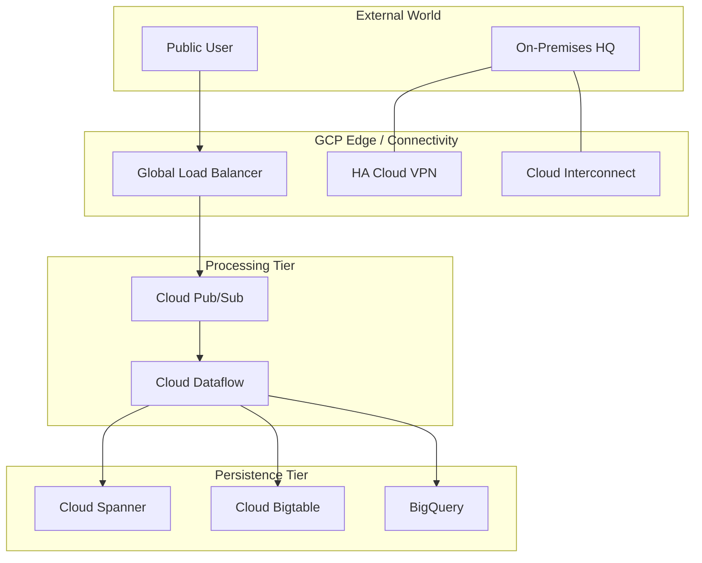

# Day 35: Week 5 Review & Mock Exam

**Duration:** ⏱️ 90 Minutes  
**Level:** Comprehensive  
**ACE Exam Weight:** ⭐⭐⭐⭐⭐ High-Frequency Synthesis

---

## 🎯 Week 5 Mastery Objective

Week 5 shifted the focus from individual services to **System Architecture**. You learned how to bridge physical data centers to the cloud, how to process petabytes of data serverlessly, and how to migrate legacy databases with zero downtime.

---

## 🏗️ 1. The Global Architecture Recap

---

## 🧠 2. The Professional Decision Matrix

If you face these requirements in the exam, choose these services:

| Requirement | Choose This | Key Rationale |
| :--- | :--- | :--- |
| **Global SQL consistency** | **Cloud Spanner** | The only GCP database with regional/global synchronous replication. |
| **Millisecond latency IoT writes** | **Bigtable** | Designed for sustained high-throughput write workloads. |
| **Hadoop/Spark Expert Team** | **Dataproc** | Leverage existing scripts (SaaS model) rather than rewriting in Beam. |
| **"At Least Once" Messaging** | **Pub/Sub** | Global bus for decoupling systems. |
| **50TB Migration (No Fiber)** | **Transfer Appliance** | Physical shipping is faster than low-bandwidth internet uploads. |
| **PostgreSQL with 99.99% HA** | **Cloud SQL / AlloyDB** | Managed PostgreSQL with automatic failover and replicas. |

---

## 📝 3. Week 5 Mock Exam (ACE Alignment)

1.  **A logistics company needs to track 500,000 trucks in real-time. Each truck sends an update every 5 seconds. The data must be available for real-time dashboards and long-term history. What is the recommended architecture?**
    *   A. Cloud SQL for all data.
    *   B. **Pub/Sub (Ingest) -> Dataflow (Process) -> Bigtable (Real-time) + BigQuery (History).** ✅
    *   C. App Engine -> Cloud Storage.
    *   D. Compute Engine -> Local SSD.

2.  **You need to connect an on-premises data center to GCP with a 10Gbps connection that MUST be encrypted for regulatory compliance. You choose Dedicated Interconnect. What additional step is required?**
    *   A. Interconnect is encrypted by default.
    *   B. **Configure MACsec or an HA VPN tunnel over the physical Interconnect line.** ✅
    *   C. Use Cloud Armor.
    *   D. Enable VPC Service Controls.

3.  **Which BigQuery pricing model allows for automatic scaling of processing power based on workload, ensuring a predictable budget?**
    *   A. On-Demand Pricing.
    *   B. **Edition Pricing (Capacity/Slots).** ✅
    *   C. Flat-rate Storage.
    *   D. BigTable Reserved Units.

4.  **You are migrating 20 MySQL databases to Google Cloud. You want a tool that manages the replication and allows for a 'one-click' cutover with minimal downtime. Which service should you use?**
    *   A. Storage Transfer Service.
    *   B. **Database Migration Service (DMS).** ✅
    *   C. gsutil rsync.
    *   D. Compute Engine Snapshots.

5.  **What is the primary difference between Dataflow and Dataproc?**
    *   A. Dataflow is for VMs, Dataproc is for containers.
    *   B. **Dataflow is serverless/NoOps; Dataproc provides managed Hadoop/Spark clusters.** ✅
    *   C. Dataflow only handles batch data.
    *   D. Dataproc is only for small datasets.

---

    <h3>
        <svg viewBox="0 0 24 24" fill="none" stroke="currentColor" stroke-width="2" stroke-linecap="round" stroke-linejoin="round" class="text-blurple">
            <path d="M22 11.08V12a10 10 0 1 1-5.93-9.14"></path>
            <polyline points="22 4 12 14.01 9 11.01"></polyline>
        </svg>
        Week 5 Readiness Checklist
    </h3>
    <template x-for="(item, index) in items" :key="index">
        

            

                <svg viewBox="0 0 24 24" fill="none" stroke="currentColor" stroke-width="3" stroke-linecap="round" stroke-linejoin="round">
                    <polyline points="20 6 9 17 4 12"></polyline>
                </svg>
            

            
        

    </template>

