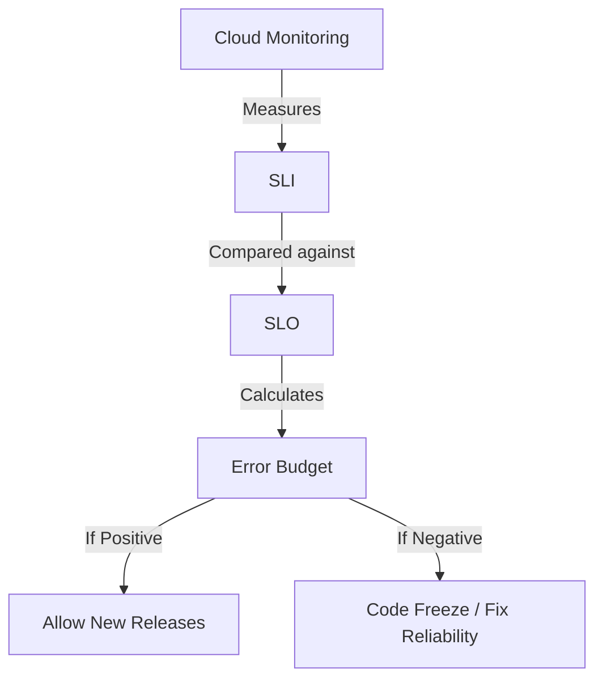

# SECTION 36: SRE Principles & Cloud Operations

> **Official Doc Reference**: [Google SRE Book](https://sre.google/books/)

## 1️⃣ Overview
**Site Reliability Engineering (SRE)** is what happens when you ask a Software Engineer to design an Operations function.
*   **Core Belief**: "Hope is not a strategy."
*   **Goal**: Automate everything. Eliminate "Toil" (manual, repetitive work).

## 2️⃣ The "S" Acronyms (SLI vs SLO vs SLA)
This is the most confusing topic for beginners. Let's simplify.

| Term | Full Name | Definition | Audience | Example |
| :--- | :--- | :--- | :--- | :--- |
| **SLI** | Service Level **Indicator** | *What is happening right now?* (The Metric) | Engineers | "Request latency is 150ms." |
| **SLO** | Service Level **Objective** | *What is our target?* (The Goal) | Engineers/Product | "99% of requests should be < 200ms." |
| **SLA** | Service Level **Agreement** | *What is the penalty?* (The Contract) | Lawyers/Customers | "If < 95% success, we refund 10%." |

> **Memory Hook:** **I**ndicator (I see it), **O**bjective (Our goal), **A**greement (Attorney).

## 3️⃣ Error Budgets
SREs don't aim for 100% uptime. 100% is too expensive and slows down innovation.
We aim for the **SLO** (e.g., 99.9%).
*   **The Math**: 100% - 99.9% = **0.1%**.
*   **The Budget**: This 0.1% is your **Error Budget**.
*   **How to use it**: You "spend" this budget to launch risky new features.
    *   *If Budget > 0*: "Launch the update! Be bold!"
    *   *If Budget < 0*: "Freeze launches. Focus on reliability until the budget refills."

## 4️⃣ Toil Reduction
Toil is work that is:
1.  Manual.
2.  Repetitive.
3.  Tactical (No long-term value).
4.  linearly scaling (More users = More work).

*   *SRE Rule:* Toil must be < 50% of your time. The other 50% must be engineering (coding automation).

## 5️⃣ Architecture Diagram: SRE Process

## 6️⃣ Hands-On Lab: Set an SLO in Cloud Monitoring 📊
1.  **Go to:** Monitoring > Services.
2.  **Define Service:** "My App Engine Service".
3.  **Choose SLI:** "Availability" (Success Rate).
4.  **Set SLO:** 99.5% Compliance.
5.  **Visualize:** See the "Burn Rate" chart. It tells you "At this rate, you will violate your SLO in 3 days."

## 7️⃣ Checkpoint Questions
<!--
**Q1. True or False: SREs strive for 100% availability.**
    *   *Answer: False. 100% is impossible and freezes innovation.* Wait, options must be A/B type?
    *   A. True
    *   B. False
> **Answer: B.** False. 100% is impossible and freezes innovation.

**Q2. Who consumes the SLA?**
*   A. Engineers
*   B. **The External Customer (and Lawyers).**
*   C. Product Managers
*   D. None
> **Answer: B.**

**Q3. If you exhaust your Error Budget, what should you do?**
*   A. Keep deploying
*   B. **Stop new feature releases. Focus on stability.**
*   C. Ignore it
*   D. Increase the budget
> **Answer: B.**
-->

## ✅ Day 36 Checklist

    <h3>
        <svg viewBox="0 0 24 24" fill="none" stroke="currentColor" stroke-width="2" stroke-linecap="round" stroke-linejoin="round" width="24" height="24" class="text-blurple">
            <path d="M22 11.08V12a10 10 0 1 1-5.93-9.14"></path>
            <polyline points="22 4 12 14.01 9 11.01"></polyline>
        </svg>
        Day 36 Checklist
    </h3>
    <template x-for="(item, index) in items" :key="index">
        

            

                <svg viewBox="0 0 24 24" fill="none" stroke="currentColor" stroke-width="3" stroke-linecap="round" stroke-linejoin="round">
                    <polyline points="20 6 9 17 4 12"></polyline>
                </svg>
            

            
        

    </template>

