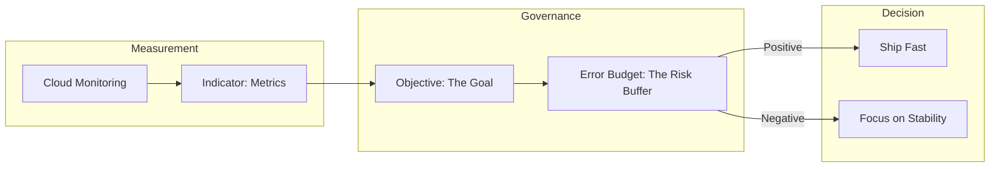

# Day 36: SRE Principles & Cloud Operations

**Duration:** ⏱️ 60 Minutes  
**Level:** Intermediate  
**ACE Exam Weight:** ⭐⭐⭐⭐ High

---

## 🎯 Learning Objectives

By the end of Day 36, you will be able to:
*   **Define** Site Reliability Engineering (SRE) and its core difference from traditional Ops.
*   **Design** observability frameworks using SLIs, SLOs, and SLAs.
*   **Manage** the Error Budget to balance innovation and stability.
*   **Identify** and eliminate "Toil" through engineering automation.

---

## 🏗️ 1. SRE: Engineering for Reliability

**Site Reliability Engineering (SRE)** is what happens when you ask a software engineer to design an operations function. Google pioneered SRE to replace a "toss it over the wall" culture with shared responsibility and automation.

### Core Tenets
*   **Embracing Risk:** 100% uptime is the wrong target. It's too expensive and stops you from deploying new features.
*   **Toil Reduction:** SREs should spend no more than 50% of their time on manual tasks. The other 50% must be spent on developing automation code.
*   **Monitoring:** Moving from "Is it up?" to "How happy are the users?"

---

## 📊 2. The Golden Triangle (SLI vs. SLO vs. SLA)

To measure happiness, you need a common language between business and engineering.

| Term | Concept | The Question | Audience | Example |
| :--- | :--- | :--- | :--- | :--- |
| **SLI** | **Indicator** | *What is the metric?* | Engineers | 99th Percentile Latency. |
| **SLO** | **Objective** | *What is the target?* | Team | Latency < 200ms for 99% of requests. |
| **SLA** | **Agreement** | *What is the penalty?* | Customers | "We pay you back if SLO is missed." |

### 🛠️ The Process Flow

---

## 📉 3. The Error Budget: Your License to Move

**Error Budget** = $100\% - \text{SLO}$.

If your SLO is 99.9%, your error budget is 0.1% of "unhappiness" per month.
*   **Spending the Budget:** Planned downtime, buggy releases, and experiments "spend" this budget.
*   **Running Out:** If you hit 0% error budget, feature releases **must stop**. The team pivots 100% to stability until the budget refills.

---

## 🛠️ 4. Hands-On Lab: Set an SLO 📊

### 🧪 Lab Objective
Configure a custom SLO for an App Engine or GKE service in Cloud Monitoring to monitor burn rate.

### ✅ Steps

1.  **Open Cloud Monitoring**: Navigate to **Services**.
2.  **Define Service**: Select an existing service (e.g., your App Engine frontend).
3.  **Create SLO**:
    *   **SLI Type**: Availability (Request count).
    *   **Performance Goal**: 99.9%.
    *   **Compliance Period**: Rolling 28 days.
4.  **Configure Alert**: Set a "Burn Rate" alert. This alerts you if your current failure rate will exhaust your entire error budget before the 28 days are up.
5.  **Visualize**: Check the dashboard to see your "Error Budget Remaining" percentage.

---

## 📝 5. Knowledge Check

<!-- QUIZ_START -->
1.  **You have a request-based service. You define an SLI as the ratio of successful requests to total requests. You set a target of 99.9%. What is this target called?**
    *   A. SLI.
    *   B. **SLO.** ✅
    *   C. SLA.
    *   D. Toil.

2.  **Your team has exhausted its 'Error Budget' for the current monthly window. According to SRE best practices, what should happen?**
    *   A. Increase the SLO to 100%.
    *   B. **Implement a feature freeze and focus 100% on system reliability.** ✅
    *   C. Ignore the budget and keep deploying to stay competitive.
    *   D. Delete the monitoring metrics.

3.  **Which term refers to manual, repetitive, tactical work that scales linearly with the number of users?**
    *   A. Engineering.
    *   B. **Toil.** ✅
    *   C. Innovation.
    *   D. Latency.

4.  **A legal contract states that a Cloud Service Provider will credit a customer 10% of their bill if service availability falls below 99.5%. What is this document?**
    *   A. SLI.
    *   B. SLO.
    *   C. **SLA.** ✅
    *   D. SRE handbook.

5.  **True or False: The primary goal of SRE is to achieve 100% uptime for all services at all times.**
    *   A. True.
    *   B. **False. 100% is too expensive and prevents innovation; SRE aims for a balance using Error Budgets.** ✅
<!-- QUIZ_END -->

---

    <h3>
        <svg viewBox="0 0 24 24" fill="none" stroke="currentColor" stroke-width="2" stroke-linecap="round" stroke-linejoin="round" class="text-blurple">
            <path d="M22 11.08V12a10 10 0 1 1-5.93-9.14"></path>
            <polyline points="22 4 12 14.01 9 11.01"></polyline>
        </svg>
        Day 36 Mastery Checklist
    </h3>
    <template x-for="(item, index) in items" :key="index">
        

            

                <svg viewBox="0 0 24 24" fill="none" stroke="currentColor" stroke-width="3" stroke-linecap="round" stroke-linejoin="round">
                    <polyline points="20 6 9 17 4 12"></polyline>
                </svg>
            

            
        

    </template>

