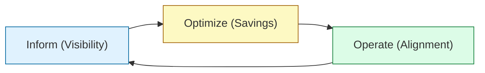

# Day 37: FinOps & Cost Optimization (Thinking Like a CFO)

**Duration:** ⏱️ 60 Minutes  
**Level:** Intermediate-Advanced  
**ACE Exam Weight:** ⭐⭐⭐⭐ High (Crucial for Resource Management)

---

## 🎯 Learning Objectives

By the end of Day 37, you will be able to:
*   **Differentiate** between SUDs, CUDs, and Spot VMs.
*   **Implement** resource labels for granular billing attribution.
*   **Design** cost-alerting workflows using Budgets and Cloud Functions.
*   **Analyze** historical spend using BigQuery billing exports.

---

## 🏗️ 1. The FinOps Lifecycle

FinOps isn't just "saving money"; it's about the **value** of every dollar spent. Google Cloud follows the three-phase lifecycle:



1.  **Inform:** Tagging resources, setting budgets, and visualizing spend in Looker Studio.
2.  **Optimize:** Rightsizing VMs, deleting orphaned disks, and purchasing CUDs.
3.  **Operate:** Automating cost-saving (e.g., stopping dev environments at night).

---

## 💰 2. Discount Models: The Holy Trinity

| Model | **Sustained Use (SUD)** | **Committed Use (CUD)** | **Spot VMs** |
| :--- | :--- | :--- | :--- |
| **Mechanic** | **Automatic**. Discount kicks in after 25% monthly usage. | **Contractual**. 1 or 3-year commitment. | **Insecure**. Google can reclaim capacity anytime. |
| **Max Savings** | ~30% | ~70% | **~91%** |
| **Best For** | Spiky/Unpredictable workloads. | Stable, 24/7 Production Databases. | Batch jobs, CI/CD, Stateless GKE nodes. |
| **Exam Trap** | You don't "buy" SUDs. They just happen. | You pay for the **commitment**, even if VMs are off. | Must handle **30-second termination** notice. |

---

## 🏷️ 3. Labels vs. Tags (ACE Must Know!)

This is one of the most common points of confusion in the exam.

*   **Labels (Billing):** Key-value pairs (e.g., `dept:marketing`) used for **cost allocation**. They show up in the billing export.
*   **Network Tags (Traffic):** Strings (e.g., `http-server`) used for **firewall rules** and routing. They have **nothing** to do with billing.

---

## 🚨 4. The "Safety Net": Budgets & Automation

**The Fact:** Budgets **DO NOT** stop your resources by default. They only send notifications.

### Pro Architecture: Automatic Shutdown
To automatically stop a project when it hits 100% budget:
1.  **Budget Alert** sends a message to a **Pub/Sub Topic**.
2.  **Cloud Function** is triggered by that topic.
3.  The Function uses the **Cloud Resource Manager API** to disable billing or the **Compute API** to stop VMs.

---

## 📊 5. Analyzing Spend with BigQuery

For any enterprise GCP setup, **Billing Export to BigQuery** is mandatory on Day 1.

```sql
-- Example: Get cost by Label (Team)
SELECT
  labels.value as team,
  SUM(cost) as total_cost
FROM `my-project.billing_dataset.gcp_billing_export`
LEFT JOIN UNNEST(labels) as labels ON labels.key = 'team'
GROUP BY 1
ORDER BY 2 DESC;
```

---

## 📝 6. Knowledge Check

<!-- QUIZ_START -->
1.  **A team needs to run a rendering job that can be interrupted and resumed. They want the lowest possible cost. Which compute option is best?**
    *   A. E2 instance with 3-year CUD.
    *   B. **Spot VM.** ✅ (Up to 91% discount for fault-tolerant tasks).
    *   C. Standard VM with SUD.
    *   D. Cloud Functions.

2.  **True or False: A Budget Alert set at 100% will automatically stop all running Compute Engine instances in a project to prevent further charges.**
    *   A. True
    *   B. **False.** ✅ (Budgets only alert; automation requires Pub/Sub + Cloud Functions).

3.  **You need to track which department is responsible for specific costs in a shared GCP project. What should you use?**
    *   A. Network Tags.
    *   B. **Resource Labels.** ✅ (Labels are for metadata and billing).
    *   C. IAM Roles.
    *   D. Project Descriptions.

4.  **You have a database server that must run 24/7 for the next 2 years. Which discount model provides the highest guaranteed savings?**
    *   A. Sustained Use Discount (SUD).
    *   B. **Committed Use Discount (CUD).** ✅ (Best for long-term stable workloads).
    *   C. Spot VMs.
    *   D. Free Tier.

5.  **Where can you view a visual dashboard of your GCP spending trends without writing custom code?**
    *   A. Cloud Shell.
    *   B. **Cloud Billing Reports (Console).** ✅ (Standard visual tool).
    *   C. Secret Manager.
    *   D. Deployment Manager.
<!-- QUIZ_END -->

---

<div class="checklist-card" x-data="{ 
    items: [
        { text: 'I understand the difference between Labels and Network Tags.', checked: false },
        { text: 'I know how to enable Billing Export to BigQuery.', checked: false },
        { text: 'I can explain why Budgets don\'t stop resources by default.', checked: false },
        { text: 'I know when to recommend Spot VMs over CUDs.', checked: false }
    ]
}">
    <h3>
        <svg viewBox="0 0 24 24" fill="none" stroke="currentColor" stroke-width="2" stroke-linecap="round" stroke-linejoin="round" class="text-blurple">
            <path d="M22 11.08V12a10 10 0 1 1-5.93-9.14"></path>
            <polyline points="22 4 12 14.01 9 11.01"></polyline>
        </svg>
        Day 37 Mastery Checklist
    </h3>
    <template x-for="(item, index) in items" :key="index">
        <div class="checklist-item" @click="item.checked = !item.checked">
            <div class="checklist-box" :class="{ 'checked': item.checked }">
                <svg viewBox="0 0 24 24" fill="none" stroke="currentColor" stroke-width="3" stroke-linecap="round" stroke-linejoin="round">
                    <polyline points="20 6 9 17 4 12"></polyline>
                </svg>
            </div>
            <span x-text="item.text" :class="{ 'line-through text-slate-400': item.checked }"></span>
        </div>
    </template>
</div>
