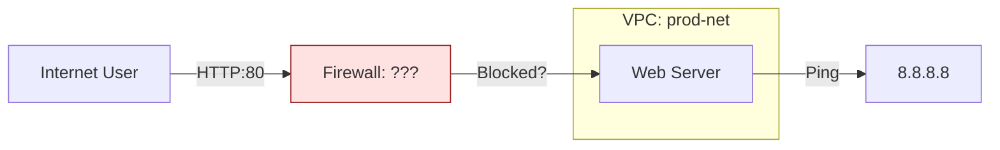

# SECTION 31: Network Capstone (The "Unreachable" VM)

## 🕵️‍♂️ The Scenario
You have been hired to fix a broken environment.
The developers created a **Custom VPC** with a Web Server, but **nobody can reach it**.

## 1️⃣ Architecture (Current State)


## 2️⃣ The Objectives
1.  **Diagnosis:** Find out why the VM has no Internet access (Outbound) and why Users cannot see the website (Inbound).
2.  **Fix:** Implement the missing components.
3.  **Verify:** `curl` the IP address.

## 3️⃣ Lab Steps (Guided) 🛠️

### Step 1: Create the Broken Environment
```bash
# Create VPC
gcloud compute networks create prod-net --subnet-mode=custom

# Create Subnet (Note the Region)
gcloud compute networks subnets create prod-subnet \
    --network=prod-net \
    --range=10.0.1.0/24 \
    --region=us-central1

# Create VM (No Public IP? Check flags)
gcloud compute instances create web-server \
    --network=prod-net \
    --subnet=prod-subnet \
    --zone=us-central1-a \
    --tags=web
```

### Step 2: The Debugging 🐛
*   **Issue A (Inbound):** Try `curl [EXTERNAL_IP]`. It hangs.
    *   *Clue:* Check `gcloud compute firewall-rules list`.
    *   *Fix:* Create an Allow rule for TCP:80.
*   **Issue B (Outbound):** SSH into the VM and `ping 8.8.8.8`. It hangs.
    *   *Clue:* Is there a route to the internet? Does the VPC have a gateway?
    *   *Fix:* A Custom VPC has NO routes by default (unlike Auto VPC). You might need a **Cloud NAT** if the VM has no public IP, or a **Default Route** to the Internet Gateway.

### Step 3: The Job-Ready Solution (Terraform) 🏗️
Instead of clicking buttons, here is the **Infrastructure as Code (IaC)** to deploy the *correct* architecture.  Save this as `main.tf`.

```hcl
# main.tf
# 1. Custom VPC (No auto-subnets)
resource "google_compute_network" "prod_net" {
  name                    = "prod-net"
  auto_create_subnetworks = false
}

# 2. Private Subnet
resource "google_compute_subnetwork" "prod_subnet" {
  name          = "prod-subnet"
  ip_cidr_range = "10.0.1.0/24"
  region        = "us-central1"
  network       = google_compute_network.prod_net.id
}

# 3. Firewall: Allow Internal + HTTP from Tags
resource "google_compute_firewall" "allow_http" {
  name    = "allow-http-ingress"
  network = google_compute_network.prod_net.name

  allow {
    protocol = "tcp"
    ports    = ["80"]
  }
  source_ranges = ["0.0.0.0/0"]
  target_tags   = ["web-server"]
}

# 4. Cloud Router & NAT (Fixes Outbound Internet!)
resource "google_compute_router" "router" {
  name    = "prod-router"
  region  = "us-central1"
  network = google_compute_network.prod_net.id
}
resource "google_compute_router_nat" "nat" {
  name                               = "prod-nat"
  router                             = google_compute_router.router.name
  region                             = google_compute_router.router.region
  nat_ip_allocate_option             = "AUTO_ONLY"
  source_subnetwork_ip_ranges_to_nat = "ALL_SUBNETWORKS_ALL_IP_RANGES"
}
```

**How to Run:**
1.  `terraform init`
2.  `terraform apply`


## 4️⃣ Checkpoint Questions
<!--
**Q1. You created a Custom VPC but forgot to create a firewall rule. What is the default behavior?**
*   A. Allow All.
*   B. Deny All Inbound / Allow All Outbound.
*   C. Deny All (Both directions).
*   D. Mirror Traffic.
> **Answer: B.** Implied Deny Inbound, Implied Allow Outbound.

**Q2. Your VM has no External IP address. How can it download updates from the internet?**
*   A. It cannot.
*   B. Through another VM.
*   C. Cloud NAT.
*   D. VPC Peering.
> **Answer: C.** Cloud NAT translates Internal IP -> External IP for outbound requests.

**Q3. Which tag links the firewall rule to the VM?**
*   A. `prod-net`
*   B. `web`
*   C. `http-server`
*   D. `us-central1`
> **Answer: B.** We used `--tags=web` on the VM and `--target-tags=web` on the Firewall.
-->
