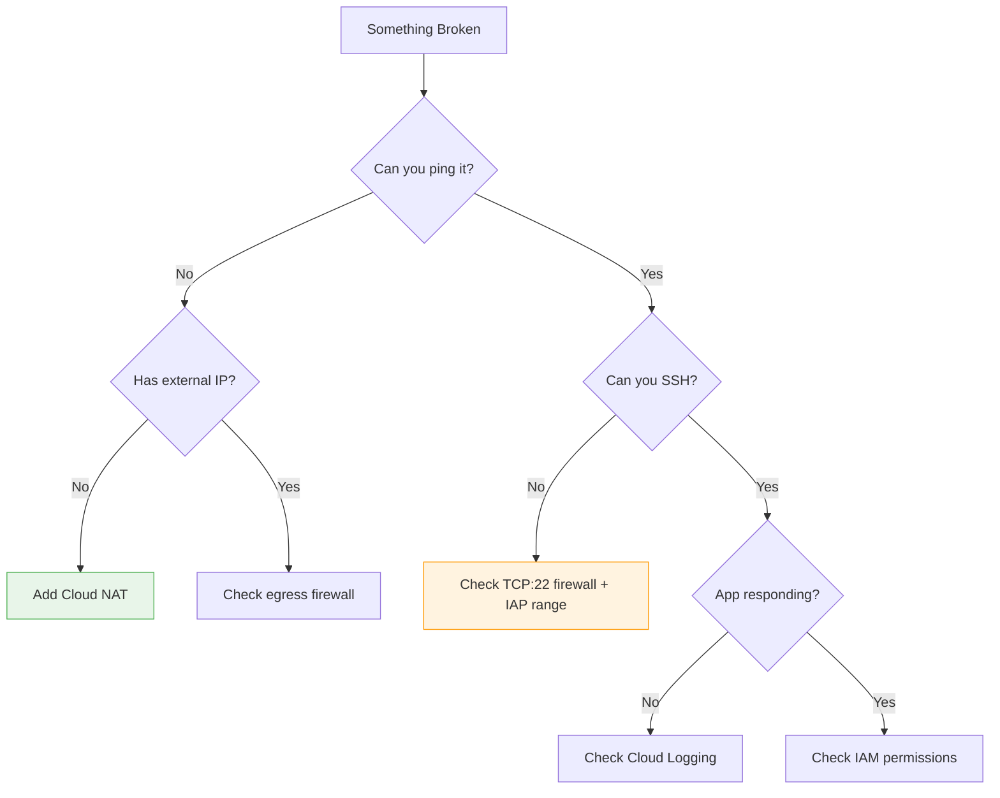

# Day 38: Network Capstone (The "Black Hole" Subnet)

**Duration:** ⏱️ 90 Minutes  
**Level:** Advanced (Scenario-Based)  
**ACE Exam Weight:** ⭐⭐⭐⭐⭐ Critical (Hands-on Troubleshooting)

---

> [!TIP]
> **TL;DR (What You'll Fix)**  
> A VM is completely isolated — no internet in, no internet out, can't even ping. You'll diagnose the problem systematically: check for missing Cloud NAT (outbound), missing firewall rules (inbound), and missing network tags. By the end, you'll have a bulletproof troubleshooting mindset for the ACE exam.

---

## 🕵️‍♂️ The Scenario: "Nothing Works!"

A junior developer has provisioned a "secure" custom VPC environment. However, the application server is completely isolated.

| 🚨 Problem | What's Broken |
|-----------|---------------|
| **Inbound** | Customers cannot reach the web UI (port 80/443) |
| **Outbound** | Server cannot download OS security patches |
| **Internal** | Database server unreachable from web tier |

**Your Goal:** Restore connectivity while maintaining the **principle of least privilege** — don't open more than necessary.

---

## 🏗️ 1. Architecture: The "Broken" State

```mermaid
graph TD
    subgraph "Public Internet"
        User[End User]
        Update[Patch Server]
    end

    subgraph "VPC: prod-net (Custom Mode)"
        subgraph "prod-subnet (10.0.1.0/24)"
            VM[web-server]
        end
    end

    User --"HTTP:80"--> |"BLOCKED: No FW Rule"| VM
    VM --"HTTPS:443"--> |"BLOCKED: No Route/NAT"| Update

    style VM fill:#fee2e2,stroke:#991b1b
```

---

## 🛠️ 2. Step-by-Step Troubleshooting Flow

> [!IMPORTANT]
> **Pro Tip:** This is the exact logical path used by Google Cloud Support Engineers. Memorize this flow for the exam!

### Phase A: Outbound Connectivity (The "NAT" Problem)

| Step | Check | If True | If False |
|------|-------|---------|----------|
| 1️⃣ | Run `ping 8.8.8.8` from VM | Go to Step 2 | **Problem found!** |
| 2️⃣ | Does VM have External IP? | Check default route `0.0.0.0/0` | **Add Cloud NAT + Cloud Router** |
| 3️⃣ | Does route exist? | Check egress firewall rules | Add default internet gateway |

> **🔒 Best Practice:** Production VMs should **NOT** have public IPs. Use Cloud NAT for outbound-only access.

### Phase B: Inbound Connectivity (The "Firewall" Problem)

| Step | Check | If True | If False |
|------|-------|---------|----------|
| 1️⃣ | Run `curl http://[VM-IP]` from internet | App works! | **Problem found!** |
| 2️⃣ | Is there a firewall rule for port 80/443? | Check target tags | **Create ingress rule** |
| 3️⃣ | Does VM have the matching network tag? | Rule is misconfigured | **Add tag to VM** |

> **⚠️ Common Trap:** The firewall rule targets `http-server` tag, but the VM has `web-server` tag. Always verify the exact tag name!

---

## 🏗️ 3. The "Hero" Solution (Infrastructure as Code)

Don't just fix it in the console. Codify the solution using Terraform to ensure it never breaks again.

```hcl
# network.tf
resource "google_compute_network" "prod_net" {
  name                    = "prod-net"
  auto_create_subnetworks = false
}

resource "google_compute_subnetwork" "web_subnet" {
  name          = "web-subnet"
  ip_cidr_range = "10.0.1.0/24"
  region        = "us-central1"
  network       = google_compute_network.prod_net.id
}

# Fix 1: The Firewall (Inbound)
resource "google_compute_firewall" "allow_http" {
  name    = "allow-http-ingress"
  network = google_compute_network.prod_net.name

  allow {
    protocol = "tcp"
    ports    = ["80"]
  }
  source_ranges = ["0.0.0.0/0"] # Allowed from Internet
  target_tags   = ["web-node"]
}

# Fix 2: Cloud NAT (Outbound)
resource "google_compute_router" "router" {
  name    = "web-router"
  region  = "us-central1"
  network = google_compute_network.prod_net.id
}

resource "google_compute_router_nat" "nat" {
  name                               = "web-nat"
  router                             = google_compute_router.router.name
  region                             = "us-central1"
  nat_ip_allocate_option             = "AUTO_ONLY"
  source_subnetwork_ip_ranges_to_nat = "ALL_SUBNETWORKS_ALL_IP_RANGES"
}
```

---

## 📝 4. Exam-Aligned Debugging Scenarios

### Scenario 1: The "Hanging" SSH
*   **Problem:** You can't SSH into the VM from the console `gcloud compute ssh`.
*   **Answer:** You must allow **TCP:22** from the source range `35.235.240.0/20` (Identity-Aware Proxy range).

### Scenario 2: The "Ping" Trap
*   **Problem:** You allowed TCP:80, but you still can't `ping` the VM.
*   **Answer:** `ping` uses **ICMP**, which is a different protocol. You must specifically allow ICMP in the firewall.

---

## 🧠 The ACE Troubleshooting Mindset (8% of Exam)

Troubleshooting is 8% of the ACE exam. Use this systematic approach for any "something isn't working" scenario.

### The 4-Step Debug Framework

| Step | Question | Tools |
|------|----------|-------|
| 1. **Reproduce** | Can you consistently trigger the issue? | Console, gcloud |
| 2. **Isolate** | Is it Network? IAM? Application code? | Connectivity tests |
| 3. **Check Logs** | What do the logs say? | Cloud Logging, Error Reporting |
| 4. **Test Incrementally** | One change at a time | Don't change 5 things at once |

### Common ACE Troubleshooting Scenarios

| Symptom | Most Likely Cause | How to Check |
|---------|-------------------|--------------|
| **VM can't reach internet** | Missing Cloud NAT or no external IP | `gcloud compute instances describe` |
| **502 Bad Gateway on LB** | Firewall blocking health checks | Allow `130.211.0.0/22`, `35.191.0.0/16` |
| **Permission denied** | Missing IAM role | `gcloud projects get-iam-policy` |
| **SSH timeout** | Firewall blocking port 22 | Check firewall rules for TCP:22 |
| **Can't ping VM** | ICMP not allowed | Allow ICMP protocol (separate from TCP) |
| **GKE pod can't reach API** | Missing Workload Identity | Check service account binding |
| **Cloud Function fails** | Missing service account permissions | Check function's SA roles |

### The "Why Not Working?" Flowchart



> **🎯 ACE Tip:** When troubleshooting, always check **Network** (firewalls, routes) before **IAM** (permissions), because network issues are more common.

---

<!-- QUIZ_START -->
## 📝 5. Knowledge Check

1.  **You have a VM in a custom VPC with no external IP. It needs to download an OS update from the internet. What is the most secure way to enable this?**
    *   A. Assign a Static External IP.
    *   B. **Configure Cloud NAT and Cloud Router.** ✅
    *   C. Create a VPC Peering connection to the Internet.
    *   D. Open a firewall rule for 0.0.0.0/0.

2.  **A firewall rule allows traffic on port 80 with the target tag 'web-tier'. Your VM is not receiving traffic. What is the first thing to check?**
    *   A. If the VM is in the same project.
    *   B. **If the VM has the 'web-tier' network tag assigned.** ✅
    *   C. If the VPC is in 'auto' mode.
    *   D. The IAM Billing Account status.

3.  **Which IP range must be allowed in the firewall to use IAP (Identity-Aware Proxy) for browser-based SSH?**
    *   A. 0.0.0.0/0
    *   B. **35.235.240.0/20** ✅
    *   C. 10.0.0.0/8
    *   D. 127.0.0.1/32

4.  **What is the priority of the default 'Allow Egress' rule in a new VPC?**
    *   A. 0
    *   B. 1000
    *   C. **65535** ✅ (The lowest possible priority).
    *   D. 1

5.  **True or False: Deleting the 'Default' network from a project removes all implied firewall rules.**
    *   A. True
    *   B. **False.** ✅ (Implied rules exist in every VPC, even custom ones, and cannot be deleted).
<!-- QUIZ_END -->
---

<div class="checklist-card" x-data="{ 
    items: [
        { text: 'I can distinguish between Inbound and Outbound connectivity issues.', checked: false },
        { text: 'I know how to configure Cloud NAT for private VMs.', checked: false },
        { text: 'I understand the role of Network Tags in firewall rules.', checked: false },
        { text: 'I can identify the IAP IP range for secure SSH.', checked: false }
    ]
}">
    <h3>
        <svg viewBox="0 0 24 24" fill="none" stroke="currentColor" stroke-width="2" stroke-linecap="round" stroke-linejoin="round" class="text-blurple">
            <path d="M22 11.08V12a10 10 0 1 1-5.93-9.14"></path>
            <polyline points="22 4 12 14.01 9 11.01"></polyline>
        </svg>
        Day 38 Mastery Checklist
    </h3>
    <template x-for="(item, index) in items" :key="index">
        <div class="checklist-item" @click="item.checked = !item.checked">
            <div class="checklist-box" :class="{ 'checked': item.checked }">
                <svg viewBox="0 0 24 24" fill="none" stroke="currentColor" stroke-width="3" stroke-linecap="round" stroke-linejoin="round">
                    <polyline points="20 6 9 17 4 12"></polyline>
                </svg>
            </div>
            <span x-text="item.text" :class="{ 'line-through text-slate-400': item.checked }"></span>
        </div>
    </template>
</div>
