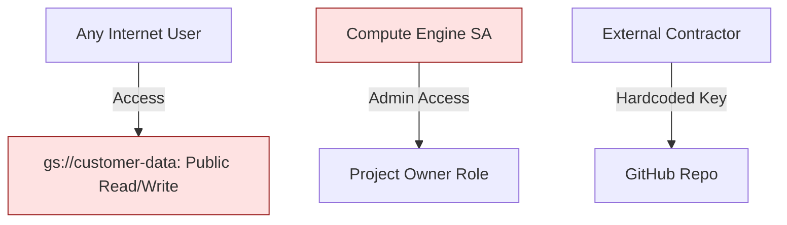
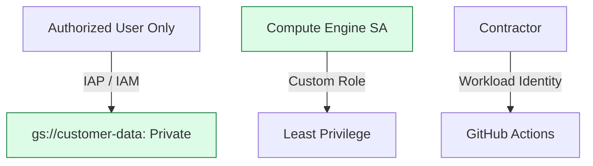

# Day 39: Security Capstone (The Red Team Audit)

**Duration:** ⏱️ 90 Minutes  
**Level:** Advanced (Security Focus)  
**ACE Exam Weight:** ⭐⭐⭐⭐⭐ Critical (Compliance & Identity)

---

## 🕵️‍♂️ The Scenario: "Shadow IT Leak"

A high-growth startup has been building in "stealth mode". Their Lead Developer just quit, and you've been hired to audit their main project. You find a "working" application that is a **Security Nightmare**.

**Your Objective:** Identify the "Crown Jewels" and lock them down before a breach occurs.

---

## 🏗️ 1. Architecture: The "Before" & "After"

### The Radioactive State (Before)


### The Hardened State (After)


---

## 🛠️ 2. The Vulnerability Matrix (Audit Report)

| Issue | Severity | Fix | ACE Exam Tip |
| :--- | :--- | :--- | :--- |
| **allUsers:Storage.Admin** | 🛑 Critical | Remove `allUsers` and `allAuthenticatedUsers`. | `allUsers` = The entire internet. |
| **SA with roles/owner** | 🛑 Critical | Replace with Custom Role or specific Predefined roles. | Never grant `owner` to a Service Account. |
| **JSON Key in Code** | ⚠️ High | Delete the key and use **Service Account Impersonation**. | JSON keys are "long-lived" and high risk. |
| **No MFA for Admin** | ⚠️ High | Enforce **Organization Policies** for MFA. | Organization Policies trump project-level IAM. |

---

## 🏗️ 3. The "Zero Trust" Solution (IaC)

Use Terraform to define a security perimeter that doesn't rely on "Lazy Admin" roles.

```hcl
# iam.tf
# 1. Create a "Least Privilege" Custom Role
resource "google_project_iam_custom_role" "app_executor" {
  role_id     = "app_executor"
  title       = "Application Executor"
  permissions = [
    "storage.objects.get",
    "storage.objects.list",
    "logging.logEntries.create"
  ]
}

# 2. Create the Identity (Service Account)
resource "google_service_account" "safe_sa" {
  account_id   = "prod-app-sa"
  display_name = "Secure App Service Account"
}

# 3. Secure Binding (No 'AllUsers'!)
resource "google_storage_bucket_iam_binding" "private_access" {
  bucket = "prod-customer-data"
  role   = "roles/storage.objectViewer"
  members = [
    "serviceAccount:${google_service_account.safe_sa.email}"
  ]
}
```

---

## 🚨 4. Pro-Grade Hardening: The "Defense in Depth"

1.  **VPC Service Controls (VPC SC):** Create a service perimeter to prevent data exfiltration. Even an admin can't copy data out of the project.
2.  **Organization Policies:** Disable "Service Account Key Creation" for the entire company.
3.  **Cloud Armor:** Protect your public endpoints from SQL injection and DDoS.

---

<!-- QUIZ_START -->
## 📝 5. Knowledge Check

1.  **You discover a Service Account with the 'Project Owner' role assigned to a VM. What is the most secure replacement?**
    *   A. Project Editor role.
    *   B. Project Viewer role.
    *   C. **A Custom Role containing only the specific permissions needed by the app.** ✅
    *   D. Remove the Service Account entirely.

2.  **Which IAM member type refers to anyone on the internet, including those without a Google account?**
    *   A. allAuthenticatedUsers
    *   B. **allUsers** ✅
    *   C. anonymousUsers
    *   D. publicAccess

3.  **An auditor wants to ensure that no developer can accidentally make a Cloud Storage bucket public. What is the best solution?**
    *   A. Set a weekly reminder to check permissions.
    *   B. **Enable the 'Enforce Public Access Prevention' Organization Policy.** ✅
    *   C. Direct all developers to a training course.
    *   D. Delete all public buckets.

4.  **How do you securely allow a developer to access a VM's terminal without a public IP or a VPN?**
    *   A. Tell them to use RDP over the internet.
    *   B. **Identity-Aware Proxy (IAP).** ✅ (Google's zero-trust entry point).
    *   C. Cloud Shell.
    *   D. Deployment Manager.

5.  **What happens if a Service Account JSON key is committed to a public Git repository?**
    *   A. Nothing, keys are encrypted.
    *   B. **The account is compromised, and the attacker has all permissions of that SA.** ✅
    *   C. Google automatically deletes the project.
    *   D. The Git repo is hidden.
<!-- QUIZ_END -->
---

<div class="checklist-card" x-data="{ 
    items: [
        { text: 'I understand the difference between allUsers and allAuthenticatedUsers.', checked: false },
        { text: 'I can create a Custom Role with granular permissions.', checked: false },
        { text: 'I know how to identify and remediate overly permissive IAM roles.', checked: false },
        { text: 'I understand the value of Organization Policies for security.', checked: false }
    ]
}">
    <h3>
        <svg viewBox="0 0 24 24" fill="none" stroke="currentColor" stroke-width="2" stroke-linecap="round" stroke-linejoin="round" class="text-blurple">
            <path d="M22 11.08V12a10 10 0 1 1-5.93-9.14"></path>
            <polyline points="22 4 12 14.01 9 11.01"></polyline>
        </svg>
        Day 39 Mastery Checklist
    </h3>
    <template x-for="(item, index) in items" :key="index">
        <div class="checklist-item" @click="item.checked = !item.checked">
            <div class="checklist-box" :class="{ 'checked': item.checked }">
                <svg viewBox="0 0 24 24" fill="none" stroke="currentColor" stroke-width="3" stroke-linecap="round" stroke-linejoin="round">
                    <polyline points="20 6 9 17 4 12"></polyline>
                </svg>
            </div>
            <span x-text="item.text" :class="{ 'line-through text-slate-400': item.checked }"></span>
        </div>
    </template>
</div>
