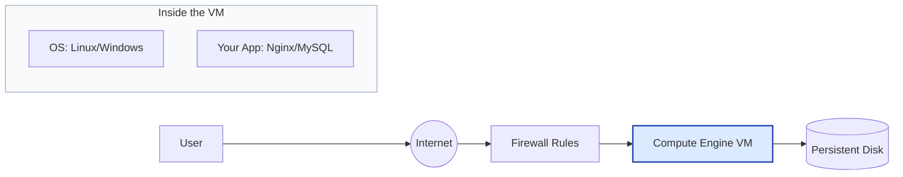
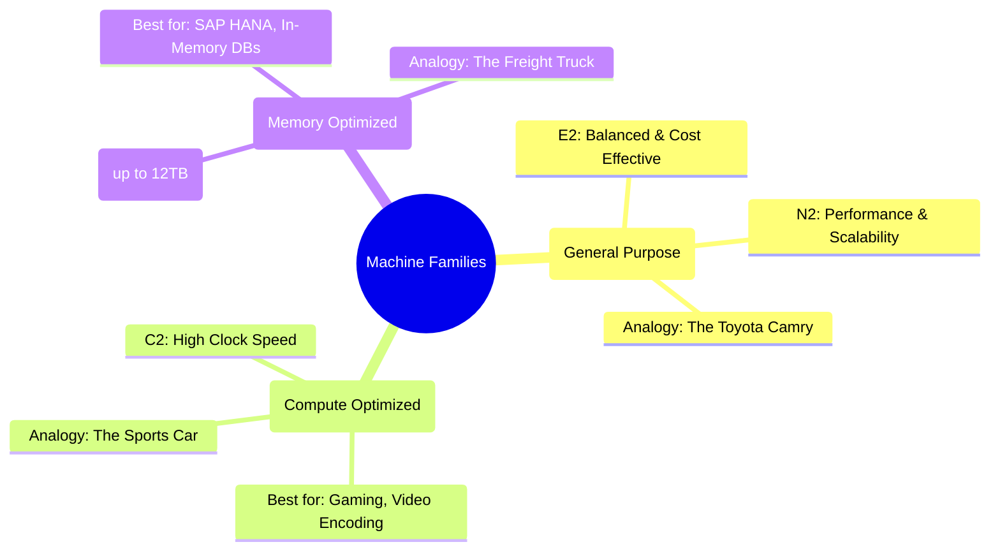

# Day 3: Compute Engine (VMs) & Machine Types

**Duration:** ⏱️ 45 Minutes  
**Level:** Beginner  
**ACE Exam Weight:** ⭐⭐⭐⭐ High (VM questions are everywhere)

---

## 🎯 Learning Objectives

By the end of Day 3, you will be able to:
*   **Explain** the Infrastructure as a Service (IaaS) model.
*   **Select** the right Machine Family for any workload.
*   **Understand** the difference between Zonal and Regional availability.
*   **Deploy** a functional web server using a Linux VM.

---

## 🧠 1. What is Compute Engine?

**Compute Engine** is Google's **IaaS** (Infrastructure as a Service) powerhouse. 

> [!NOTE]
> Think of it as renting a "raw" computer in Google's data center. You get to choose the CPU, RAM, Disk, and Operating System.

### Core Architecture


---

## 🍕 2. The "Pizza as a Service" Analogy

How does **Compute Engine (IaaS)** compare to other models?

| Feature | **IaaS (Compute Engine)** | **PaaS (App Engine)** | **FaaS (Cloud Functions)** |
| :--- | :--- | :--- | :--- |
| **Analogy** | Making Pizza at Home | Pizza Delivery | Eating at a Buffet |
| **Control** | High (Dough, Sauce, Oven) | Medium (Just Toppings) | Low (Just Eat) |
| **Effort** | High (Clean the kitchen) | Low (Just wait) | Zero (Disposable) |
| **Pricing** | By the Hour/Minute | By Instance/Request | By Execution Time |

> [!TIP]
> Use **IaaS (Compute Engine)** when you need total control over the OS or have legacy software that requires specific configuration.

---

## 🏗️ 3. Machine Families: The "Right Tool for the Job"

Google offers three main families of virtual machines. Choosing the wrong one can waste thousands of dollars!



> [!IMPORTANT]
> **E2 Series** is your best friend for learning. It's cost-optimized and part of the **GCP Free Tier** (e2-micro).

---

## 🛠️ 4. Hands-On Lab: Your First Cloud Server

**🧪 Lab Objective:** Create a Linux VM and install a web server that says "Hello World".

### ✅ Step 1: Configuration
1.  Go to **Compute Engine > VM Instances**.
2.  Click **Create Instance**.
3.  Name: `web-server-1`.
4.  Region: `us-central1`.
5.  Machine type: **e2-micro** (Look for the "Free Tier" badge!).

### ✅ Step 2: The Firewall (Critical!)
Scroll down to **Networking**.
*   [x] **Allow HTTP traffic**
*   [x] **Allow HTTPS traffic**

> [!WARNING]
> If you forget to check these boxes, your web server will be "UP" but nobody will be able to see it!

### ✅ Step 3: Automation (Startup Script)
Expand **Advanced Options > Management**. In the **Startup Script** box, paste:
```bash
#! /bin/bash
apt update
apt install -y apache2
echo "<h1>Deployed via Compute Engine 🚀</h1>" > /var/www/html/index.html
```

---

<!-- QUIZ_START -->
## 📝 5. Checkpoint Quiz

1.  **You need a VM for a high-performance video rendering app. Which family should you choose?**
    *   A. E2
    *   B. **C2** ✅
    *   C. M2

2.  **Which service model requires the MOST management effort from you?**
    *   A. **IaaS** ✅
    *   B. PaaS
    *   C. SaaS

3.  **True or False: A VM's Ephemeral IP Address remains the same if you stop and restart the VM.**
    *   *Answer:* **False.** It changes. Use a **Static IP** if you need it to stay the same.
<!-- QUIZ_END -->
---

<div class="checklist-card" x-data="{ 
    items: [
        { text: 'I understand what IaaS stands for.', checked: false },
        { text: 'I know when to use C2 vs E2 machine types.', checked: false },
        { text: 'I successfully launched a VM and saw the Hello page.', checked: false },
        { text: 'I know that allowing HTTP traffic creates a firewall rule.', checked: false }
    ]
}">
    <h3>
        <svg viewBox="0 0 24 24" fill="none" stroke="currentColor" stroke-width="2" stroke-linecap="round" stroke-linejoin="round" width="24" height="24" class="text-blurple">
            <path d="M22 11.08V12a10 10 0 1 1-5.93-9.14"></path>
            <polyline points="22 4 12 14.01 9 11.01"></polyline>
        </svg>
        Day 3 Checklist
    </h3>
    <template x-for="(item, index) in items" :key="index">
        <div class="checklist-item" @click="item.checked = !item.checked">
            <div class="checklist-box" :class="{ 'checked': item.checked }">
                <svg viewBox="0 0 24 24" fill="none" stroke="currentColor" stroke-width="3" stroke-linecap="round" stroke-linejoin="round">
                    <polyline points="20 6 9 17 4 12"></polyline>
                </svg>
            </div>
            <span x-text="item.text" :class="{ 'line-through text-slate-400': item.checked }"></span>
        </div>
    </template>
</div>

---

### 🗑️ Lab Cleanup (Mandatory)

> **⚠️ Critical:** Delete resources to avoid unecessary billing!

1.  **Delete Project:** (Fastest way)
    ```bash
    gcloud projects delete $PROJECT_ID
    ```
2.  **Or Delete Resources Individually:**
    ```bash
    # Example commands (verify before running)
    gcloud compute instances delete [INSTANCE_NAME] --quiet
    gcloud storage rm -r gs://[BUCKET_NAME]
    ```
