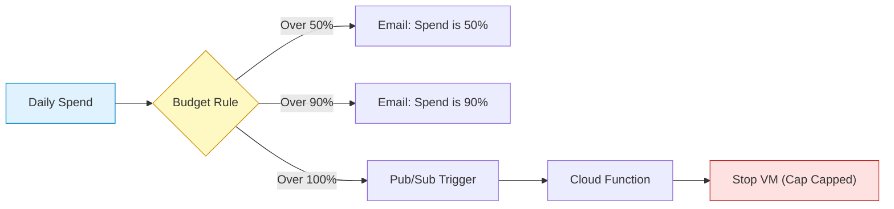

# SECTION 3: GCP Billing, Free Tier, Quotas & Cost Control

## 1️⃣ Plain-English Explanation
In the last section, we learned that a **Project** is like a "Bucket" for your resources. But who pays for that bucket?

*   **The Billing Account:** This is the credit card or bank account. You attach Projects to a Billing Account. If you don't attach one, the Project can't run anything (except Free Tier stuff).
*   **Budgets & Alerts:** These are your safety guards. You tell Google, "If I spend more than $50, scream at me via email."
*   **Quotas:** These are "hard limits" to prevent you from accidentally launching 10,000 servers and going bankrupt in an hour.

## 2️⃣ Real-World Analogy
**The "Teenager with a Credit Card" Analogy**

1.  **Billing Account:** The parent's Credit Card.
2.  **Project:** The Teenager's shopping cart. The parent links the card to the cart so the transaction goes through.
3.  **Budgets & Alerts:** The parent saying, "Text me if you spend more than $50." (Note: The store *still* lets you spend more, it just warns the parent).
4.  **Quotas:** The Credit Card Limit (e.g., $500 max). The machine will literally decline the transaction if you try to go over.

## 3️⃣ Why This Exists (Exam Focus)
*   **Control:** Large companies have many departments. They can have **One** Billing Account (paid by Finance) linked to **Many** Projects (Marketing, IT, HR).
*   **Safety:** The cloud scales infinitely. Without Quotas and Budgets, a coding error (infinite loop creating VMs) could cost millions of dollars overnight.

## 4️⃣ How It Works (Simple Mental Model)
*   **Hierarchy:** Billing Checking Account ➔ Linked to Project ➔ Pays for Resources (VMs, Storage).
*   **One-to-Many:** One Billing Account can pay for MANY Projects.
*   **Many-to-One:** A Project can only have ONE Billing Account at a time.

## 5️⃣ GCP Console Walkthrough (Step-by-step)
**Checking Billing:**
*   **Step 1:** Go to `console.cloud.google.com`.
*   **Step 2:** Open the Navigation Menu 🍔 and scroll down to **Billing**.
*   **Step 3:** If you are the admin, you see the "Overview" with current costs.

**Creating a Budget Alert (CRITICAL STEP):**
*   **Step 1:** In the Billing section, click **Budgets & alerts** on the left.
*   **Step 2:** Click **Create Budget**.

*   **Step 3:** Name it "Stop-Me-From-Bankruptcy".
*   **Step 4:** Set amount: **$10** (or whatever you like).
*   **Step 5:** Set Thresholds: Trigger at 50%, 90%, and 100%.
*   **Step 6:** Check "Email alerts to billing admins". **Done.**

## 6️⃣ Key Exam Triggers 🚨
*   **"Hard Limit" vs "Warning"**:
    *   **Quotas** are HARD limits. (The action fails).
    *   **Budgets** are WARNINGS. (The spending continues, you just get an email).
*   **"CapEx vs OpEx"**: Cloud is OpEx (Operational Expenditure). You pay for what you use.
*   **"Disable Billing"**: To stop spending *immediately*, you must disable billing on the Project. This stops all services.

## 7️⃣ Free Tier vs Free Trial vs Quotas

| Feature | What is it? | Exam Note |
| :--- | :--- | :--- |
| **Free Trial** | $300 credit for 90 days. | Once it's gone, it's gone. |
| **Free Tier** | "Always Free" limits (e.g., 1 tiny VM per month forever). | Available to everyone, even after trial ends. |
| **Quotas** | Limits on *how many* resources you can create (e.g., Max 5 VMs). | Protects Google (from running out of hardware) and You (from accidental spend). |

**Beginner Mistake:** Thinking a "Budget Alert" will automatically shut down your VMs. **IT WILL NOT.** It only sends an email. To shut things down automatically, you need to write a special script (Cloud Function) triggered by the alert, which is an advanced topic.

## 7.5️⃣ Troubleshooting Free Tier (Common Issues) 🛠️
**"I'm from India/Europe and Google asks for payment. Is it free?"**
*   **Yes, but:** Google requires a credit/debit card to verify you are a human, not a bot.
*   **The Charge:** They might charge a small amount (e.g., INR 2 or $1) to verify the card is active. This is **refunded** automatically.
*   **Debit Cards:** Many prepaid or domestic-only debit cards decline international transactions. Use a standard Credit Card or a Debit Card with international transactions enabled.
*   **Business vs Individual:** Always select "Individual" for a learning account to avoid needing tax ID documents.

## 8️⃣ Interview-Ready Q&A
**Q: "We need to ensure a specific project never spends more than $1,000. Can we set a hard cap?"**
*   **A:** Native GCP Budgets send alerts, they don't stop spending. To enforce a hard cap, we would need to set up a programmatic action (using Pub/Sub and Cloud Functions) to disable billing when the cap is reached.

**Q: "I'm trying to create a GPU instance but I get a 'Quota Exceeded' error. I have money in the account. What's wrong?"**
*   **A:** You hit a resource quota. New accounts often have 0 GPU quota by default to prevent fraud. You must request a **Quota Increase** from support.

## 9️⃣ Zero-to-Hero: Pro Tips (Cost Optimization)
1.  **GCP Pricing Calculator:**
    *   Always estimate BEFORE you build. Go to `cloud.google.com/products/calculator`.
    *   *Tip:* It has a "Save Estimate" feature to share with your manager.
2.  **Spot VMs (Preemptible)**:
    -   Use these for batch jobs or stateless workloads to save 60-91%.
    -   *Risk:* Google can reclaim them at any time with 30s warning.
3.  **Committed Use Discounts (CUDs)**:
    -   Commit to using a certain amount of vCPU/RAM for 1 or 3 years for deep discounts.
    -   *Flexibility:* Flexible CUDs apply to many machine types.
4.  **Billing Export to BigQuery:**
    -   *The Golden Rule:* Enable this on Day 1.
    -   It sends every line item of your bill to a database.
    -   *Example Query:* "Show me which user spent the most on Storage in June." (Impossible in the UI, easy in SQL).
5.  **Active Assist (Recommender)**:
    -   Google's AI that tells you "Hey, this VM is 90% idle, resize it to save $50/month."

## 🚀 Next-Level: FinOps & Cost Control
*   **CUDs (Committed Use Discounts):** Know the difference between **Spend-based** (flexible) and **Resource-based** (specific hardware) CUDs.
*   **Billing Export:** The *first* thing you do in a new Org is export billing data to **BigQuery**. You can't analyze costs effectively in the console UI alone. Labels are KEY.
*   **Labels vs Tags:**
    *   **Labels:** User-defined key-value pairs (e.g., `env:prod`, `cost-center:123`) for billing breakdown.
    *   **Tags:** Used for Organization Policies and IAM (e.g., allow ingress). Tags are inherited; Labels are not always.
*   **Quotas Deep Dive:**
    *   **Allocation Quotas:** "How many VMs?" (e.g., 50 CPUs). Changeable via support.
    *   **Rate Quotas:** "How fast?" (e.g., 100 API calls per minute). Harder to change.

<!-- FLASHCARDS
[
  {"term": "Billing Account", "def": "The credit card or invoice where costs are charged."},
  {"term": "Budget Alert", "def": "Sends an email when spending hits a threshold (does NOT stop services)."},
  {"term": "Quota", "def": "Hard limit on resource usage (e.g., Max 5 VMs) to prevent abuse."},
  {"term": "CapEx", "def": "Capital Expenditure (buying servers upfront). Cloud is usually OpEx."},
  {"term": "OpEx", "def": "Operational Expenditure (paying monthly for what you use)."}
]
-->

## 🚨 Checkpoint Questions
## 🚨 Checkpoint Questions
**Q1. True or False: Setting a budget of $100 will automatically turn off your servers when you spend $101.**
*   A. True
*   B. False
> **Answer: B.** False. Budgets only send emails/alerts. They do not stop services by default.

**Q2. Which mechanism allows you to run a small Linux VM for free every month, forever?**
*   A. Free Trial ($300 credit)
*   B. Free Tier (Always Free)
*   C. Committed Use Discount
*   D. Spot VM
> **Answer: B.** Free Tier offers perpetual free limits (e.g. e2-micro in specific regions).

**Q3. One Billing Account can be linked to how many Projects?**
*   A. Only One
*   B. Multiple (Many)
*   C. Zero
*   D. Depends on the Credit Limit
> **Answer: B.** One Billing Account pays for Many Projects.

**Q4. You receive a "Quota Exceeded" error when trying to launch a TPU. What should you do?**
*   A. Create a new Billing Account.
*   B. Request a Quota Increase from Support.
*   C. Delete all other projects.
*   D. Wait 24 hours for it to reset.
> **Answer: B.** Quotas are hard limits. You must ask Google to raise them.

**Q5. Which of the following is an example of OpEx (Operational Expenditure)?**
*   A. Buying a physical server for $10,000.
*   B. Paying a monthly electricity bill for a data center.
*   C. Paying for Cloud Storage based on GB/month usage.
*   D. Building a server room.
> **Answer: C.** Cloud is OpEx—pay for what you consume.

**Q6. To analyze your cloud costs with SQL (e.g., "Find top spending user"), what should you enable?**
*   A. Billing Export to BigQuery
*   B. Cost Table Reports
*   C. Budgets and Alerts
*   D. Datadog Integration
> **Answer: A.** BigQuery Export provides the raw granular data needed for SQL analysis.

## ➡️ What’s Next
We have the **Theory** (Section 1), the **Structure** (Section 2), and the **Money** (Section 3).
**Next Section:** Identity & Access Management (IAM) - The security guard at the door.
