# SECTION 3: Billing, Budgets & Cost Management

> **🎯 Objectives:**
> *   Master core concepts
> *   Build hands-on resources
> *   Pass the ACE exam scenarios

| 📚 Concepts | 🧪 Lab | 📝 Quiz | 💼 Interview |
|---|---|---|---|
| [Jump to Theory](#concepts) | [Jump to Lab](#hands-on-lab) | [Jump to Quiz](#knowledge-check) | [Jump to Interview](#interview-questions) |

---


> **🎯 Objectives:**
> *   Master core concepts
> *   Build hands-on resources
> *   Pass the ACE exam scenarios

| 📚 Concepts | 🧪 Lab | 📝 Quiz | 💼 Interview |
|---|---|---|---|
| [Jump to Theory](#concepts) | [Jump to Lab](#hands-on-lab) | [Jump to Quiz](#knowledge-check) | [Jump to Interview](#interview-questions) |

---


> **🎯 Objectives:**
> *   Master core concepts
> *   Build hands-on resources
> *   Pass the ACE exam scenarios

| 📚 Concepts | 🧪 Lab | 📝 Quiz | 💼 Interview |
|---|---|---|---|
| [Jump to Theory](#concepts) | [Jump to Lab](#hands-on-lab) | [Jump to Quiz](#knowledge-check) | [Jump to Interview](#interview-questions) |

---


> **Official Doc Reference**: [Cloud Billing Docs](https://cloud.google.com/billing/docs)

## 1️⃣ How Google Charges You 💸
### The Relationship: Billing Account <-> Project
The most common point of confusion: **Projects DO NOT hold money. Billing Accounts do.**

```mermaid
graph LR
    CC["💳 Credit Card / Invoice"] --> BA["Billing Account"]
    BA -- Pays for --> P1["Project A (Dev)"]
    BA -- Pays for --> P2["Project B (Prod)"]
    BA -- Pays for --> P3["Project C (Test)"]

    style CC fill:#bbf7d0,stroke:#16a34a
    style BA fill:#fef08a,stroke:#ca8a04,stroke-width:2px
    style P1 fill:#e0f2fe,stroke:#0284c7
    style P2 fill:#e0f2fe,stroke:#0284c7
    style P3 fill:#e0f2fe,stroke:#0284c7
```



*   **One-to-Many:** One Billing Account can pay for huge numbers of projects.
*   **Many-to-One:** A Project can only be linked to **ONE** Billing Account at a time.
*   **Linking:** You "link" a project to a billing account to enable services. If you "unlink" it, everything stops.

---

## 2️⃣ Cost Controls: Quotas vs Budgets 🛡️
These are your two shields against bankruptcy.

| Feature | Type | Example | Action on Trigger |
| :--- | :--- | :--- | :--- |
| **Quota** | **Hard Limit** | "Max 5 GPUs per Region" | **Stops Deployment.** "Error: Quota Exceeded". |
| **Budget** | **Warning** | "$500 Monthly Budget" | **Sends Email.** "Alert: You have spent $450". |

> **IMPORTANT:** A Budget Notification does **NOT** stop your services. It just emails you. If you sleep through the email, you keep paying.

---

## 3️⃣ Free Tier vs Free Trial 🆓
*   **Free Trial:** $300 credit for 90 days. Once it's gone, it's gone.
*   **Free Tier (Always Free):** Generous limits available to everyone, forever.
    *   *Example:* `e2-micro` instance in `us-central1`, `us-west1`, or `us-east1` (check specifics, they change!).
    *   *Storage:* 5GB Regional Storage.

---

## 4️⃣ Hands-On Lab: Setting a Safety Net 🪂
**Mission:** Create a Budget Alert to prevent surprises.

1.  **Navigate:** Hamburger Menu > **Billing**.
2.  **Select:** Go to **Budgets & alerts** (Left sidebar).
3.  **Create:** Click **Create Budget**.
4.  **Scope:** Select your Project (or "All Projects").
5.  **Amount:** Set Target amount to **$10** (or your currency equivalent).
6.  **Actions:**
    *   Set thresholds at 50% ($5), 90% ($9), and 100% ($10).
    *   Check "Email alerts to billing admins".
7.  **Finish:** Click Save. Use this for every personal project!

---


## 5️⃣ Checkpoint Quiz

1. **True or False: If you exceed your configured Budget Alert, Google Cloud will automatically shut down your virtual machines to prevent further charges.**
    * A. True
    * B. **False** ✅

2. **You try to create a TPU (Tensor Processing Unit) for AI training but receive a "Quota Exceeded" error. You have a valid credit card attached. What is the issue?**
    * A. Your credit card failed.
    * B. **You hit a default Rate/Allocation Quota.** ✅
    * C. TPUs are only for Enterprises.
    * D. You must enable the "AI API" first.

3. **Which of the following is an example of CapEx (Capital Expenditure)?**
    * A. Monthly Cloud SQL bill.
    * B. **Buying a physical server rack for $50,000.** ✅
    * C. Pay-as-you-go Network egress fees.
    * D. Spot VM instances.


---

### ⚡ Zero-to-Hero: Pro Tips
*   **The "BigQuery Export":** Professional Cloud Architects enable "Billing Export to BigQuery" on Day 1. It allows you to run SQL queries on your costs (e.g., "Show me costs by Label in June"). The standard Console UI cannot answer complex questions.
*   **Labels:** Tag everything! Add labels like `env:prod` or `team:marketing` to resources so you can split the bill later.

---
<!-- FLASHCARDS
[
  {"term": "Billing Account", "def": "The entity that performs the actual payment (Credit Card/Invoice). linked to Projects."},
  {"term": "Quota", "def": "Hard limit on resource usage (e.g. 5 VMs max). Protects against accidental overspend."},
  {"term": "Budget", "def": "A soft limit that sends alerts (emails) when thresholds are met. Does NOT stop spending."},
  {"term": "Free Tier", "def": "Always Free resource limits available to all users (separate from Free Trial)."}
]
-->
---

### 🗑️ Lab Cleanup (Mandatory)

> **⚠️ Critical:** Delete resources to avoid unecessary billing!

1.  **Delete Project:** (Fastest way)
    ```bash
    gcloud projects delete $PROJECT_ID
    ```
2.  **Or Delete Resources Individually:**
    ```bash
    # Example commands (verify before running)
    gcloud compute instances delete [INSTANCE_NAME] --quiet
    gcloud storage rm -r gs://[BUCKET_NAME]
    ```