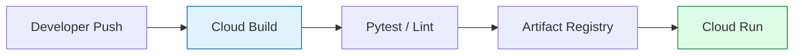

# Day 40: DevOps Capstone (The "Broken Pipeline" Rescue)

**Duration:** ⏱️ 90 Minutes  
**Level:** Advanced (Scenario-Based)  
**ACE Exam Weight:** ⭐⭐⭐⭐⭐ Critical (CI/CD & Automation)

---

## 🕵️‍♂️ The Scenario: "Dead on Arrival"

The Lead DevOps Engineer has left the company midway through a migration to Cloud Run. Your goal is to take over a failing Cloud Build pipeline that refuses to deploy the application.

**The Symptom:** Every build fails at the `pytest` or `deploy` step.
**The Goal:** Fix the pipeline, automate the trigger, and implement a "Zero-Downtime" deployment strategy.

---

## 🏗️ 1. Architecture: The CI/CD Lifecycle



---

## 🛠️ 2. The DevOps Debugging Checklist

When a build fails, follow this triage order:

### Phase 1: Environment Errors
*   **Error:** `Command not found` or `File not found`.
*   **Check:** Is the `cloudbuild.yaml` running in the correct directory? Are all files (.requirements.txt, Dockerfile) in the root?
*   **Fix:** Ensure `COPY . .` is in your Dockerfile.

### Phase 2: IAM Permissions (90% of failures)
*   **Error:** `403 Permission Denied: Unable to act as service account`.
*   **Check:** Does the **Cloud Build Service Account** have the `Cloud Run Admin` and `Service Account User` roles?
*   **ACE Exam Rule:** Cloud Build is a separate identity that needs explicit permission to "hand over" a container to Cloud Run.

---

## 🏗️ 3. The "Production-Ready" Pipeline (IaC)

Upgrade the basic build to a professional-grade config.

```yaml
# cloudbuild.yaml
steps:
  # 1. Static Analysis (Linting)
  - name: 'python:3.9-slim'
    entrypoint: 'bash'
    args:
      - '-c'
      - |
        pip install flake8
        flake8 .

  # 2. Build and Tag with Commit SHA (Best Practice)
  - name: 'gcr.io/cloud-builders/docker'
    args: ['build', '-t', 'us-central1-docker.pkg.dev/$PROJECT_ID/my-repo/app:$SHORT_SHA', '.']

  # 3. Deploy to Cloud Run (Managed)
  - name: 'gcr.io/google.com/cloudsdktool/cloud-sdk'
    entrypoint: 'gcloud'
    args:
      - 'run'
      - 'deploy'
      - 'my-service'
      - '--image'
      - 'us-central1-docker.pkg.dev/$PROJECT_ID/my-repo/app:$SHORT_SHA'
      - '--region'
      - 'us-central1'
      - '--platform'
      - 'managed'
      - '--allow-unauthenticated'

images:
  - 'us-central1-docker.pkg.dev/$PROJECT_ID/my-repo/app:$SHORT_SHA'

options:
  logging: CLOUD_LOGGING_ONLY
```

---

## 🚀 4. Deployment Strategies: Blue-Green vs. Canary

| Strategy | Logic | Risk | Use Case |
| :--- | :--- | :--- | :--- |
| **Blue-Green** | Spin up a full new version (Green) and switch all traffic at once. | Low (Easy rollback). | Mission-critical apps. |
| **Canary** | Send 5% of traffic to New, 95% to Old. Monitor for errors. | Very Low. | High-traffic web apps. |
| **Rolling** | Update one instance at a time (Standard GKE/GCE). | Medium. | Standard internal apps. |

---

## 📝 5. Knowledge Check

<!-- QUIZ_START -->
1.  **Your Cloud Build pipeline fails at the 'Deploy' step with a 403 error. Which Service Account likely needs more permissions?**
    *   A. Your personal Google Account.
    *   B. **The Cloud Build Service Account ([NUMBER]@cloudbuild.gserviceaccount.com).** ✅
    *   C. The Compute Engine Default SA.
    *   D. The App Engine Default SA.

2.  **What is the benefit of using $SHORT_SHA in your container tags?**
    *   A. It makes the build faster.
    *   B. **It provides traceability between the deployed image and the specific Git commit.** ✅
    *   C. It reduces storage costs.
    *   D. It encrypts the image.

3.  **You want to ensure that a new version of your app is only released if it passes all unit tests. Where should the tests run?**
    *   A. On the developer's laptop.
    *   B. **As an early step in the Cloud Build pipeline.** ✅
    *   C. After the app is deployed to Cloud Run.
    *   D. Inside the Dockerfile.

4.  **A Cloud Build 'Trigger' allows you to automate builds based on which event?**
    *   A. A manual API call.
    *   B. **A push to a specific branch in GitHub/Bitbucket.** ✅
    *   C. A change in the Billing account.
    *   D. A user logging into the console.

5.  **Which deployment strategy involves running two identical environments but only sending traffic to one at a time?**
    *   A. Canary.
    *   B. **Blue-Green.** ✅
    *   C. Rolling.
    *   D. A/B Testing.
<!-- QUIZ_END -->

---

<div class="checklist-card" x-data="{ 
    items: [
        { text: 'I can troubleshoot 403 errors in Cloud Build.', checked: false },
        { text: 'I understand how to use substitution variables like $SHORT_SHA.', checked: false },
        { text: 'I know the difference between Blue-Green and Canary deployments.', checked: false },
        { text: 'I can define a multi-step pipeline in cloudbuild.yaml.', checked: false }
    ]
}">
    <h3>
        <svg viewBox="0 0 24 24" fill="none" stroke="currentColor" stroke-width="2" stroke-linecap="round" stroke-linejoin="round" class="text-blurple">
            <path d="M22 11.08V12a10 10 0 1 1-5.93-9.14"></path>
            <polyline points="22 4 12 14.01 9 11.01"></polyline>
        </svg>
        Day 40 Mastery Checklist
    </h3>
    <template x-for="(item, index) in items" :key="index">
        <div class="checklist-item" @click="item.checked = !item.checked">
            <div class="checklist-box" :class="{ 'checked': item.checked }">
                <svg viewBox="0 0 24 24" fill="none" stroke="currentColor" stroke-width="3" stroke-linecap="round" stroke-linejoin="round">
                    <polyline points="20 6 9 17 4 12"></polyline>
                </svg>
            </div>
            <span x-text="item.text" :class="{ 'line-through text-slate-400': item.checked }"></span>
        </div>
    </template>
</div>
