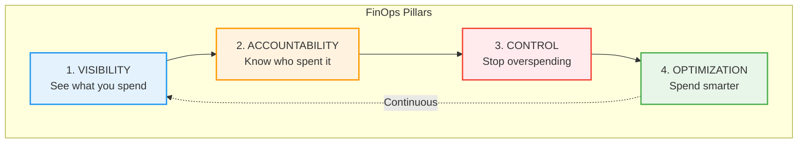
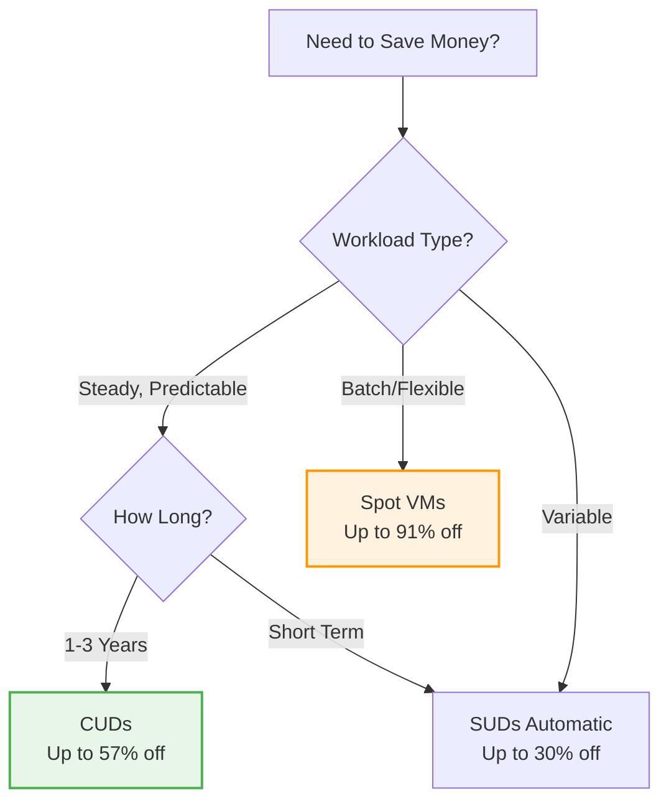

# Day 37: FinOps & Sustained Cost Optimization

**Duration:** ⏱️ 45 Minutes  
**Level:** Intermediate  
**ACE Exam Weight:** ⭐⭐⭐ High (Cost management questions appear frequently)

---

## 🎯 Learning Objectives

By the end of this lesson, you will:

*   **Implement** the FinOps framework for cloud cost management
*   **Configure** budgets, alerts, and quotas
*   **Apply** committed use discounts and sustained use discounts
*   **Identify** orphaned resources and cost leaks
*   **Use** Recommender API for optimization insights

---

## 🧠 1. The FinOps Framework (Plain-English)

**FinOps = Financial Operations for Cloud.**

Think of it like **managing a household budget**: You track spending, set limits, and find ways to save without sacrificing quality of life.

### 💡 Real-World Analogy: Electricity Bill

| Home Management | Cloud FinOps |
|----------------|--------------|
| Check monthly bill | Billing Reports |
| Set spending alerts | Budget Alerts |
| Turn off unused lights | Delete orphaned resources |
| Buy energy-efficient appliances | Use Committed Use Discounts |
| Assign costs to family members | Project/Label-based attribution |

---

## 📊 2. The 4 Pillars of Cost Optimization



### Pillar Details

| Pillar | GCP Tools | Key Actions |
|--------|----------|-------------|
| **Visibility** | Billing Reports, Cost Table, BigQuery Export | See spend by project, service, SKU |
| **Accountability** | Labels, Cost Attribution | Tag resources with team/owner |
| **Control** | Budgets, Quotas, IAM | Set spending limits |
| **Optimization** | Recommender, Discounts | Apply savings recommendations |

---

## 💰 3. GCP Discount Types

### Discount Comparison Matrix

| Discount Type | Savings | Commitment | Best For |
|--------------|---------|------------|----------|
| **Sustained Use Discounts (SUD)** | Up to 30% | None (automatic) | Steady workloads running >25% of month |
| **Committed Use Discounts (CUD)** | Up to 57% | 1 or 3 years | Predictable, long-term workloads |
| **Preemptible/Spot VMs** | Up to 91% | None (can be terminated) | Batch jobs, fault-tolerant workloads |
| **Free Tier** | 100% (within limits) | None | Learning, small projects |

### Discount Selection Decision Tree



---

## 🔍 4. Finding Cost Leaks

### Common Orphaned Resources

| Resource Type | Problem | How to Find |
|--------------|---------|-------------|
| **Unattached Disks** | VM deleted, disk remains | `gcloud compute disks list --filter="NOT users:*"` |
| **Static IPs** | Unused = charges apply | `gcloud compute addresses list --filter="status=RESERVED"` |
| **Old Snapshots** | Accumulate over time | Billing Reports → Filter by Snapshot |
| **Idle VMs** | Running but no traffic | Recommender API or CPU < 5% |
| **Oversized VMs** | More resources than needed | Recommender → Right-sizing |

### Resource Cleanup Script
```bash
#!/bin/bash
# Find orphaned resources

echo "=== Unattached Persistent Disks ==="
gcloud compute disks list --filter="NOT users:*" --format="table(name,zone,sizeGb,status)"

echo ""
echo "=== Reserved (Unused) Static IPs ==="
gcloud compute addresses list --filter="status=RESERVED" --format="table(name,region,address)"

echo ""
echo "=== Snapshots Older Than 90 Days ==="
gcloud compute snapshots list --filter="creationTimestamp<-P90D" --format="table(name,diskSizeGb,creationTimestamp)"
```

---

## 🛠️ 5. Hands-On Lab: Set Up Cost Controls

**Mission:** Configure budgets and alerts to prevent surprise bills.

### Step 1: Create a Budget
```bash
# Create a $100/month budget with alerts at 50%, 90%, 100%
gcloud billing budgets create \
    --billing-account=BILLING_ACCOUNT_ID \
    --display-name="Monthly Safety Net" \
    --budget-amount=100USD \
    --threshold-rules=percent=0.5,basis=CURRENT_SPEND \
    --threshold-rules=percent=0.9,basis=CURRENT_SPEND \
    --threshold-rules=percent=1.0,basis=CURRENT_SPEND
```

### Step 2: Set Up Pub/Sub Notifications
```bash
# Create a topic for budget alerts
gcloud pubsub topics create budget-alerts

# Update budget to publish to topic
gcloud billing budgets update BUDGET_ID \
    --billing-account=BILLING_ACCOUNT_ID \
    --notifications-pubsub-topic=projects/PROJECT_ID/topics/budget-alerts
```

### Step 3: Create Alert Function
```python
# Cloud Function to send Slack notification
import base64
import json
import requests

def budget_alert(event, context):
    """Triggered by Pub/Sub when budget threshold is exceeded."""
    pubsub_data = base64.b64decode(event['data']).decode('utf-8')
    budget_data = json.loads(pubsub_data)
    
    cost = budget_data['costAmount']
    budget = budget_data['budgetAmount']
    percent = (cost / budget) * 100
    
    slack_message = {
        "text": f"⚠️ GCP Budget Alert: ${cost:.2f} spent ({percent:.0f}% of ${budget:.2f} budget)"
    }
    
    requests.post(SLACK_WEBHOOK_URL, json=slack_message)
```

### Step 4: Apply Labels for Cost Attribution
```bash
# Label a VM with team and environment
gcloud compute instances add-labels my-vm \
    --labels=team=engineering,environment=production,cost-center=cc-1234

# Label a GCS bucket
gcloud storage buckets update gs://my-bucket \
    --update-labels=team=data,project=analytics
```

---

## 📈 6. Using the Recommender API

### Available Recommendations

| Recommender | Purpose |
|-------------|---------|
| **VM Rightsizing** | Resize over/under-provisioned VMs |
| **Idle Resource** | Delete unused VMs, disks, IPs |
| **Commitment** | Suggest CUDs based on usage patterns |
| **Unattended Project** | Flag inactive projects |

### Get Recommendations via CLI
```bash
# Get VM rightsizing recommendations
gcloud recommender recommendations list \
    --project=PROJECT_ID \
    --location=us-central1-a \
    --recommender=google.compute.instance.MachineTypeRecommender \
    --format="table(name,primaryImpact.costProjection.cost.units)"

# Get idle VM recommendations
gcloud recommender recommendations list \
    --project=PROJECT_ID \
    --location=us-central1-a \
    --recommender=google.compute.instance.IdleResourceRecommender
```

---

## ⚠️ 7. Common Pitfalls & Pro Tips

### ❌ Cost Traps
| Mistake | Cost Impact | Prevention |
|---------|-------------|------------|
| Forgot to delete disk with VM | $5-50/month per disk | Use `--delete-disks=all` |
| Left static IP unattached | $7.30/month per IP | Release unused IPs |
| Snapshot accumulation | Grows indefinitely | Use retention policies |
| Wrong storage class | 2-10x cost difference | Match class to access pattern |
| No budget alerts | Unlimited spending | Always set budgets |

### ✅ Pro Tips
*   **Export billing to BigQuery** for custom dashboards
*   **Use Spot VMs** for batch jobs (91% savings!)
*   **Apply SUDs automatically** - just run VMs >25% of month
*   **Review Recommender weekly** - low-hanging fruit awaits
*   **Label EVERYTHING** - "If it's not labeled, it can't be attributed"

---

## 🎯 8. ACE Exam Focus

### Key Facts to Memorize

| Topic | Fact |
|-------|------|
| SUD threshold | Starts at **25% monthly usage** |
| CUD terms | **1 year or 3 years** |
| Spot VM savings | Up to **91%** |
| Budget alert default | Alerts at **50%, 90%, 100%** |
| Unattached static IP cost | **$7.30/month** |

### Exam Traps
*   ⚠️ **Budgets DON'T stop spending** - they only alert
*   ⚠️ **SUDs are automatic** - no action required
*   ⚠️ **CUDs are non-refundable** - plan carefully
*   ⚠️ **Labels ≠ Tags** - Labels are for billing, Tags are for firewall

---

<!-- QUIZ_START -->
## 📝 9. Knowledge Check Quiz

1. **Which discount is applied automatically without any commitment?**
    *   A. Committed Use Discount
    *   B. **Sustained Use Discount** ✅
    *   C. Spot VM Discount
    *   D. Free Tier

2. **You deleted a VM but your bill is still increasing. What's the most likely cause?**
    *   A. The VM is in a zombie state
    *   B. **You forgot to delete the attached Persistent Disk** ✅
    *   C. Google charges a deletion fee
    *   D. Budget alerts are misconfigured

3. **What is the maximum savings from Spot VMs compared to regular VMs?**
    *   A. 30%
    *   B. 57%
    *   C. 70%
    *   D. **91%** ✅

4. **A Budget Alert set at 100% will automatically do what?**
    *   A. Stop all resources
    *   B. Disable the billing account
    *   C. **Send a notification only** ✅
    *   D. Reduce VM sizes

5. **Which GCP feature provides recommendations for idle or oversized resources?**
    *   A. Cloud Monitoring
    *   B. Cost Table
    *   C. **Recommender API** ✅
    *   D. Billing Export
<!-- QUIZ_END -->

---

## ✅ Day 37 Checklist

- [ ] Understand the 4 FinOps pillars
- [ ] Know the difference between SUD and CUD
- [ ] Set up a budget with alerts
- [ ] Run the orphaned resource script
- [ ] Check Recommender for savings opportunities

---

### 🚀 What's Next?
**Day 38: Capstone - Multi-Region Network Lab**
*   Design global VPC architecture
*   Implement Cloud Interconnect
*   Configure hybrid connectivity

<!-- FLASHCARDS
[
  {"term": "FinOps", "def": "Financial Operations. Framework for managing cloud costs through visibility, accountability, control, and optimization."},
  {"term": "Sustained Use Discount", "def": "Automatic discount (up to 30%) for VMs running >25% of the month. No commitment required."},
  {"term": "Committed Use Discount", "def": "Up to 57% savings for 1-3 year commitments. Non-refundable."},
  {"term": "Spot VM", "def": "Preemptible compute at up to 91% discount. Can be terminated anytime. Best for batch jobs."},
  {"term": "Budget Alert", "def": "Notification when spending reaches threshold. Does NOT stop resources automatically."},
  {"term": "Recommender API", "def": "ML-powered suggestions for rightsizing, idle resources, and cost savings."}
]
-->

---

### 🗑️ Lab Cleanup (Mandatory)

> **⚠️ Critical:** Delete resources to avoid unecessary billing!

1.  **Delete Project:** (Fastest way)
    ```bash
    gcloud projects delete $PROJECT_ID
    ```
2.  **Or Delete Resources Individually:**
    ```bash
    # Example commands (verify before running)
    gcloud compute instances delete [INSTANCE_NAME] --quiet
    gcloud storage rm -r gs://[BUCKET_NAME]
    ```
