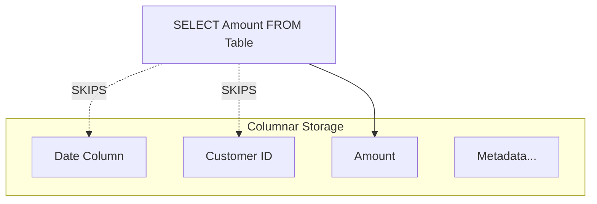

# Day 41: Data Capstone (The $50 Query Rescue)

**Duration:** ⏱️ 90 Minutes  
**Level:** Advanced (Scenario-Based)  
**ACE Exam Weight:** ⭐⭐⭐⭐⭐ Critical (Data Analytics & Cost)

---

## 🕵️‍♂️ The Scenario: "The Runaway Dashboard"

A Marketing Director is complaining that their internal dashboard has become "unusable." It used to load in seconds; now it takes minutes and has triggered a "Budget Alert" for the data team. Every time the dashboard refreshes, it costs the company $50 in BigQuery scan fees.

**The Symptom:** 10 TB of data is being scanned per query to find just 10 GB of relevant info.
**The Goal:** Reduce the scan volume (and cost) by 99% using partitioning and clustering.

---

## 🏗️ 1. Architecture: BigQuery Columnar Storage

BigQuery doesn't store data in rows like Excel. It stores it in **Columns**.



**The Lesson:** If you `SELECT *`, you pay for **every** column, even the ones you don't use.

---

## 🛠️ 2. The Performance Audit (Dry Run)

Before fixing the query, always calculate the damage. Use the `--dry_run` flag in the CLI:

```bash
gcloud bq query --use_legacy_sql=false --dry_run \
"SELECT * FROM sales.transactions_all WHERE date = '2025-01-01'"
```
> **Output:** "This query will process **10.2 TB**." -> **Estimated Cost: $51.00**

---

## 🏗️ 3. The "Hero" Solution: Partitioning & Clustering

### Step 1: Create the Partitioned Table
Partitioning splits the table into "mini-tables" by date.

```sql
CREATE TABLE `sales.transactions_optimized`
PARTITION BY DATE(transaction_date)
CLUSTER BY customer_id
AS
SELECT * FROM `sales.transactions_all`
```

### Step 2: The Audit (After Fix)
Run the same query against the *optimized* table:
```bash
gcloud bq query --use_legacy_sql=false --dry_run \
"SELECT amount FROM sales.transactions_optimized WHERE transaction_date = '2025-01-01'"
```
> **Output:** "This query will process **12 GB**." -> **Estimated Cost: $0.06**

---

## 💰 4. Performance vs. Cost Comparison

| Feature | Without Optimization | With Partitioning | With Partitioning + Clustering |
| :--- | :--- | :--- | :--- |
| **Scan Size** | 10.2 TB | 12.5 GB | **2.1 GB** |
| **Cost** | ~$51.00 | ~$0.06 | **~$0.01** |
| **Latency** | 240 seconds | 12 seconds | **3 seconds** |

---

## 🏗️ 5. The Job-Ready Solution (Terraform) 📉

Automate the data lifecycle to prevent "Resource Leakage."

```hcl
# bigquery.tf
resource "google_bigquery_dataset" "marketing" {
  dataset_id = "marketing_prod"
  location   = "US"
}

resource "google_bigquery_table" "sales" {
  dataset_id = google_bigquery_dataset.marketing.dataset_id
  table_id   = "optimized_sales"

  # 1. Partitioning (By Date)
  time_partitioning {
    type  = "DAY"
    field = "sale_timestamp"
  }

  # 2. Clustering (By High-Cardinality Columns)
  clustering = ["customer_id", "store_id"]

  # 3. Expiration (Compliance/Cost)
  expiration_time = 31536000000 # 365 Days
}
```

---

<!-- QUIZ_START -->
## 📝 6. Knowledge Check

1.  **Which BigQuery feature allows the query engine to completely skip entire blocks of data that don't match a time-based filter?**
    *   A. Clustering.
    *   B. **Partitioning.** ✅ (Pruning happens at the partition level).
    *   C. Indices.
    *   D. Materialized Views.

2.  **You want to sort data within a partition to make filters like `WHERE customer_id = 123` faster. What should you use?**
    *   A. Primary Key.
    *   B. **Clustering.** ✅ (Clustering organizes data within partitions).
    *   C. Row Keys.
    *   D. Cloud SQL.

3.  **True or False: Using `SELECT *` in BigQuery is a recommended practice because the query engine automatically optimizes out unused columns.**
    *   A. True
    *   B. **False.** ✅ (BigQuery is columnar; `SELECT *` forces a scan of all columns, increasing cost).

4.  **How can you find out how much a query will cost without actually running it and incurring charges?**
    *   A. Run it and check the bill tomorrow.
    *   B. **Use the --dry_run flag in the CLI or 'Query Validator' in the Console.** ✅
    *   C. Ask Google Support.
    *   D. Check the Secret Manager.

5.  **What is the best way to handle data that is over 2 years old and no longer needed for daily reports?**
    *   A. Manually delete it.
    *   B. **Set a Table or Partition Expiration policy.** ✅ (Automated lifecycle management).
    *   C. Move it to a different project.
    *   D. Encrypt it and forget the key.
<!-- QUIZ_END -->
---

<div class="checklist-card" x-data="{ 
    items: [
        { text: 'I understand the performance impact of Columnar Storage.', checked: false },
        { text: 'I can distinguish between Partitioning and Clustering.', checked: false },
        { text: 'I know how to use --dry_run to estimate query costs.', checked: false },
        { text: 'I can implement table expiration for data lifecycle management.', checked: false }
    ]
}">
    <h3>
        <svg viewBox="0 0 24 24" fill="none" stroke="currentColor" stroke-width="2" stroke-linecap="round" stroke-linejoin="round" class="text-blurple">
            <path d="M22 11.08V12a10 10 0 1 1-5.93-9.14"></path>
            <polyline points="22 4 12 14.01 9 11.01"></polyline>
        </svg>
        Day 41 Mastery Checklist
    </h3>
    <template x-for="(item, index) in items" :key="index">
        <div class="checklist-item" @click="item.checked = !item.checked">
            <div class="checklist-box" :class="{ 'checked': item.checked }">
                <svg viewBox="0 0 24 24" fill="none" stroke="currentColor" stroke-width="3" stroke-linecap="round" stroke-linejoin="round">
                    <polyline points="20 6 9 17 4 12"></polyline>
                </svg>
            </div>
            <span x-text="item.text" :class="{ 'line-through text-slate-400': item.checked }"></span>
        </div>
    </template>
</div>
