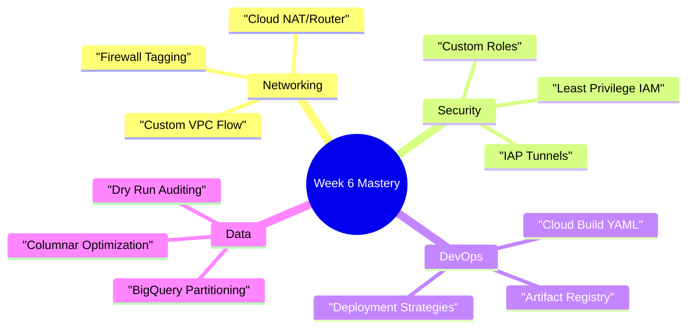

# Week 6 Review: The Capstone Experience & SRE Mindset

**Duration:** ⏱️ 60 Minutes  
**Level:** Comprehensive  
**ACE Exam Weight:** ⭐⭐⭐⭐⭐ Critical (Scenario Synthesis)

---

## 🏗️ 1. The Capstone Skills Tree

This week, you transitioned from a "student" to a "builder." You solved four real-world scenarios that mirrored the complexity of the ACE exam's highest-weighted questions.



---

## 📈 2. SRE: Balancing Reliability vs. Agility

Site Reliability Engineering (SRE) is the "secret sauce" of Google's operations. The ACE exam expects you to understand how to balance innovation with stability.

| Concept | The "Human" Definition | The "Exam" Definition |
| :--- | :--- | :--- |
| **SLI** | "How are we doing right now?" | A specific metric (Latency, Error Rate). |
| **SLO** | "The goal we usually hit." | A target value for an SLI (99.9% success). |
| **SLA** | "The contract with legal teeth." | A business agreement with financial penalties. |
| **Error Budget** | "Permission to break things." | The amount of downtime allowed before stopping new features. |

**Pro Tip:** If you have 100% of your Error Budget left, you are moving too slowly! Use that budget to push new features or perform risky migrations.

---

## 💼 3. Career Pivot: Building Your Portfolio

The projects you built this week aren't just for learning; they are for your resume.

*   **Network Fix:** Showcases your ability to troubleshoot complex hybrid-cloud connectivity.
*   **Hardened IAM:** Demonstrates that you are a "Security-First" engineer.
*   **Automated Pipeline:** Proves you can scale infrastructure without "ClickOps."
*   **Optimized BigQuery:** Shows you understand cloud costs (FinOps).

---

## 🚀 Resume-Ready Project Ideas

These projects demonstrate real cloud engineering skills to employers. Each is designed to be completed in 2-4 hours.

### 🔥 Tier 1: Foundation Projects (Add to GitHub)

| Project | Skills Demonstrated | Description |
|---------|---------------------|-------------|
| **Auto-Healing Web Cluster** | MIG, Load Balancing, Health Checks | Regional MIG with HTTP LB. Simulate failure by deleting VM. |
| **Secure Static Website** | Cloud Storage, IAM, Cloud CDN | Host static site with signed URLs for private assets. |
| **Serverless API** | Cloud Run, Firestore, IAM | REST API with authentication using Cloud Run + Firestore. |

### 🔥 Tier 2: Intermediate Projects (Interview Ready)

| Project | Skills Demonstrated | Description |
|---------|---------------------|-------------|
| **CI/CD Pipeline** | Cloud Build, Artifact Registry, GKE | Auto-deploy container to GKE on Git push. |
| **Cost Monitor** | Cloud Functions, Pub/Sub, Billing API | Alert Slack when daily spend exceeds threshold. |
| **Multi-Region DR** | Cloud SQL, Cross-region replication | Primary in US, failover replica in EU. Test failover. |

### 🔥 Tier 3: Advanced Capstone (Portfolio Highlight)

| Project | Skills Demonstrated | Description |
|---------|---------------------|-------------|
| **Microservices Platform** | GKE, Cloud SQL, Pub/Sub, Monitoring | 3-service app with async messaging and full observability. |
| **Data Lake Architecture** | Cloud Storage, Dataflow, BigQuery | Ingest CSV → Transform → Analytics dashboard. |
| **Zero-Trust Network** | VPC Service Controls, IAP, Private Google Access | Corporate-grade network with no public IPs. |

### How to Present on Resume

```
PROJECTS
─────────────────────────────────────────────────
GCP Auto-Healing Web Infrastructure
• Deployed regional MIG with HTTP(S) Load Balancer
• Configured auto-healing with custom health checks
• Achieved 99.9% uptime simulation with zero manual intervention
• Technologies: Compute Engine, Cloud Load Balancing, Terraform
```

### GitHub Repository Structure

```
gcp-portfolio/
├── README.md           # Overview with architecture diagrams
├── auto-healing-mig/   # Project 1
│   ├── terraform/
│   └── README.md       # Setup instructions
├── serverless-api/     # Project 2
│   ├── src/
│   └── cloudbuild.yaml
└── data-pipeline/      # Project 3
    └── dataflow/
```

> **💡 Pro Tip:** Every project should have a README with:
> 1. Architecture diagram (Mermaid or image)
> 2. Problem it solves
> 3. How to deploy (step-by-step)
> 4. Cost estimate

---

## 🎯 Capstone Mini-Projects (2-Hour Challenges)

Complete these quick challenges to reinforce your skills:

### Challenge 1: The "Break-Fix" Lab
**Time:** 30 minutes | **Difficulty:** Medium

1. Create a VM with no external IP
2. Try to SSH (it will fail)
3. Fix it using **IAP tunnel** without adding a public IP
4. Document the commands used

### Challenge 2: The "Cost Optimizer"
**Time:** 45 minutes | **Difficulty:** Medium

1. Create a Cloud Storage bucket with Standard class
2. Add a lifecycle rule: Move to Nearline after 30 days, Archive after 90 days
3. Upload test files and verify the rule applies
4. Calculate cost savings compared to keeping in Standard

### Challenge 3: The "Incident Response"
**Time:** 60 minutes | **Difficulty:** Hard

1. Deploy a simple web app on Cloud Run
2. Create an alerting policy for 5xx errors
3. Configure a Pub/Sub notification channel
4. Simulate an error and verify the alert fires

### Challenge 4: The "Security Audit"
**Time:** 30 minutes | **Difficulty:** Easy

1. Run `gcloud projects get-iam-policy [PROJECT]`
2. Identify any Basic roles (Owner/Editor/Viewer) in use
3. Create a report recommending specific Predefined role replacements
4. Apply one recommendation to prove the concept

## 📝 4. Advanced Mock Exam (Week 6)


1.  **Your application has an SLO of 99.9% availability per month. You have experienced 40 minutes of downtime this month. Your monthly 'Error Budget' is 43 minutes. What should you do?**
    *   A. Stop all new feature releases immediately.
    *   B. **Proceed with caution. You have 3 minutes of budget left.** ✅
    *   C. Ignore it; 40 minutes is close enough.
    *   D. Delete the project and restart.

2.  **A team is using a basic 'roles/editor' permission for their Service Accounts. You recommend 'Custom Roles.' What is the primary benefit?**
    *   A. It reduces the monthly bill.
    *   B. **It reduces the 'Attack Surface' by following the Principle of Least Privilege.** ✅
    *   C. It makes the build process faster.
    *   D. It allows access to the Free Tier.

3.  **Which combination of services allows a private VM to download internet updates while blocking all direct inbound traffic?**
    *   A. VPC Peering + Cloud SQL.
    *   B. **Cloud NAT + Cloud Router + VPC Firewall (Default Egress).** ✅
    *   C. Global Load Balancer + Cloud Armor.
    *   D. App Engine + Secret Manager.

4.  **How does 'Partitioning' in BigQuery directly contribute to FinOps goals?**
    *   A. It encrypts data for free.
    *   B. **It allows the query engine to prune unrelated data, reducing the bytes scanned and thus lowering cost.** ✅
    *   C. It makes the dashboard look better.
    *   D. It increases the throughput of the API.

5.  **A developer committed a Service Account JSON key to a public GitHub repo. What is the immediate 'SRE' response?**
    *   A. Ask the developer to delete the file from Git.
    *   B. **Disable/Delete the key in GCP Console and rotate the credentials immediately.** ✅
    *   C. Change the developer's password.
    *   D. Do nothing; the repo is private now.


---

<div class="checklist-card" x-data="{ 
    items: [
        { text: 'I can explain the relationship between SLIs and SLOs.', checked: false },
        { text: 'I know when to use an Error Budget to push features.', checked: false },
        { text: 'I understand why long-lived JSON keys are a security risk.', checked: false },
        { text: 'I can articulate the value of my capstone projects to an employer.', checked: false }
    ]
}">
    <h3>
        <svg viewBox="0 0 24 24" fill="none" stroke="currentColor" stroke-width="2" stroke-linecap="round" stroke-linejoin="round" class="text-blurple">
            <path d="M22 11.08V12a10 10 0 1 1-5.93-9.14"></path>
            <polyline points="22 4 12 14.01 9 11.01"></polyline>
        </svg>
        Week 6 Mastery Checklist
    </h3>
    <template x-for="(item, index) in items" :key="index">
        <div class="checklist-item" @click="item.checked = !item.checked">
            <div class="checklist-box" :class="{ 'checked': item.checked }">
                <svg viewBox="0 0 24 24" fill="none" stroke="currentColor" stroke-width="3" stroke-linecap="round" stroke-linejoin="round">
                    <polyline points="20 6 9 17 4 12"></polyline>
                </svg>
            </div>
            <span x-text="item.text" :class="{ 'line-through text-slate-400': item.checked }"></span>
        </div>
    </template>
</div>
