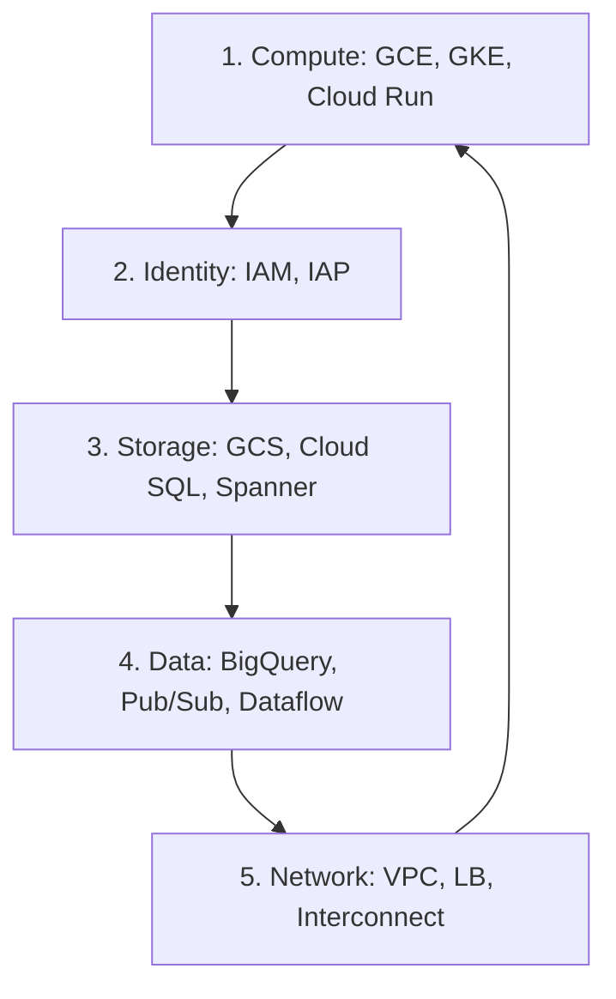

# Day 44: Week 7 Review & Course Completion (The Finish Line)

**Duration:** ⏱️ 60 Minutes  
**Level:** Comprehensive Review  
**ACE Exam Weight:** ⭐⭐⭐⭐⭐ 100% (The Total Synthesis)

---

## 🎯 Learning Objectives

By the end of Day 44, you will be able to:
*   **Recall** the core services from all 5 GCP pillars.
*   **Map** complex business requirements to the correct architectural patterns.
*   **Validate** your readiness for the 2-hour official exam.
*   **Navigate** the post-certification career paths (Professional level exams).

---

## 🏗️ 1. The "Big Five" Pilar Recap

This is the entire course in one diagram. If you understand these five connections, you are ready.



| Pillar | Key Service for ACE | "The Hook" |
| :--- | :--- | :--- |
| **Compute** | **Compute Engine (MIGs)** | High availability & Auto-scaling. |
| **Identity** | **IAM (Custom Roles)** | Least Privilege & Resource Hierarchy. |
| **Storage** | **Cloud Storage (Classes)** | Lifecycle rules & Cost reduction. |
| **Data** | **BigQuery** | Serverless SQL at petabyte scale. |
| **Network** | **VPC (Firewall Tags)** | Global isolation & hybrid connectivity. |

---

## 📈 2. Domain Cheat Sheet (ACE Blueprint)

1.  **Setting up a Cloud Solution:** Focus on Billing Accounts, Projects, and gcloud config.
2.  **Planning & Configuring:** Focus on pricing calculations and choosing between Compute options.
3.  **Deploying & Implementing:** Focus on `gcloud`, `gsutil`, and `kubectl` basics.
4.  **Ensuring Successful Operation:** Focus on Cloud Monitoring, Logging, and quotas.
5.  **Configuring Access & Security:** Focus on IAM, Audit Logs, and Service Accounts.

---

## 📝 3. Final Knowledge Check (Mixed Domains)


1.  **A company wants to migrate an on-premises Hadoop cluster to GCP with minimal operational change. What is the best service?**
    *   A. Cloud Spanner.
    *   B. **Cloud Dataproc.** ✅ (Managed Spark/Hadoop).
    *   C. Dataflow.
    *   D. Compute Engine with manual install.

2.  **You need to ensure that no developer can create a public Cloud Storage bucket in your entire organization. Where do you apply the policy?**
    *   A. On each individual bucket.
    *   B. On each project.
    *   C. **At the Organization node (Organization Policy).** ✅
    *   D. In the billing account.

3.  **What is the fastest way to migrate 100 TB of image data from an AWS S3 bucket to GCP?**
    *   A. `gsutil cp`.
    *   B. **Storage Transfer Service.** ✅ (Managed, high-speed over the internet).
    *   C. Transfer Appliance (Physical).
    *   D. Cloud Build.

4.  **You want to serve a global application via a single IP address and ensure traffic is routed to the nearest regional GKE cluster. What do you use?**
    *   A. Regional Network LB.
    *   B. **Global External HTTP(S) Load Balancer.** ✅
    *   C. VPC Peering.
    *   D. Cloud DNS.

5.  **True or False: A Subscriber in Pub/Sub consumes messages from a 'Topic' directly.**
    *   A. True
    *   B. **False.** ✅ (Subscribers always consume from a **Subscription**, which is linked to a Topic).


---

## 🎓 4. Next Steps: Beyond the ACE

Congratulations! You have completed the 45-day curriculum. Here is how to keep the momentum:
1.  **Take the Final Mock Exam (Day 45).**
2.  **Schedule your ACE Exam** via [Webassessor](https://www.webassessor.com/googlecloud/).
3.  **Plan your Professional Exam:**
    *   **Professional Cloud Architect:** For designers.
    *   **Professional Data Engineer:** For data gurus.
    *   **Professional Cloud Security Engineer:** For security experts.

---

<div class="checklist-card" x-data="{ 
    items: [
        { text: 'I have completed all 45 days of the curriculum.', checked: false },
        { text: 'I can map requirements to GCP services with confidence.', checked: false },
        { text: 'I understand the ACE exam blueprint domains.', checked: false },
        { text: 'I am ready to tackle the final mock exam.', checked: false }
    ]
}">
    <h3>
        <svg viewBox="0 0 24 24" fill="none" stroke="currentColor" stroke-width="2" stroke-linecap="round" stroke-linejoin="round" class="text-blurple">
            <path d="M22 11.08V12a10 10 0 1 1-5.93-9.14"></path>
            <polyline points="22 4 12 14.01 9 11.01"></polyline>
        </svg>
        Course Completion Checklist
    </h3>
    <template x-for="(item, index) in items" :key="index">
        <div class="checklist-item" @click="item.checked = !item.checked">
            <div class="checklist-box" :class="{ 'checked': item.checked }">
                <svg viewBox="0 0 24 24" fill="none" stroke="currentColor" stroke-width="3" stroke-linecap="round" stroke-linejoin="round">
                    <polyline points="20 6 9 17 4 12"></polyline>
                </svg>
            </div>
            <span x-text="item.text" :class="{ 'line-through text-slate-400': item.checked }"></span>
        </div>
    </template>
</div>

---

### 🗑️ Lab Cleanup (Mandatory)

> **⚠️ Critical:** Delete resources to avoid unecessary billing!

1.  **Delete Project:** (Fastest way)
    ```bash
    gcloud projects delete $PROJECT_ID
    ```
2.  **Or Delete Resources Individually:**
    ```bash
    # Example commands (verify before running)
    gcloud compute instances delete [INSTANCE_NAME] --quiet
    gcloud storage rm -r gs://[BUCKET_NAME]
    ```
