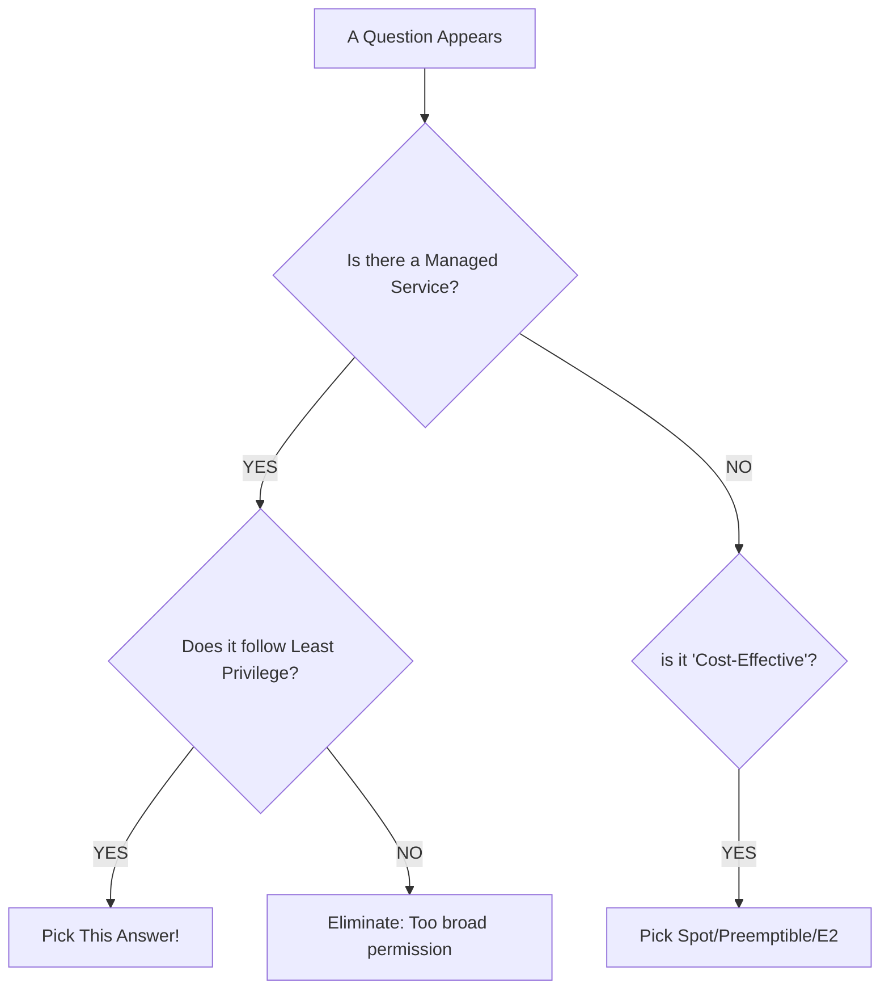

# Day 43: The Strategic Test Taker (Cracking the ACE)

**Duration:** ⏱️ 60 Minutes  
**Level:** Expert Tactics  
**ACE Exam Weight:** ⭐⭐⭐⭐⭐ 100% (The Final Stretch)

---

## 🎯 Learning Objectives

By the end of Day 43, you will be able to:
*   **Apply** the "Google Way" of elimination to complex scenarios.
*   **Identify** specific keywords that point to the correct gcloud command.
*   **Navigate** the exam interface to maximize your time.
*   **Execute** a final 24-hour study plan for peak performance.

---

## 🏗️ 1. The "Google Way" Decision Matrix

Google doesn't just want to know if you can click a button. They want to know if you understand **architectural trade-offs**. Use this hierarchy when you see multiple "correct" options:

### The Hierarchy of Choice:
1.  **Managed over Self-Managed:** (Cloud SQL > MySQL on GCE).
2.  **Serverless over Clusters:** (Cloud Run > GKE if simple).
3.  **Specific Role over Basic Role:** (`roles/storage.objectViewer` > `roles/viewer`).
4.  **Google Groups over Individual Users:** (Manage 100 users by adding them to a group).

---

## 🔍 2. Keyword Matchmaker (The "Cheat Sheet")

| If you see this requirement... | Think of this GCP Service... |
| :--- | :--- |
| **"Global, Relational, ACID"** | **Cloud Spanner** |
| **"Hadoop/Spark Lift & Shift"** | **Cloud Dataproc** |
| **"Sub-10ms Nosql High Throughput"** | **Cloud Bigtable** |
| **"Petabyte Scale Analytics"** | **BigQuery** |
| **"Private Fiber Connection"** | **Dedicated Interconnect** |
| **"Hybrid DNS Resolution"** | **Cloud DNS Peering/Forwarding** |
| **"Event-Driven Glue"** | **Cloud Functions** |

---

## 🚨 3. Common Exam Traps (Avoid These!)

*   **Trap: The `LIMIT` Myth.**
    *   Requirement: "Lower the cost of a BigQuery query."
    *   Wrong: "Add a `LIMIT 10` clause." (BigQuery is columnar; you pay for the scan, not the rows displayed).
    *   Right: **"Use Partitioning and select only specific columns."**
*   **Trap: The `Bucket Public` Laziness.**
    *   Requirement: "Give a contractor access to one file for 1 hour."
    *   Wrong: "Make the bucket public." or "Give them the Owner role."
    *   Right: **"Generate a Signed URL."** or **"Use IAM with a condition."**
*   **Trap: Outbound from Private VMs.**
    *   Requirement: "A VM with no public IP needs to download a patch."
    *   Wrong: "Open Firewall port 80/443." (Firewalls don't provide pathing).
    *   Right: **"Configure Cloud NAT."**

---

## 🧪 4. Final 24-Hour Checklist

1.  **T-24h:** Take one full mock exam (Day 45).
2.  **T-12h:** Review the "Exam Case Studies" (Mountkirk, TerramEarth).
3.  **T-4h:** Scan the `gcloud` command syntax for GKE, Compute, and Storage.
4.  **T-1h:** Review the **Resource Hierarchy** (Org > Folder > Project > Resource).
5.  **T-0h:** **MARK FOR REVIEW** is your best friend. Don't get stuck.

---

    <h3>
        <svg viewBox="0 0 24 24" fill="none" stroke="currentColor" stroke-width="2" stroke-linecap="round" stroke-linejoin="round" class="text-blurple">
            <path d="M22 11.08V12a10 10 0 1 1-5.93-9.14"></path>
            <polyline points="22 4 12 14.01 9 11.01"></polyline>
        </svg>
        Day 43 Strategy Checklist
    </h3>
    <template x-for="(item, index) in items" :key="index">
        

            

                <svg viewBox="0 0 24 24" fill="none" stroke="currentColor" stroke-width="3" stroke-linecap="round" stroke-linejoin="round">
                    <polyline points="20 6 9 17 4 12"></polyline>
                </svg>
            

            
        

    </template>

