# Day 45: The ACE Exam - Final Strategy & Tips

**Duration:** ⏱️ 45 Minutes  
**Level:** Expert Tactics  
**ACE Exam Weight:** ⭐⭐⭐⭐⭐ 100% (Everything leads here!)

---

> [!TIP]
> **TL;DR (Your Exam Cheat Sheet)**  
> When stuck between two answers: pick **Managed over DIY**, **Serverless over Clusters**, **Predefined Role over Basic Role**, and **Groups over Users**. Security is 19% of the exam (highest!). Pass score is 70%, not 100%. Time strategy: 60 min first pass, flag hard questions, 30 min review.

---

## 🎯 Learning Objectives

| ✅ What You'll Master | How It Helps |
|-----------------------|--------------|
| **"Google Way" elimination** | Break ties between similar answers |
| **Keyword-to-service mapping** | Instantly recognize correct service |
| **Common exam traps** | Avoid the mistakes 80% of test-takers make |
| **Exam day strategy** | Manage time and reduce anxiety |

---

## 🧠 1. The "Google Way" Decision Hierarchy

When multiple answers seem correct, Google wants you to choose:

```mermaid
flowchart TD
    A[Multiple Correct Answers?] --> B{Managed Service?}
    B -->|Yes| C{Least Privilege?}
    B -->|No| D[Eliminate: DIY usually wrong]
    
    C -->|Yes| E{Minimal Effort?}
    C -->|No| F[Eliminate: Over-permissioned]
    
    E -->|Yes| PICK[✅ Pick This Answer!]
    E -->|No| G[Eliminate: Too complex]
    
    style PICK fill:#e8f5e9,stroke:#4caf50,stroke-width:2px
    style D fill:#ffebee,stroke:#f44336
    style F fill:#ffebee,stroke:#f44336
```



### The Golden Rules

| Priority | Rule | Example |
|----------|------|---------|
| 1️⃣ | **Managed > Self-managed** | Cloud SQL > MySQL on GCE |
| 2️⃣ | **Serverless > Clusters** | Cloud Run > GKE (for simple apps) |
| 3️⃣ | **Specific Role > Basic Role** | `roles/storage.objectViewer` > `roles/viewer` |
| 4️⃣ | **Groups > Individual Users** | Manage 100 users via 1 group |

---

## 🔍 2. Keyword-to-Service Cheat Sheet

| When You See... | Think... |
|----------------|----------|
| "Global, Relational, ACID" | **Cloud Spanner** |
| "Hadoop/Spark lift and shift" | **Dataproc** |
| "Sub-10ms NoSQL, high throughput" | **Bigtable** |
| "Petabyte analytics, SQL" | **BigQuery** |
| "Private fiber connection" | **Dedicated Interconnect** |
| "Event-driven, serverless" | **Cloud Functions / Eventarc** |
| "Container without cluster" | **Cloud Run** |
| "Kubernetes required" | **GKE** |
| "Store images, videos" | **Cloud Storage** |
| "Cache frequently accessed data" | **Memorystore (Redis)** |
| "Low RTO/RPO for Disaster Recovery" | **VPC Peering/VPN with Multi-Region GCS** |

---

## 🏗️ 2.5 HA vs DR: The Resilience Duo
For the "Best in Market" edge, understand the difference between High Availability and Disaster Recovery:

*   **HA (High Availability):** Active-Active. Keeping the system UP during failures (e.g., Multi-Zonal MIG).
*   **DR (Disaster Recovery):** Active-Passive. Restoring the system AFTER a failure (e.g., Archive data, cross-region backups).
*   **RPO (Recovery Point Objective):** How much data can you afford to lose? (Time since last backup).
*   **RTO (Recovery Time Objective):** How quickly must you be back online? (Time to restore).

> [!TIP]
> **ACE Rule:** If they ask for "Global HA", look for **Multi-Region** or **Global** services like Spanner or Global LB.

---

## 🚨 3. Top Exam Traps (Avoid These!)

> [!CAUTION]
> These are the **most common mistakes** that cause people to fail. Memorize them!

| 🚩 Trap | ❌ Wrong Answer | ✅ Right Answer | Why |
|---------|-----------------|-----------------|-----|
| **The LIMIT Myth** | Add `LIMIT 10` to reduce BigQuery cost | Use partitioning + select columns | LIMIT still scans all data first |
| **Public Bucket Shortcut** | Make bucket public for contractor | Generate a Signed URL | Public = security risk |
| **Private VM Internet** | Open firewall ports | Configure Cloud NAT | NAT = outbound only, more secure |
| **VPC Scope** | VPCs are Regional | VPCs are **Global** | Subnets are regional, not VPCs |
| **Default SA** | Use default SA with Editor | Create custom SA with minimal perms | Least privilege principle |

---

## 📊 4. Exam Domain Weight


### Focus Areas by Domain

| Domain | Key Topics |
|--------|-----------|
| **Security (19%)** | IAM, Service Accounts, VPC firewalls, Cloud Armor |
| **Compute (17%)** | CE vs GKE vs Cloud Run vs Functions |
| **Projects (17%)** | Hierarchy, billing, quotas, labels |
| **Data (14%)** | Cloud SQL vs Spanner vs Bigtable vs BigQuery |
| **Networking (14%)** | VPCs, subnets, load balancing, VPN |

---

## 🕐 5. Exam Day Strategy

### Time Management

| Phase | Time | Action |
|-------|------|--------|
| **First Pass** | 0-60 min | Answer confident questions |
| **Mark & Skip** | If >60 sec | Flag for review, move on |
| **Second Pass** | 60-90 min | Return to flagged questions |
| **Final Review** | 90-120 min | Double-check marked answers |

### Question Analysis Framework
```
1. Read LAST sentence first (what are they asking?)
2. Identify the CONSTRAINT (cost? latency? compliance?)
3. Eliminate 2 obviously wrong answers
4. Choose between remaining 2 based on constraint
```

---

## ✅ 6. Final 24-Hour Checklist

| Time | Action |
|------|--------|
| **T-24h** | Take final mock exam |
| **T-12h** | Review weak areas only |
| **T-4h** | Scan key gcloud commands |
| **T-1h** | Review resource hierarchy |
| **T-0** | Relax, trust your prep |

### Quick Reference Card

| Category | Remember |
|----------|----------|
| **VPC** | Global. Subnets are Regional. |
| **Firewall** | Ingress blocked by default. |
| **IAM** | Least privilege. Groups > Users. |
| **Storage** | Standard > Nearline > Coldline > Archive |
| **LB** | HTTP(S) = Global. Network = Regional. |
| **Pass Score** | 70% (not 100%!) |

---

<!-- QUIZ_START -->
## 📝 7. Final Strategy Quiz

1. **A question asks for "MOST cost-effective" batch processing. What should you choose?**
    *   A. N1-Standard with CUDs
    *   B. **Spot/Preemptible VMs** ✅
    *   C. App Engine Standard
    *   D. Cloud Run always-on

2. **You see two correct answers: one uses Predefined Role, another uses Custom Role. Which to prefer?**
    *   A. Custom Role (more precise)
    *   B. **Predefined Role (less management)** ✅
    *   C. Basic Role (simpler)
    *   D. No difference

3. **During the exam, you're stuck on a long scenario question. Best strategy?**
    *   A. Spend 10+ minutes
    *   B. Skip permanently
    *   C. **Mark for Review, return later** ✅
    *   D. Pick C and move on

4. **Which exam domain has the highest weight?**
    *   A. Compute resources
    *   B. **Security implementation (19%)** ✅
    *   C. Networking
    *   D. Data solutions

5. **The exam says "minimum operational overhead." What type of solution?**
    *   A. Custom VM setup
    *   B. **Managed/Serverless service** ✅
    *   C. Third-party tool
    *   D. Open-source on GCE
<!-- QUIZ_END -->

---

## 🚀 You Are Ready!

Take a deep breath. You didn't just read about the cloud—**you built it.**

### Remember:
*   **70% to pass** - You don't need perfection
*   **Mark for Review** - Your best friend
*   **Managed > DIY** - When in doubt
*   **Trust your preparation**

**Good luck! You've got this! 🍀**

<!-- FLASHCARDS
[
  {"term": "50/50 Rule", "def": "Eliminate 2 wrong answers to double your odds."},
  {"term": "Business Constraint", "def": "Key requirement (cost, latency, compliance) that dictates the answer."},
  {"term": "Mark for Review", "def": "Flag difficult questions and return after completing easier ones."},
  {"term": "Managed Service", "def": "Always prefer managed over DIY when asked for 'minimum effort'."},
  {"term": "Pass Score", "def": "70%. You don't need to be perfect."},
  {"term": "Security Domain", "def": "Highest weight at 19%. Focus on IAM and firewalls."}
]
-->

---

### 🗑️ Lab Cleanup (Mandatory)

> **⚠️ Critical:** Delete resources to avoid unecessary billing!

1.  **Delete Project:** (Fastest way)
    ```bash
    gcloud projects delete $PROJECT_ID
    ```
2.  **Or Delete Resources Individually:**
    ```bash
    # Example commands (verify before running)
    gcloud compute instances delete [INSTANCE_NAME] --quiet
    gcloud storage rm -r gs://[BUCKET_NAME]
    ```
