# Day 45: The ACE Exam - Final Strategy & Tips

**Duration:** ⏱️ 45 Minutes  
**Level:** Expert Tactics  
**ACE Exam Weight:** ⭐⭐⭐⭐⭐ 100% (Everything leads here!)

---

## 🎯 Learning Objectives

By the end of this session, you will:

*   **Apply** the "Google Way" elimination strategy
*   **Recognize** keyword-to-service mappings
*   **Avoid** common exam traps
*   **Execute** a winning exam day strategy

---

## 🧠 1. The "Google Way" Decision Hierarchy

When multiple answers seem correct, Google wants you to choose:

```mermaid
flowchart TD
    A[Multiple Correct Answers?] --> B{Managed Service?}
    B -->|Yes| C{Least Privilege?}
    B -->|No| D[Eliminate: DIY usually wrong]
    
    C -->|Yes| E{Minimal Effort?}
    C -->|No| F[Eliminate: Over-permissioned]
    
    E -->|Yes| PICK[✅ Pick This Answer!]
    E -->|No| G[Eliminate: Too complex]
    
    style PICK fill:#e8f5e9,stroke:#4caf50,stroke-width:2px
    style D fill:#ffebee,stroke:#f44336
    style F fill:#ffebee,stroke:#f44336
```



### The Golden Rules

| Priority | Rule | Example |
|----------|------|---------|
| 1️⃣ | **Managed > Self-managed** | Cloud SQL > MySQL on GCE |
| 2️⃣ | **Serverless > Clusters** | Cloud Run > GKE (for simple apps) |
| 3️⃣ | **Specific Role > Basic Role** | `roles/storage.objectViewer` > `roles/viewer` |
| 4️⃣ | **Groups > Individual Users** | Manage 100 users via 1 group |

---

## 🔍 2. Keyword-to-Service Cheat Sheet

| When You See... | Think... |
|----------------|----------|
| "Global, Relational, ACID" | **Cloud Spanner** |
| "Hadoop/Spark lift and shift" | **Dataproc** |
| "Sub-10ms NoSQL, high throughput" | **Bigtable** |
| "Petabyte analytics, SQL" | **BigQuery** |
| "Private fiber connection" | **Dedicated Interconnect** |
| "Event-driven, serverless" | **Cloud Functions / Eventarc** |
| "Container without cluster" | **Cloud Run** |
| "Kubernetes required" | **GKE** |
| "Store images, videos" | **Cloud Storage** |
| "Cache frequently accessed data" | **Memorystore (Redis)** |

---

## 🚨 3. Top Exam Traps (Avoid These!)

### Trap 1: The LIMIT Myth
> **Question:** "How to reduce BigQuery costs?"  
> ❌ **Wrong:** Add `LIMIT 10` (you still scan all data)  
> ✅ **Right:** Use partitioning + select specific columns

### Trap 2: The Public Bucket Shortcut
> **Question:** "Give contractor access to one file for 1 hour"  
> ❌ **Wrong:** Make bucket public  
> ✅ **Right:** Generate a Signed URL

### Trap 3: The Private VM Internet Access
> **Question:** "VM with no public IP needs to download patches"  
> ❌ **Wrong:** Open firewall ports  
> ✅ **Right:** Configure Cloud NAT

### Trap 4: The VPC Scope
> **Question:** "VPCs are..."  
> ❌ **Wrong:** Regional  
> ✅ **Right:** Global (subnets are regional)

### Trap 5: The Default SA
> **Question:** "Best practice for VM service account"  
> ❌ **Wrong:** Use default SA with Editor role  
> ✅ **Right:** Create custom SA with minimal permissions

---

## 📊 4. Exam Domain Weight


### Focus Areas by Domain

| Domain | Key Topics |
|--------|-----------|
| **Security (19%)** | IAM, Service Accounts, VPC firewalls, Cloud Armor |
| **Compute (17%)** | CE vs GKE vs Cloud Run vs Functions |
| **Projects (17%)** | Hierarchy, billing, quotas, labels |
| **Data (14%)** | Cloud SQL vs Spanner vs Bigtable vs BigQuery |
| **Networking (14%)** | VPCs, subnets, load balancing, VPN |

---

## 🕐 5. Exam Day Strategy

### Time Management

| Phase | Time | Action |
|-------|------|--------|
| **First Pass** | 0-60 min | Answer confident questions |
| **Mark & Skip** | If >60 sec | Flag for review, move on |
| **Second Pass** | 60-90 min | Return to flagged questions |
| **Final Review** | 90-120 min | Double-check marked answers |

### Question Analysis Framework
```
1. Read LAST sentence first (what are they asking?)
2. Identify the CONSTRAINT (cost? latency? compliance?)
3. Eliminate 2 obviously wrong answers
4. Choose between remaining 2 based on constraint
```

---

## ✅ 6. Final 24-Hour Checklist

| Time | Action |
|------|--------|
| **T-24h** | Take final mock exam |
| **T-12h** | Review weak areas only |
| **T-4h** | Scan key gcloud commands |
| **T-1h** | Review resource hierarchy |
| **T-0** | Relax, trust your prep |

### Quick Reference Card

| Category | Remember |
|----------|----------|
| **VPC** | Global. Subnets are Regional. |
| **Firewall** | Ingress blocked by default. |
| **IAM** | Least privilege. Groups > Users. |
| **Storage** | Standard > Nearline > Coldline > Archive |
| **LB** | HTTP(S) = Global. Network = Regional. |
| **Pass Score** | 70% (not 100%!) |

---

<!-- QUIZ_START -->
## 📝 7. Final Strategy Quiz

1. **A question asks for "MOST cost-effective" batch processing. What should you choose?**
    *   A. N1-Standard with CUDs
    *   B. **Spot/Preemptible VMs** ✅
    *   C. App Engine Standard
    *   D. Cloud Run always-on

2. **You see two correct answers: one uses Predefined Role, another uses Custom Role. Which to prefer?**
    *   A. Custom Role (more precise)
    *   B. **Predefined Role (less management)** ✅
    *   C. Basic Role (simpler)
    *   D. No difference

3. **During the exam, you're stuck on a long scenario question. Best strategy?**
    *   A. Spend 10+ minutes
    *   B. Skip permanently
    *   C. **Mark for Review, return later** ✅
    *   D. Pick C and move on

4. **Which exam domain has the highest weight?**
    *   A. Compute resources
    *   B. **Security implementation (19%)** ✅
    *   C. Networking
    *   D. Data solutions

5. **The exam says "minimum operational overhead." What type of solution?**
    *   A. Custom VM setup
    *   B. **Managed/Serverless service** ✅
    *   C. Third-party tool
    *   D. Open-source on GCE
<!-- QUIZ_END -->

---

## 🚀 You Are Ready!

Take a deep breath. You didn't just read about the cloud—**you built it.**

### Remember:
*   **70% to pass** - You don't need perfection
*   **Mark for Review** - Your best friend
*   **Managed > DIY** - When in doubt
*   **Trust your preparation**

**Good luck! You've got this! 🍀**

<!-- FLASHCARDS
[
  {"term": "50/50 Rule", "def": "Eliminate 2 wrong answers to double your odds."},
  {"term": "Business Constraint", "def": "Key requirement (cost, latency, compliance) that dictates the answer."},
  {"term": "Mark for Review", "def": "Flag difficult questions and return after completing easier ones."},
  {"term": "Managed Service", "def": "Always prefer managed over DIY when asked for 'minimum effort'."},
  {"term": "Pass Score", "def": "70%. You don't need to be perfect."},
  {"term": "Security Domain", "def": "Highest weight at 19%. Focus on IAM and firewalls."}
]
-->
