# Day 4: Cloud Storage (GCS) & Storage Classes

**Duration:** ⏱️ 45 Minutes  
**Level:** Beginner  
**ACE Exam Weight:** ⭐⭐⭐⭐⭐ Very High

---

## 🎯 Learning Objectives

By the end of Day 4, you will be able to:
*   **Differentiate** between Object Storage and Block Storage.
*   **Select** the optimal Storage Class based on access frequency.
*   **Deploy** a static website using a globally unique bucket.
*   **Configure** IAM permissions for public object access.

---

## 🧠 1. What is Cloud Storage?

**Cloud Storage (GCS)** is "Object Storage". Unlike a hard drive (which stores bits of files in blocks), GCS stores the entire file as an "Object" along with metadata.

### Object vs. Block Storage

```mermaid
graph TD
    subgraph Object_Storage ["📦 Object Storage (GCS)"]
        Obj1["File + Metadata + ID"]
        Obj2["File + Metadata + ID"]
    end
    
    subgraph Block_Storage ["💾 Block Storage (Persistent Disk)"]
        Block1["Data Segment"]
        Block2["Data Segment"]
    end
    
    Object_Storage -- "Accessed via API/URL" --> Internet((Internet))
    Block_Storage -- "Attached to VM" --> VM[Compute Engine VM]
```

> [!NOTE]
> **Key Rule:** If you need to run an OS or a high-performance DB, use **Block Storage**. If you need to store billions of images or backups, use **Object Storage**.

---

## 🏗️ 2. The Storage Hierarchy: Buckets & Objects

*   **Bucket:** A container for your objects. 
*   **Object:** The actual file (image, video, log).

> [!IMPORTANT]
> **The Global Rule:**
> Bucket names must be **globally unique**. This means if I name my bucket `test-bucket`, nobody else on the planet can use that name.

---

## 🔥 3. Storage Classes: The "Temperature" of Data

Google allows you to trade accessibility for cost. The less you access it, the less you pay.

| Class | Analogy | Use Case | Min Duration |
| :--- | :--- | :--- | :--- |
| **Standard** | 🔥 Hot | Streaming, Websites, Daily use. | None |
| **Nearline** | 🌦️ Warm | Backups (accessed < once / mo). | 30 Days |
| **Coldline** | ❄️ Cold | Disaster Recovery (< once / quarter). | 90 Days |
| **Archive** | 🧊 Frozen | Regulatory compliance (< once / year). | 365 Days |

> [!TIP]
> **Lifecycle Policies:** You can automate this! You can set a rule to move files from **Standard** to **Archive** automatically after 365 days.

---

## 🛠️ 4. Hands-On Lab: Host a Static Website

**🧪 Lab Objective:** Create a bucket and host a public image/file.

### ✅ Step 1: Create the Bucket
1.  Go to **Cloud Storage > Buckets**.
2.  Click **Create**.
3.  Name: `gcp-hero-website-{{RANDOM_NUM}}`.
4.  Choose **Regional** and pick `us-central1`.

### ✅ Step 2: Public Access (Security)
1.  **Uncheck** "Enforce public access prevention on this bucket".
2.  Select **Uniform** access control.

> [!CAUTION]
> In a production environment, you should almost always use **Enforce Public Access Prevention** unless you specifically intend to host a public website.

### ✅ Step 3: Make it Public
After uploading a file (e.g., `index.html`):
1.  Go to the **Permissions** tab.
2.  Click **Grant Access**.
3.  New Principal: `allUsers`.
4.  Role: **Storage > Storage Object Viewer**.

---

## 📝 5. Checkpoint Quiz

1.  **You need to store 10TB of tax records that legal says you must keep for 7 years, but will likely never look at. Which class?**
    *   A. Standard
    *   B. Nearline
    *   C. **Archive** ✅
    *   D. Coldline

2.  **What happens if you delete a file in a bucket that has 'Object Versioning' enabled?**
    *   *Answer:* The file becomes a **Noncurrent Version**. It isn't actually gone; it's just hidden. You can restore it later.

3.  **True or False: Bucket names can be duplicated as long as they are in different regions.**
    *   *Answer:* **False.** Names are globally unique.

---

    <h3>
        <svg viewBox="0 0 24 24" fill="none" stroke="currentColor" stroke-width="2" stroke-linecap="round" stroke-linejoin="round" width="24" height="24" class="text-blurple">
            <path d="M22 11.08V12a10 10 0 1 1-5.93-9.14"></path>
            <polyline points="22 4 12 14.01 9 11.01"></polyline>
        </svg>
        Day 4 Checklist
    </h3>
    <template x-for="(item, index) in items" :key="index">
        

            

                <svg viewBox="0 0 24 24" fill="none" stroke="currentColor" stroke-width="3" stroke-linecap="round" stroke-linejoin="round">
                    <polyline points="20 6 9 17 4 12"></polyline>
                </svg>
            

            
        

    </template>

