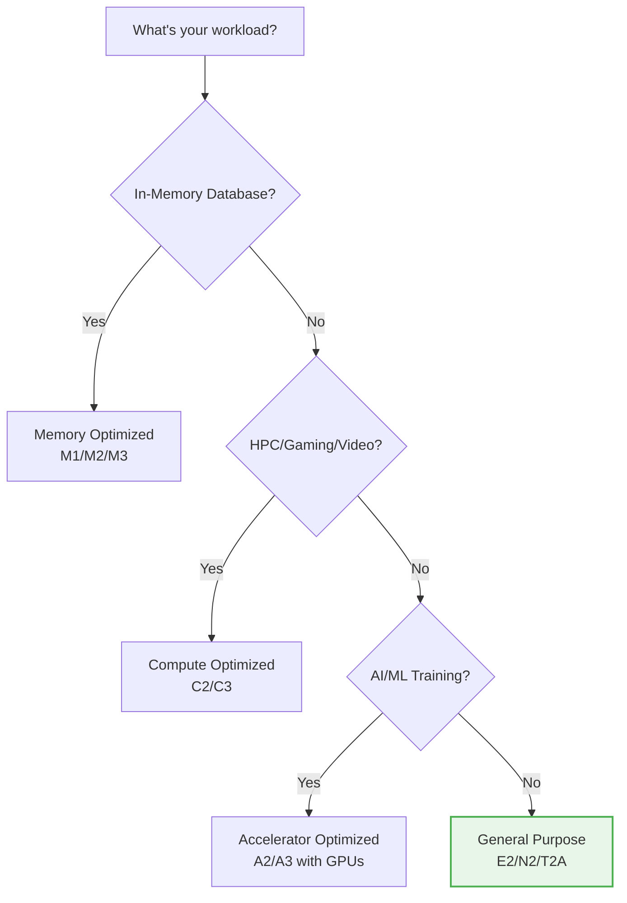
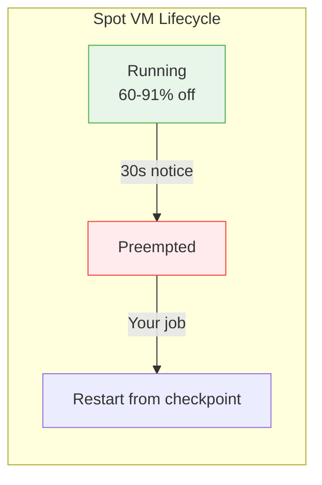
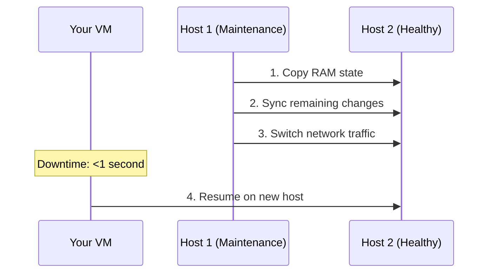

# Module 5: Compute Engine Basics

> **🎯 Objectives:**
> *   Master core concepts
> *   Build hands-on resources
> *   Pass the ACE exam scenarios

| 📚 Concepts | 🧪 Lab | 📝 Quiz | 💼 Interview |
|---|---|---|---|
| [Jump to Theory](#concepts) | [Jump to Lab](#hands-on-lab) | [Jump to Quiz](#knowledge-check) | [Jump to Interview](#interview-questions) |

---


> **🎯 Objectives:**
> *   Master core concepts
> *   Build hands-on resources
> *   Pass the ACE exam scenarios

| 📚 Concepts | 🧪 Lab | 📝 Quiz | 💼 Interview |
|---|---|---|---|
| [Jump to Theory](#concepts) | [Jump to Lab](#hands-on-lab) | [Jump to Quiz](#knowledge-check) | [Jump to Interview](#interview-questions) |

---


> **🎯 Objectives:**
> *   Master core concepts
> *   Build hands-on resources
> *   Pass the ACE exam scenarios

| 📚 Concepts | 🧪 Lab | 📝 Quiz | 💼 Interview |
|---|---|---|---|
| [Jump to Theory](#concepts) | [Jump to Lab](#hands-on-lab) | [Jump to Quiz](#knowledge-check) | [Jump to Interview](#interview-questions) |

---


**Duration:** ⏱️ 60 Minutes  
**Level:** Intermediate  
**ACE Exam Weight:** ⭐⭐⭐⭐⭐ Critical (The backbone of GCP compute)

---

> [!TIP]
> **TL;DR (Quick Summary)**  
> Compute Engine = Virtual Machines (VMs) in Google's data centers. Pick the right **machine family** (E2 for cheap, N2 for consistent, M2 for huge RAM). Save money with **Spot VMs** (60-91% off but can be stopped) or **CUDs** (commit for 1-3 years). Google's **Live Migration** moves your VM during maintenance with <1 second of downtime.

---

## 🎯 Learning Objectives

| ✅ Skill | Why It Matters |
|---------|----------------|
| **Select** the right machine family | Match workload to VM type = optimal cost |
| **Implement** Spot VMs and CUDs | Save up to 91% on compute costs |
| **Configure** startup scripts | Automate VM configuration on boot |
| **Understand** Live Migration | Know how Google handles maintenance |
| **Create** VMs using gcloud CLI | Essential hands-on skill for ACE exam |

---

## 🏢 Industry Context: Compute Engine in Production

> [!NOTE]
> **Role Lens:** Every Cloud Engineer manages VMs daily. This is your bread and butter.

### Job Roles & Compute Usage

| Role | How They Use Compute | Day-to-Day Tasks |
|------|---------------------|------------------|
| **Cloud Engineer** | Provision, resize, troubleshoot VMs | Creating templates, managing MIGs |
| **DevOps Engineer** | Automate VM deployments | Golden images, startup scripts |
| **SRE** | Capacity planning, incident response | Auto-scaling, health monitoring |
| **Data Engineer** | Compute for ETL jobs | Batch processing on Spot VMs |
| **Platform Engineer** | Standardize VM configurations | Instance policies, org constraints |

### Production Patterns

| Pattern | Architecture | When to Use |
|---------|--------------|-------------|
| **MIG + Load Balancer** | Auto-scaling VM fleet behind LB | Web apps, APIs |
| **Spot for Batch** | Checkpoint-enabled batch on Spot VMs | ETL, ML training |
| **Golden Image Pipeline** | Packer → Custom Image → MIG | Standardized deployments |
| **Preemptible Rendering** | GPU Spot VMs with checkpointing | Video encoding, 3D rendering |

### ❌ Mistakes Interview Panels Reject

| Mistake | Why It's Bad | What to Say Instead |
|---------|--------------|---------------------|
| "I always use E2 because it's cheapest" | Shows no workload analysis | "I match machine family to workload characteristics" |
| "I manually configure each VM via SSH" | Doesn't scale, not reproducible | "I use startup scripts and instance templates" |
| "Spot VMs are unreliable so I avoid them" | Missing 60-91% cost savings | "I use Spot for fault-tolerant batch jobs with checkpoints" |

---

## 🧠 1. What is Compute Engine? (Plain-English)

**Compute Engine = Virtual machines on Google's infrastructure.**

You get raw computing power (CPU, RAM, disk), and you control everything else.

### 💡 Real-World Analogy

| Service | Analogy |
|---------|---------|
| **Physical Server** | Buying a house - total ownership |
| **Compute Engine** | Renting an apartment - flexible, managed building |
| **App Engine** | Staying in a hotel - fully managed, limited control |
| **Cloud Functions** | Airbnb for a few hours - pay only when used |

### What You Manage vs Google Manages

| Layer | You | Google |
|-------|-----|--------|
| Application | ✅ | |
| Runtime | ✅ | |
| OS | ✅ | |
| Virtualization | | ✅ |
| Hardware | | ✅ |
| Network | | ✅ |
| Security (physical) | | ✅ |

---

## 🤖 2. Machine Families (Choose Your Fighter)

Don't memorize specs. **Memorize workloads.**

### Decision Tree



### Machine Family Comparison

| Family | Series | Best For | Max RAM |
|--------|--------|----------|---------|
| **General Purpose** | E2, N2, N2D, T2A | Web servers, dev/test, microservices | 128 GB |
| **Compute Optimized** | C2, C3 | Gaming, video encoding, HPC | 192 GB |
| **Memory Optimized** | M1, M2, M3 | SAP HANA, large databases | **12 TB** |
| **Accelerator** | A2, A3 | ML training, AI inference | 1.3 TB |

### E2 vs N2: Quick Guide

| Feature | E2 | N2 |
|---------|----|----|
| **Cost** | Cheapest | 10-20% more |
| **Performance** | Variable | Consistent |
| **Best For** | Dev/test, variable loads | Production, consistent loads |

---

## 💰 3. Pricing Strategies (Save 91%!)

### Pricing Options Comparison

| Option | Discount | Commitment | Use Case |
|--------|----------|------------|----------|
| **On-Demand** | 0% | None | Short, unpredictable workloads |
| **Spot/Preemptible** | 60-91% | None (can be stopped) | Batch processing, fault-tolerant |
| **CUD (1 year)** | 37-57% | 1 year | Predictable baseline |
| **CUD (3 year)** | 52-70% | 3 years | Long-term production |
| **SUD** | Up to 30% | Auto (run >25% month) | N1 family only |

### Spot VMs Deep Dive



**When to Use Spot VMs:**
*   ✅ Batch processing that can be restarted
*   ✅ CI/CD build workers
*   ✅ Video rendering
*   ✅ Data analysis jobs
*   ❌ Databases
*   ❌ User-facing production apps

---

## ⚡ 4. Live Migration (Google's Superpower)

**Google patches hardware without rebooting your VM.**

### How It Works



### Maintenance Policies

| Policy | Behavior | Use Case |
|--------|----------|----------|
| **Migrate (default)** | Live migrate to healthy host | Most workloads |
| **Terminate** | Stop and optionally restart | Spot VMs, stateless apps |

> **🎯 ACE Tip:** Competitors often require scheduled downtime for maintenance. Google's Live Migration is a major differentiator!

---

## 🛠️ 5. Hands-On Lab: Deploy a Web Server

### Step 1: Create VM with Startup Script
```bash
gcloud compute instances create web-server \
    --zone=us-central1-a \
    --machine-type=e2-micro \
    --tags=http-server \
    --metadata=startup-script='#!/bin/bash
apt-get update
apt-get install -y nginx
echo "<h1>Hello from Compute Engine! 🚀</h1>" > /var/www/html/index.html
systemctl start nginx'
```

### Step 2: Create Firewall Rule
```bash
gcloud compute firewall-rules create allow-http \
    --direction=INGRESS \
    --action=ALLOW \
    --rules=tcp:80 \
    --target-tags=http-server
```

### Step 3: Get External IP and Test
```bash
# Get the external IP
gcloud compute instances list --format="value(EXTERNAL_IP)"

# Test (or open in browser)
curl http://EXTERNAL_IP
```

### Step 4: View Startup Script Logs
```bash
# SSH into VM
gcloud compute ssh web-server --zone=us-central1-a

# View startup script output
sudo journalctl -u google-startup-scripts.service
```

### Step 5: Cleanup
```bash
gcloud compute instances delete web-server --zone=us-central1-a --quiet
gcloud compute firewall-rules delete allow-http --quiet
```

---

## ⚠️ 6. Exam Traps & Pro Tips

### ❌ Common Mistakes
| Mistake | Reality |
|---------|---------|
| "Spot VMs are reliable" | No! They can be preempted anytime |
| "E2 is always best" | Not for consistent performance needs |
| "Live Migration works for GPUs" | No! GPU VMs must terminate |

### ✅ Pro Tips
*   **Use startup scripts** instead of manual SSH setup
*   **Use Spot VMs** for batch jobs (60-91% savings!)
*   **Use instance templates** for reproducibility
*   **Check serial console logs** when startup script fails

---

## 🔧 7. Troubleshooting: "VM Won't Work" Scenarios

> [!NOTE]
> **Role Lens:** These are the most common issues you'll debug as a Cloud Engineer.

### Scenario 1: Startup Script Not Running
```bash
# Check if script ran
sudo journalctl -u google-startup-scripts.service

# Check metadata for script
gcloud compute instances describe VM_NAME --format="get(metadata.items[startup-script])"
```
**Common causes:** Script syntax error, missing shebang, wrong metadata key

### Scenario 2: VM Not Responding After Boot
```bash
# Check serial output (works even if VM seems stuck)
gcloud compute instances get-serial-port-output VM_NAME --zone=ZONE

# Check if VM is actually running
gcloud compute instances describe VM_NAME --format="get(status)"
```
**Common causes:** Disk full, OS kernel panic, misconfigured network

### Scenario 3: SSH Connection Refused
```bash
# Check firewall rules
gcloud compute firewall-rules list --filter="ALLOW:22"

# Check if SSH key is in metadata
gcloud compute instances describe VM_NAME --format="get(metadata.items[ssh-keys])"
```
**Common causes:** No firewall rule for port 22, wrong SSH key, IAP not configured

---

## 💼 8. Interview Question Bank

### Beginner Level (Conceptual)

**Q1: When would you use E2 vs N2 machine types?**
> **Strong Answer:** "E2 is cheapest but has variable performance—great for dev/test and workloads that can tolerate some inconsistency. N2 provides consistent performance at a 10-20% premium—I use it for production databases and apps with SLAs. I always test both before deciding."

**Q2: How do you save money on VMs for a batch pipeline that takes 8 hours?**
> **Strong Answer:** "I'd use Spot VMs with checkpointing. Spot gives 60-91% discount. Since batch jobs can be interrupted, I design the job to save progress periodically. If preempted, it restarts from the last checkpoint. I also right-size the machine to avoid paying for unused capacity."

### Intermediate Level (Trade-offs)

**Q3: Your VM needs to survive host maintenance. How do you configure it?**
> **Strong Answer:** "I set the availability policy to use Live Migration, which is the default. Google moves the VM to healthy hardware with less than 1 second of downtime. Exception: GPU VMs don't support Live Migration—those must be restarted. For critical workloads, I'd also put them in a Managed Instance Group for auto-healing."

**Q4: Should you use custom images or startup scripts for VM configuration?**
> **Strong Answer:** "It depends on boot time requirements. Custom images bake everything in—faster boot, better for production. Startup scripts run on every boot—more flexible, better for dev/test. My pattern: create a base custom image with foundational software, then use startup scripts for environment-specific config like secrets."

### Advanced Level (Scenario-Based)

**Q5: Design a solution for a video encoding workload that processes 1000 videos/day, tolerates delays, and needs to minimize cost.**
> **Strong Answer:**
> - Use Spot VMs with C2 (compute-optimized) family for encoding performance
> - Create an autoscaling MIG that scales to 0 when idle
> - Use Pub/Sub queue to buffer video jobs
> - Implement checkpointing every 5 minutes to Cloud Storage
> - If Spot VM preempted, job re-queues and picks up from checkpoint
> - "This gives 60-91% savings with fault tolerance."

**Q6: A production VM's performance degrades every afternoon. How do you troubleshoot?**
> **Strong Answer:**
> 1. Check Cloud Monitoring CPU/memory graphs for patterns
> 2. Check if it's an E2 (variable performance) vs N2
> 3. Look for noisy neighbor if using shared-core
> 4. Check for scheduled jobs that spike at that time
> 5. Review network egress—could be hitting quotas
> "If pattern correlates with traffic, I'd scale vertically or add auto-scaling."

---

<!-- QUIZ_START -->
## 📝 7. Knowledge Check

### Level 1: Beginner (Recall)

1.  **Which Compute Engine machine family is best for cost-effective batch processing?**
    *   A. E2
    *   B. C2
    *   C. **Spot VMs** ✅
    *   D. N2

2.  **How do you enable a VM to automatically restart on a different host after a hardware failure?**
    *   A. Enable "Preemptibility"
    *   B. **Set "On Host Maintenance" to "Migrate" and "Automatic Restart" to "On"** ✅
    *   C. Use a Shielded VM
    *   D. Use a Local SSD

### Level 2: ACE Exam (Scenario)

3.  **You need to deploy a web application that requires high availability across three zones. The application is stateless. Which configuration should you choose?**
    *   A. Three standalone VMs in different zones with a DNS round-robin.
    *   B. **A Regional Managed Instance Group (MIG) with an HTTP Load Balancer.** ✅
    *   C. A Zonal MIG with a Network Load Balancer.
    *   D. An Unmanaged Instance Group with a Regional external IP.

4.  **A developer wants to SSH into a VM that has no external IP address. The VM is in a private subnet. What is the most secure way to allow access?**
    *   A. Create a firewall rule allowing 0.0.0.0/0 on port 22.
    *   B. Assign a public IP to the VM temporarily.
    *   C. **Use Identity-Aware Proxy (IAP) TCP forwarding.** ✅
    *   D. Set up a VPN connection just for this single user.

### Level 3: Interview (Reasoning)

5.  **Interviewer: "Why would you choose a Custom Machine Type over a Predefined one?"**
    *   **Strong Answer:** "I would choose a Custom Machine Type when my workload's resource ratio doesn't match predefined types—for example, a memory-intensive cache that needs 64GB RAM but only 2 vCPUs. Using a standard `n2-highmem-8` would force me to pay for 6 extra vCPUs I don't need. Custom types save money by right-sizing resources to the exact application profile."

<!-- QUIZ_END -->

---

## ✅ Day 4 Checklist

- [ ] Know which machine family for each workload
- [ ] Understand Spot VM tradeoffs
- [ ] Create a VM with a startup script
- [ ] Connect a firewall rule to a VM
- [ ] Complete the hands-on lab

---

<!-- FLASHCARDS
[
  {"term": "Compute Engine", "def": "IaaS. Virtual machines on Google infrastructure. You manage OS and up."},
  {"term": "Spot VM", "def": "Up to 91% discount. Can be preempted with 30s notice. For fault-tolerant jobs."},
  {"term": "CUD", "def": "Committed Use Discount. 1 or 3 year commitment for 37-70% savings."},
  {"term": "Live Migration", "def": "Google moves your VM to healthy host during maintenance. <1s downtime."},
  {"term": "Startup Script", "def": "Script that runs when VM boots. Use for automated configuration."},
  {"term": "Machine Family", "def": "Category of VM types optimized for different workloads (E2, N2, C2, M2)."}
]
-->
---

### 🗑️ Lab Cleanup (Mandatory)

> **⚠️ Critical:** Delete resources to avoid unecessary billing!

1.  **Delete Project:** (Fastest way)
    ```bash
    gcloud projects delete $PROJECT_ID
    ```
2.  **Or Delete Resources Individually:**
    ```bash
    # Example commands (verify before running)
    gcloud compute instances delete [INSTANCE_NAME] --quiet
    gcloud storage rm -r gs://[BUCKET_NAME]
    ```