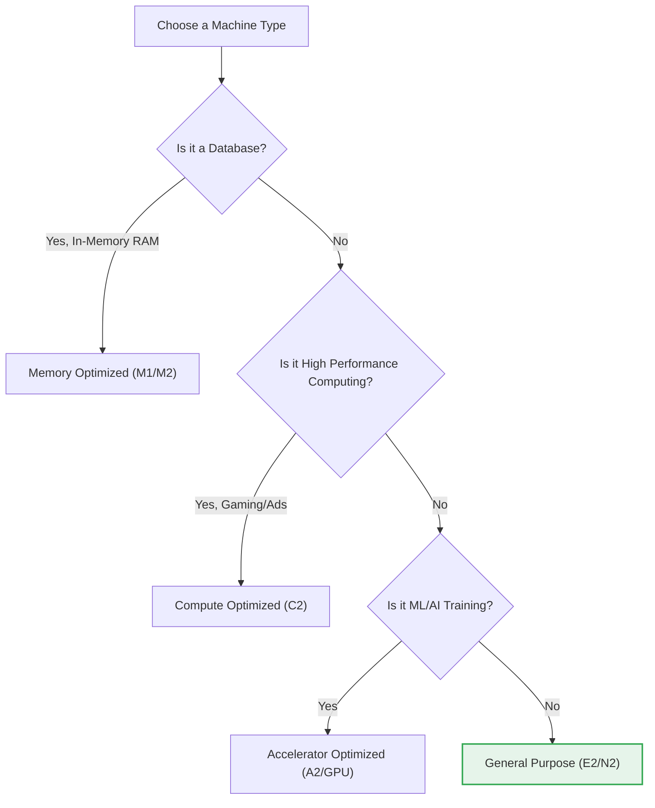

# SECTION 4: Compute Engine (Virtual Machines)

> **Official Doc Reference**: [Compute Engine Documentation](https://cloud.google.com/compute/docs)

## 1️⃣ Overview
Compute Engine provides scalable, high-performance virtual machines (VMs) running in Google's data centers. It is the core **IaaS** offering.

### Unique GCP Superpower: Live Migration 🔄
Google Cloud can move your running instance to another host in the same zone **without a reboot** during maintenance.
*   **Competitors:** AWS/Azure typically require a reboot.
*   **Result:** Highest uptime SLAs in the industry.

## 2️⃣ Machine Families (Choosing the Right CPU)
Don't memorize specs, memorize **Workloads**.

| Family | Name Series | Use Case | Memory-to-vCPU Ratio |
| :--- | :--- | :--- | :--- |
| **General Purpose** | **E2, N2, N2D** | Web Servers, Dev/Test, Databases. | Balanced (4GB per vCPU) |
| **Compute Optimized** | **C2, C3** | Gaming, Ad-Tech, Video Encoding. | Low Memory / High Speed CPU |
| **Memory Optimized** | **M1, M2, M3** | SAP HANA, In-Memory DBs, Analytics. | High Memory (up to 12TB!) |
| **Accelerator** | **A2, A3 (GPU)** | Machine Learning, AI Training. | Massive Parallel Processing |
| **Storage Optimized** | **Z3** | Data Warehousing, Log Processing. | High Disk I/O |

## 3️⃣ Pricing & Discounts (Exam Gold 💰)
Running a VM 24/7 is expensive. Use these to save money.

1.  **Spot VMs (Formerly Preemptible):**
    *   **Discount:** 60-91% off.
    *   **Catch:** Google can shut it down with **30 seconds notice**.
    *   **Use Case:** Batch jobs, Rendering, Fault-tolerant node pools.

2.  **Sudden Termination:**
    *   *Old Preemptible Model:* Maximum 24-hour runtime.
    *   *New Spot Model:* No time limit, but can be killed anytime resource is needed.

3.  **Committed Use Discounts (CUDs):**
    *   Contract for 1 or 3 years.
    *   Save 57% to 70%.
    *   **Flexible CUDs:** Commit to "$10/hour spend" rather than "100 CPUs".

## 4️⃣ Managed Instance Groups (MIGs)
Never deploy a "naked" VM in production. Use a MIG.

*   **Stateless MIG:** Auto-scaling web servers. If one dies, it's replaced instantly.
*   **Stateful MIG:** Databases (MongoDB / Kafka) where disk data matters.
*   **Auto-Healing:** The MIG pings the VM ("Health Check"). If VM stops responding on port 80, MIG kills it and starts a fresh one.

## 5️⃣ Sole-Tenant Nodes (Compliance)
Sometimes laws say, "You cannot share a physical server with other customers."
*   **Solution:** Sole-Tenant Nodes.
*   **Concept:** You rent the *entire* physical metal box.
*   **Why?**
    1.  **Compliance:** Government / Financial regulations.
    2.  **Licensing:** Your software license (e.g., Windows/Oracle) charges "Per Core". Renting the host is cheaper than paying per vCPU.

## 6️⃣ Advanced Security (Shielded vs Confidential)
1.  **Shielded VMs:**
    *   **What:** Verifies the bootloader/kernel integrity. "Did a rootkit modify my OS before it started?"
    *   **Features:** vTPM (Trusted Platform Module), Secure Boot.
    *   *Recommendation:* Turn this ON for everything. It's free and safer.
2.  **Confidential VMs:**
    *   **What:** Encrypts data **in-use** (while it's in the RAM).
    *   **Tech:** Uses AMD SEV (Secure Encrypted Virtualization).
    *   **Use Case:** Highly regulated industries (Banking, Healthcare) processing PII. Even Google engineers cannot dump the RAM to see your passwords.

## 6️⃣ Hands-On Lab: The "Burn Rate" Test 🔥
**Mission:** Create a VM and stop it to verify billing.

1.  **Create:** `gcloud compute instances create test-vm --zone=us-central1-a`
2.  **Stop:** `gcloud compute instances stop test-vm`
3.  **Inspect:** `gcloud compute instances describe test-vm`
    *   Status: `TERMINATED`.
    *   **Billing:** You are NO longer paying for CPU. But you ARE paying for the Disk.
4.  **Delete:** `gcloud compute instances delete test-vm`
    *   **Billing:** Now Disk billing stops.

## 7️⃣ Checkpoint Questions
## 7️⃣ Checkpoint Questions
**Q1. Which discount type incurs a risk of sudden shutdown within 30 seconds?**
*   A. Committed Use Discount
*   B. Spot VM (Preemptible)
*   C. Sustained Use Discount
*   D. Free Tier
> **Answer: B.** Spot VMs are cheap but risky for stateful apps.

**Q2. You need to run a legacy Windows app that requires specific "Per-Core" licensing on physical hardware. What do you use?**
*   A. Preemptible VM
*   B. Shielded VM
*   C. Sole-Tenant Node
*   D. Shared-Core E2 Instance
> **Answer: C.** Sole-Tenant allows you to rent the physical host for compliance/licensing.

**Q3. What unique GCP feature keeps your VM running even while Google updates the BIOS on the host machine?**
*   A. vMotion
*   B. Live Migration
*   C. Auto-Healing
*   D. Hot Patching
> **Answer: B.** Live Migration moves running VMs to new hosts without rebooting.

**Q4. Which machine family is best suited for a high-performance database like SAP HANA?**
*   A. E2 (General Purpose)
*   B. C2 (Compute Optimized)
*   C. M1/M2 (Memory Optimized)
*   D. A2 (Accelerator Optimized)
> **Answer: C.** Memory-optimized machines offer massive RAM for in-memory databases.

**Q5. You want to ensure that if your web server VM crashes, it is automatically replaced. What should you configure?**
*   A. A snapshot schedule
*   B. A loop in your startup script
*   C. A Managed Instance Group (MIG) with Auto-healing
*   D. A large Local SSD
> **Answer: C.** MIGs monitor health and recreate failed instances automatically.

**Q6. What is the primary benefit of "Confidential VMs"?**
*   A. They speed up boot times.
*   B. They encrypt data in-use (while in RAM).
*   C. They are 50% cheaper.
*   D. They run on dedicated hardware.
> **Answer: B.** Confidential VMs protect memory contents from the host system.

<!-- FLASHCARDS
[
  {
    "term": "E2/N2 Series",
    "def": "General Purpose VMs. Balanced reliability and price."
  },
  {
    "term": "Spot VM",
    "def": "Up to 91% discount, but can be pre-empted (stopped) by Google with 30s notice."
  },
  {
    "term": "Live Migration",
    "def": "Google moves your running VM to a new host during maintenance without reboot."
  },
  {
    "term": "Sole-Tenant Node",
    "def": "Renting the physical server. Used for Compliance or Licensing."
  },
  {
    "term": "MIG (Managed Instance Group)",
    "def": "A group of identical VMs that scale up/down automatically."
  }
]
-->