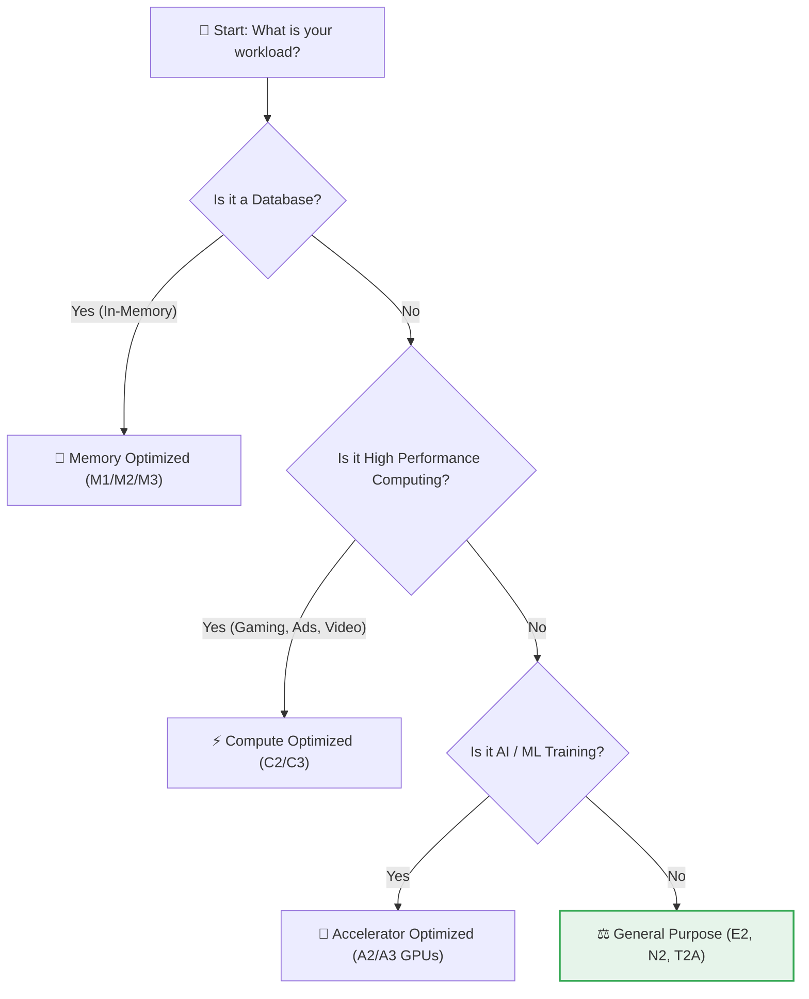

# SECTION 4: Compute Engine (Virtual Machines)

> **Official Doc Reference**: [Compute Engine Documentation](https://cloud.google.com/compute/docs)

## 1️⃣ Overview: The "Workhorse" of the Cloud 🐎
Compute Engine (GCE) provides virtual machines (VMs) running on Google's infrastructure.
*   **IaaS:** You get raw computing power (CPU & RAM). You install the OS, Web Server, App, etc.
*   **Billing:** Per Second (minimum 1 minute).

### The "Live Migration" Superpower 🦅
We mentioned this in Day 1, but it's crucial:
**Google patches hardware without rebooting your VM.**
1.  Google detects a host RAM failure.
2.  It copies your VM's RAM state to a new host *while it's running*.
3.  It switches the network traffic.
4.  **Downtime:** < 1 second. (Competitors often require a scheduled reboot).

---

## 2️⃣ Machine Families (Choosing Your Fighter) 🤖
Don't memorize specs. Memorize **Workloads**.



| Family | Series | Best For... |
| :--- | :--- | :--- |
| **General Purpose** | **E2, N2, N2D** | Web Servers, Microservices, Dev/Test. (Most Common) |
| **Compute Optimized** | **C2, C3** | Video Encoding, High-frequency Trading, Gaming Servers. |
| **Memory Optimized** | **M1, M2, M3** | SAP HANA, Massive SQL Databases (up to 12TB RAM). |
| **Accelerator** | **A2, A3 (GPU)** | Machine Learning, AI Training, Molecular Modeling. |

---

## 3️⃣ Pricing Strategy (Save 90%!) 💰
Running a VM 24/7 is expensive. Use these tools to slash costs.

### 1. Spot VMs (Formerly Preemptible)
*   **The Deal:** You use Google's "spare capacity".
*   **The Discount:** **60-91% Off**.
*   **The Catch:** Google can shut you down with **30 seconds notice** if they need the capacity back.
*   **Use Case:** Batch processing, Rendering videos, Stateless web servers (in a group).

### 2. Committed Use Discounts (CUDs)
*   **The Deal:** You promise to use GCP for 1 or 3 years.
*   **The Discount:** **57-70% Off**.
*   **Flexible CUDs:** You commit to *spending* $10/hour. It applies to *any* VM family (E2, C2, N2).

### 3. Sustained Use Discounts (SUDs)
*   **The Deal:** Automatic discount just for running a VM for more than 25% of the month. (Only on older families like N1).

---

## 4️⃣ Hands-On Lab: Host a Serverless Website 🛠️
**Mission:** Deploy an Nginx web server using a "Startup Script" so you don't even have to log in.

1.  **Open Cloud Shell** (Top right `>_`).
2.  **Run Command:**
    ```bash
    gcloud compute instances create my-web-server \
        --zone=us-central1-a \
        --machine-type=e2-micro \
        --tags=http-server \
        --metadata=startup-script='#! /bin/bash
    apt-get update
    apt-get install -y nginx
    echo "<h1>Hello from Compute Engine! 🚀</h1>" > /var/www/html/index.html'
    ```
3.  **Create Firewall Rule** (Allow traffic on Port 80):
    ```bash
    gcloud compute firewall-rules create allow-http-traffic \
        --action=ALLOW \
        --rules=tcp:80 \
        --target-tags=http-server
    ```
4.  **Verify:**
    *   Find External IP: `gcloud compute instances list`
    *   Click the IP (or paste in Chrome). You see your custom page!
5.  **Cleanup:**
    *   `gcloud compute instances delete my-web-server --zone=us-central1-a --quiet`

---

## 5️⃣ Checkpoint Quiz
<form>
  <!-- Q1 -->
  <div class="quiz-question" id="q1">
    <p class="font-bold">1. You need to run a batch processing job that takes 4 hours. If the job stops, it can restart from a checkpoint. Which VM type is the most cost-effective?</p>
    <div class="space-y-2">
      <label class="block"><input type="radio" name="q1" value="correct"> Spot VM</label>
      <label class="block"><input type="radio" name="q1" value="wrong"> Standard E2 Instance</label>
      <label class="block"><input type="radio" name="q1" value="wrong"> Memory Optimized VM</label>
      <label class="block"><input type="radio" name="q1" value="wrong"> Sole-Tenant Node</label>
    </div>
    <div class="feedback hidden mt-2 p-2 rounded bg-gray-100 text-sm">
      <span class="text-green-600 font-bold">Correct!</span> Spot VMs offer up to 91% discount and are perfect for fault-tolerant batch jobs.
    </div>
  </div>

  <!-- Q2 -->
  <div class="quiz-question mt-6" id="q2">
    <p class="font-bold">2. Your company runs a critical SAP HANA database that requires 4TB of RAM. Which machine family should you choose?</p>
    <div class="space-y-2">
      <label class="block"><input type="radio" name="q2" value="wrong"> Compute Optimized (C2)</label>
      <label class="block"><input type="radio" name="q2" value="wrong"> General Purpose (E2)</label>
      <label class="block"><input type="radio" name="q2" value="correct"> Memory Optimized (M2)</label>
      <label class="block"><input type="radio" name="q2" value="wrong"> Accelerator Optimized (A2)</label>
    </div>
    <div class="feedback hidden mt-2 p-2 rounded bg-gray-100 text-sm">
      <span class="text-green-600 font-bold">Correct!</span> The M-series is designed specifically for large in-memory databases.
    </div>
  </div>

  <!-- Q3 -->
  <div class="quiz-question mt-6" id="q3">
    <p class="font-bold">3. What happens if you define a "Startup Script" for a VM?</p>
    <div class="space-y-2">
      <label class="block"><input type="radio" name="q3" value="wrong"> It runs every hour.</label>
      <label class="block"><input type="radio" name="q3" value="correct"> It runs once, every time the VM boots up.</label>
      <label class="block"><input type="radio" name="q3" value="wrong"> It runs only when you click "SSH".</label>
      <label class="block"><input type="radio" name="q3" value="wrong"> It defines the Machine Type.</label>
    </div>
    <div class="feedback hidden mt-2 p-2 rounded bg-gray-100 text-sm">
      <span class="text-green-600 font-bold">Correct!</span> Startup scripts execute as root during the boot process.
    </div>
  </div>
</form>

---

### ⚡ Zero-to-Hero: Pro Tips
*   **Metadata:** Startup scripts are stored in "Metadata". You can query this from *inside* the VM using `curl metadata.google.internal`. This is how the VM knows what to do!
*   **Serial Port Output:** If your startup script fails and you can't SSH in, look at the "Serial Port 1 (Console)" logs in the GCP UI. It shows the boot text!

---
<!-- FLASHCARDS
[
  {"term": "Spot VM", "def": "Highly discounted VM (up to 91%) that can be stopped by Google with 30s notice."},
  {"term": "Startup Script", "def": "A script that runs automatically when the VM boots (e.g., to install software)."},
  {"term": "Live Migration", "def": "Google moves running VMs to healthy hosts during maintenance without downtime."},
  {"term": "Metadata Server", "def": "A special internal URL where the VM gets info about itself (scripts, tags, IP)."}
]
-->