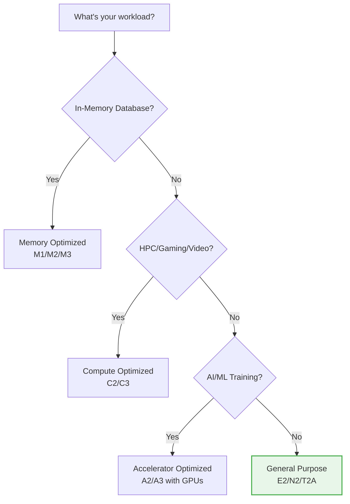
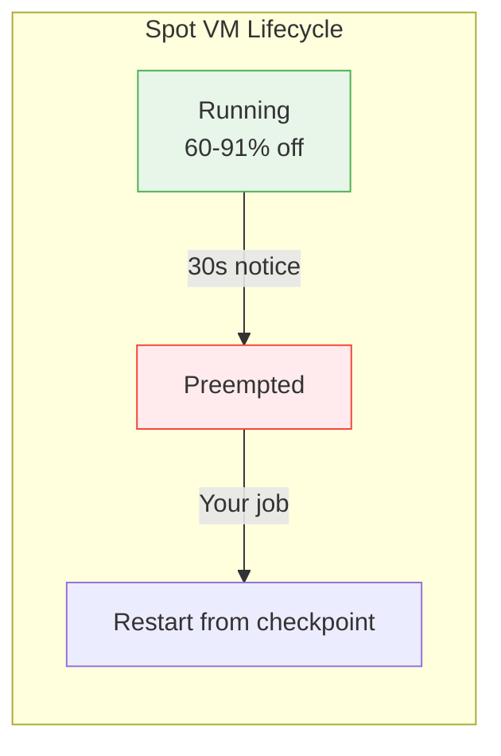
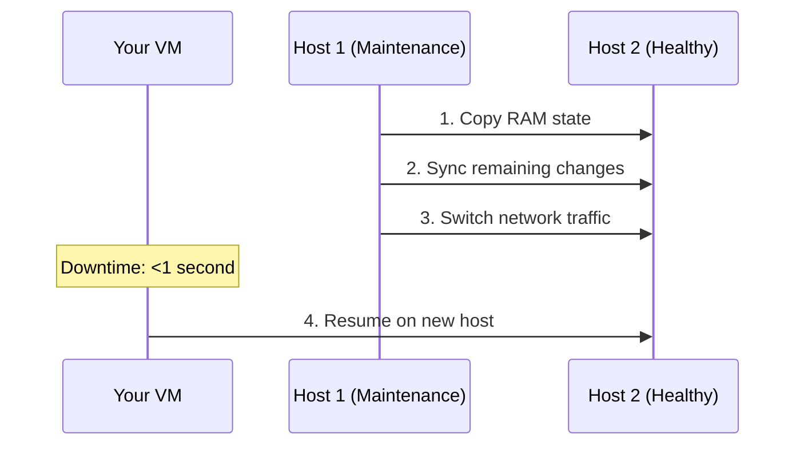

# Day 4: Compute Engine (Virtual Machines)

**Duration:** ⏱️ 60 Minutes  
**Level:** Intermediate  
**ACE Exam Weight:** ⭐⭐⭐⭐⭐ Critical (The backbone of GCP compute)

---

## 🎯 Learning Objectives

By the end of Day 4, you will be able to:

*   **Select** the right machine family for your workload
*   **Implement** cost optimization using Spot VMs and CUDs
*   **Configure** startup scripts and metadata
*   **Understand** Live Migration and maintenance policies
*   **Create** VMs using gcloud CLI

---

## 🧠 1. What is Compute Engine? (Plain-English)

**Compute Engine = Virtual machines on Google's infrastructure.**

You get raw computing power (CPU, RAM, disk), and you control everything else.

### 💡 Real-World Analogy

| Service | Analogy |
|---------|---------|
| **Physical Server** | Buying a house - total ownership |
| **Compute Engine** | Renting an apartment - flexible, managed building |
| **App Engine** | Staying in a hotel - fully managed, limited control |
| **Cloud Functions** | Airbnb for a few hours - pay only when used |

### What You Manage vs Google Manages

| Layer | You | Google |
|-------|-----|--------|
| Application | ✅ | |
| Runtime | ✅ | |
| OS | ✅ | |
| Virtualization | | ✅ |
| Hardware | | ✅ |
| Network | | ✅ |
| Security (physical) | | ✅ |

---

## 🤖 2. Machine Families (Choose Your Fighter)

Don't memorize specs. **Memorize workloads.**

### Decision Tree



### Machine Family Comparison

| Family | Series | Best For | Max RAM |
|--------|--------|----------|---------|
| **General Purpose** | E2, N2, N2D, T2A | Web servers, dev/test, microservices | 128 GB |
| **Compute Optimized** | C2, C3 | Gaming, video encoding, HPC | 192 GB |
| **Memory Optimized** | M1, M2, M3 | SAP HANA, large databases | **12 TB** |
| **Accelerator** | A2, A3 | ML training, AI inference | 1.3 TB |

### E2 vs N2: Quick Guide

| Feature | E2 | N2 |
|---------|----|----|
| **Cost** | Cheapest | 10-20% more |
| **Performance** | Variable | Consistent |
| **Best For** | Dev/test, variable loads | Production, consistent loads |

---

## 💰 3. Pricing Strategies (Save 91%!)

### Pricing Options Comparison

| Option | Discount | Commitment | Use Case |
|--------|----------|------------|----------|
| **On-Demand** | 0% | None | Short, unpredictable workloads |
| **Spot/Preemptible** | 60-91% | None (can be stopped) | Batch processing, fault-tolerant |
| **CUD (1 year)** | 37-57% | 1 year | Predictable baseline |
| **CUD (3 year)** | 52-70% | 3 years | Long-term production |
| **SUD** | Up to 30% | Auto (run >25% month) | N1 family only |

### Spot VMs Deep Dive



**When to Use Spot VMs:**
*   ✅ Batch processing that can be restarted
*   ✅ CI/CD build workers
*   ✅ Video rendering
*   ✅ Data analysis jobs
*   ❌ Databases
*   ❌ User-facing production apps

---

## ⚡ 4. Live Migration (Google's Superpower)

**Google patches hardware without rebooting your VM.**

### How It Works



### Maintenance Policies

| Policy | Behavior | Use Case |
|--------|----------|----------|
| **Migrate (default)** | Live migrate to healthy host | Most workloads |
| **Terminate** | Stop and optionally restart | Spot VMs, stateless apps |

> **🎯 ACE Tip:** Competitors often require scheduled downtime for maintenance. Google's Live Migration is a major differentiator!

---

## 🛠️ 5. Hands-On Lab: Deploy a Web Server

### Step 1: Create VM with Startup Script
```bash
gcloud compute instances create web-server \
    --zone=us-central1-a \
    --machine-type=e2-micro \
    --tags=http-server \
    --metadata=startup-script='#!/bin/bash
apt-get update
apt-get install -y nginx
echo "<h1>Hello from Compute Engine! 🚀</h1>" > /var/www/html/index.html
systemctl start nginx'
```

### Step 2: Create Firewall Rule
```bash
gcloud compute firewall-rules create allow-http \
    --direction=INGRESS \
    --action=ALLOW \
    --rules=tcp:80 \
    --target-tags=http-server
```

### Step 3: Get External IP and Test
```bash
# Get the external IP
gcloud compute instances list --format="value(EXTERNAL_IP)"

# Test (or open in browser)
curl http://EXTERNAL_IP
```

### Step 4: View Startup Script Logs
```bash
# SSH into VM
gcloud compute ssh web-server --zone=us-central1-a

# View startup script output
sudo journalctl -u google-startup-scripts.service
```

### Step 5: Cleanup
```bash
gcloud compute instances delete web-server --zone=us-central1-a --quiet
gcloud compute firewall-rules delete allow-http --quiet
```

---

## ⚠️ 6. Exam Traps & Pro Tips

### ❌ Common Mistakes
| Mistake | Reality |
|---------|---------|
| "Spot VMs are reliable" | No! They can be preempted anytime |
| "E2 is always best" | Not for consistent performance needs |
| "Live Migration works for GPUs" | No! GPU VMs must terminate |

### ✅ Pro Tips
*   **Use startup scripts** instead of manual SSH setup
*   **Use Spot VMs** for batch jobs (60-91% savings!)
*   **Use instance templates** for reproducibility
*   **Check serial console logs** when startup script fails

---

<!-- QUIZ_START -->
## 📝 7. Knowledge Check Quiz

1. **You need to run a 4-hour batch job that can restart from checkpoints. Which is most cost-effective?**
    *   A. **Spot VM** ✅
    *   B. Standard E2 Instance
    *   C. Memory Optimized VM
    *   D. Sole-Tenant Node

2. **Your company runs SAP HANA requiring 4TB of RAM. Which machine family?**
    *   A. Compute Optimized (C2)
    *   B. General Purpose (E2)
    *   C. **Memory Optimized (M2)** ✅
    *   D. Accelerator Optimized (A2)

3. **What happens when you set a startup script for a VM?**
    *   A. It runs every hour
    *   B. **It runs once, every time the VM boots** ✅
    *   C. It runs only when you SSH
    *   D. It defines the machine type

4. **Which feature allows Google to patch hardware without rebooting your VM?**
    *   A. Auto-healing
    *   B. **Live Migration** ✅
    *   C. Preemption
    *   D. Snapshot restore

5. **You want consistent performance for a production database. Which should you choose?**
    *   A. E2 (cheapest)
    *   B. **N2 (consistent performance)** ✅
    *   C. Spot VM (discounted)
    *   D. T2A (ARM-based)
<!-- QUIZ_END -->

---

## ✅ Day 4 Checklist

- [ ] Know which machine family for each workload
- [ ] Understand Spot VM tradeoffs
- [ ] Create a VM with a startup script
- [ ] Connect a firewall rule to a VM
- [ ] Complete the hands-on lab

---

<!-- FLASHCARDS
[
  {"term": "Compute Engine", "def": "IaaS. Virtual machines on Google infrastructure. You manage OS and up."},
  {"term": "Spot VM", "def": "Up to 91% discount. Can be preempted with 30s notice. For fault-tolerant jobs."},
  {"term": "CUD", "def": "Committed Use Discount. 1 or 3 year commitment for 37-70% savings."},
  {"term": "Live Migration", "def": "Google moves your VM to healthy host during maintenance. <1s downtime."},
  {"term": "Startup Script", "def": "Script that runs when VM boots. Use for automated configuration."},
  {"term": "Machine Family", "def": "Category of VM types optimized for different workloads (E2, N2, C2, M2)."}
]
-->
