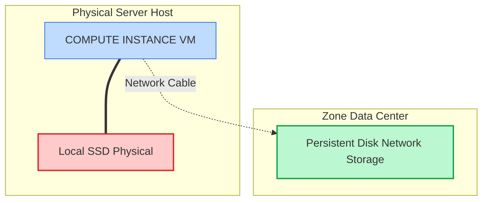

# SECTION 5: Disks & Storage Basics

## 1️⃣ Plain-English Explanation
When you buy a laptop, it comes with a hard drive. If the laptop breaks, the hard drive usually still has your files.
In the cloud, we separate the **Computer** (VM) from the **Hard Drive** (Persistent Disk).

*   **Persistent Disk (PD):** A network hard drive. It lives in the same building (Zone) as your VM. If you delete the VM, the disk *can* stay alive (if you configured it to).
*   **Local SSD:** A super-fast hard drive physically plugged into the server motherboard. It is fleeting. If the VM turns off, the data on the Local SSD is gone **forever**.

## 2️⃣ Persistent Disk vs Local SSD (The Analogy)
*   **Persistent Disk:** Your **External USB Drive**. You can unplug it from one computer and plug it into another. It’s reliable.
*   **Local SSD:** The **RAM** (almost). It’s incredibly fast, but if you reboot or shut down, it gets wiped clean (Ephemeral). *Use it for "Swap" or temp cache only.*

## 3️⃣ Boot Disk vs Data Disk
*   **Boot Disk:** Contains the Operating System (Windows C: Drive). Every VM requires one.
*   **Data Disk:** Additional space (D: Drive). You can attach many of these.

## 4️⃣ Attach/Detach Disks (Exam Focus)
*   **Attach:** You can attach a disk to a running VM (Hot Attach).
*   **Resize:** You can increase the size of a disk while the VM is running (Upsizing is easy).
    *   *Trap:* You CANNOT decrease the size. You can only make it bigger.
*   **Detach:** You must unmount it from the OS first, then click detach.

## 5️⃣ Common Disk Types (Speed vs Cost)
1.  **Standard Persistent Disk (HDD):** Cheap, slow, magnetic. good for backups.
2.  **Balanced Persistent Disk (SSD):** Middle ground. Best for most web apps.
3.  **SSD Persistent Disk:** Fast. Good for databases.
4.  **Extreme Persistent Disk:** Insanely fast. For heavy enterprise databases (SAP HANA).
5.  **Hyperdisk (New 🚀):** The next generation. Decouples IOPS from Size (unlike PD). You can have a small disk with massive IOPS.

## 5.5️⃣ RAID (Redundant Array of Independent Disks)
*   *Question:* "Do I need to configure RAID 10 on my VM?"
*   *Answer:* **NO.**
*   *Why?* Google does this for you automatically at the hardware layer. Every block of data is replicated and checksummed. Doing software RAID on top is usually redundant and slows things down (unless you are aggregating disks for IOPS).

## 5.6️⃣ Bonus: Filestore (NFS)
    *   Sometimes you need a folder shared by 100 Linux VMs (Like a shared office drive).
    *   **Persistent Disks** are focused on ONE VM (usually).
    *   **Filestore** is a managed NFS server for *many* VMs to read/write simultaneously. Use cases: Rendering farms, CMS media folders.

## 6️⃣ Hands-On Lab: Creating Disks 💾
1.  **Go to:** Compute Engine > Disks.
2.  **Create:** Click "Create Disk".
3.  **Region/Zone:** MUST match your VM.
4.  **Source:** "Blank disk" (empty) or "Image" (with OS).
5.  **Attach:** Go to VM > Edit > Additional Disks > Attach Existing Disk.

## 7️⃣ Comparison Table

| Feature | Persistent Disk (PD) | Local SSD |
| :--- | :--- | :--- |
| **Speed** | Fast (Network attached) | Extreme (Physically attached) |
| **Durability** | High (Data survives reboots) | None (Data dies on stop) |
| **Migration** | Can move to another VM | Locked to one VM |
| **Max Size** | 64 TB | 9 TB (distributed in 375GB chunks) |

## 8️⃣ Interview-Ready Q&A
**Q: "I deleted my VM and my important database data is gone! Why?"**
*   **A:** When creating a VM, there is a checkbox: *"Delete boot disk when instance is deleted"*. It is checked by default. You should have unchecked it or used a separate **Data Disk**.

**Q: "Can I share one disk between two VMs?"**
*   **A:** Yes, but only in **Read-Only** mode (Multi-writer is possible but very complex and rare, usually for specific clusters like Oracle RAC).

## 9️⃣ One-Line Memory Hook 🧠
> "Persistent Disks are **USB sticks** (moveable); Local SSDs are **RAM** (fast but forgetful)."

## 🚨 Checkpoint Questions
## 🚨 Checkpoint Questions
**Q1. True or False: You can resize a 100GB persistent disk down to 50GB without deleting it.**
*   A. True
*   B. False
> **Answer: B.** False. You can only upsizing (increase) disks. To shrink, you must create a new smaller disk and migrate data.

**Q2. Which disk type provides the absolute highest IOPS and lowest latency, but loses data if the instance stops?**
*   A. Standard Persistent Disk
*   B. SSD Persistent Disk
*   C. Local SSD
*   D. Hyperdisk
> **Answer: C.** Local SSD is physically attached. It is ephemeral (data loss on stop/maintenance) but fastest.

**Q3. If your VM is in Zone A, can you attach a Zonal Persistent Disk from Zone B?**
*   A. Yes, over the internal network.
*   B. No, Zonal PDs are locked to the zone.
*   C. Yes, if you use a snapshot.
*   D. Only if using a VPN.
> **Answer: B.** Zonal resources must be in the same zone. You'd need to snapshot and restore to move it.

**Q4. You are running a mission-critical Oracle database that requires 100,000 IOPS. Which disk type should you choose?**
*   A. Standard HDD
*   B. Balanced PD
*   C. Extreme PD (or Hyperdisk Extreme)
*   D. Local SSD (as boot disk)
> **Answer: C.** Extreme PD is designed for high-performance enterprise workloads.

**Q5. What is the main use case for Google Cloud Filestore?**
*   A. Storing object data like photos.
*   B. Shared NFS file storage for multiple VMs.
*   C. Boot disks for Windows VMs.
*   D. Archiving logs.
> **Answer: B.** Filestore provides a managed NFS server for shared access.

**Q6. What happens to the data on a "Boot Disk" when you delete the VM instance by default?**
*   A. It is preserved as a snapshot.
*   B. It is detached and saved.
*   C. It is deleted.
*   D. It is archived to Cloud Storage.
> **Answer: C.** The "Delete boot disk when instance is deleted" flag is checked by default. You must uncheck it to save the disk.

## ➡️ What’s Next 
We stored data on a disk. But what about storing photos, videos, and backups that *anyone* on the internet can see?
**Next Section:** Cloud Storage (Buckets).

## ⚡ Zero-to-Hero: Pro Tips
*   **CLI Command**: Practice `gcloud storage list` to see resources via command line.
*   **Real World**: In production, prefer **Terraform** over clicking in the console for storage.

## 🚀 Next-Level: VM Performance & Security
*   **Confidential VMs:** Encrypt data *in-use* (in RAM) using AMD SEV technologies.
*   **VM Manager:** Automated tool to manage OS patches (Patch management) and configuration (OS config) across a massive fleet of 1,000+ VMs.

<!-- FLASHCARDS
[
  {
    "term": "Block Storage",
    "def": "Like a hard drive. Good for OS and databases. Expensive. (Persistent Disk)."
  },
  {
    "term": "Object Storage",
    "def": "Like Google Drive. Good for files/media. Infinite scale. (Cloud Storage)."
  },
  {
    "term": "File Storage",
    "def": "Network Attached Storage (NAS). Good for shared files. (Filestore)."
  },
  {
    "term": "Persistent Disk",
    "def": "Zonal block storage attached to a VM."
  },
  {
    "term": "Local SSD",
    "def": "Ephemeral, super-fast storage attached physically to the server. Data lost on stop."
  }
]
-->
