# SECTION 5: Block Storage (Disks)

> **Official Doc Reference**: [Persistent Disk](https://cloud.google.com/compute/docs/disks)

## 1️⃣ The Concept: Block vs Object 📦
Storage is not all the same. This distinction is the **#1 Exam Topic**.

| Feature | **Block Storage** (Persistent Disk) | **Object Storage** (Cloud Storage) |
| :--- | :--- | :--- |
| **Analogy** | **Hard Drive (C:)** | **Google Drive / Dropbox** |
| **Data Type** | OS, Databases, Installed Apps. | Photos, Videos, Backups, CSVs. |
| **Editability** | You can edit *parts* of a file (e.g. Database record). | You must re-upload the *whole* file. (Immutable). |
| **Access** | Attached to **ONE** VM (usually). | Accessible by **ANYONE** (Authentication). |

---

## 2️⃣ Disk Types: The Speed Ladder 🏎️
You attach these to your VM.

```mermaid
graph TD
    Level1[Standard HDD] -- "Cheap / Backup" --> Level2[Standard SSD]
    Level2 -- "Web Apps" --> Level3[Balanced SSD]
    Level3 -- "Databases" --> Level4[Extreme SSD]
    Level4 -- "Top Tier" --> Level5[🚀 Hyperdisk Extreme]

    style Level1 fill:#f1f5f9,stroke:#64748b
    style Level2 fill:#e2e8f0,stroke:#64748b
    style Level3 fill:#cbd5e1,stroke:#475569
    style Level4 fill:#94a3b8,stroke:#334155
    style Level5 fill:#fef08a,stroke:#ca8a04,stroke-width:2px
```

1.  **Standard HDD:** Magnetic spinning disks. Cheap. Good for backups/logs.
2.  **Balanced Persistent Disk:** Best Price/Performance. **Default for most apps.**
3.  **SSD Persistent Disk:** Fast. For Databases (Postgres/MySQL).
4.  **Hyperdisk:** The new architecture. **Decouples IOPS from Size.**
    *   *Old Way:* To get more speed (IOPS), you had to buy a bigger disk (Size).
    *   *Hyperdisk Way:* You can have a 10GB disk with massive speed.

---

## 3️⃣ Persistent Disk vs Local SSD (The Physical Difference) 🔌

*   **Persistent Disk (PD):** Safe. If your VM crashes, the disk is safe in the network. You can attach it to a new VM.
*   **Local SSD:** **Ephemeral (Temporary).** It is physically glued to the server. If you stop the VM, the data is **WIPED**. Use it for Cache or Swap only.

---

## 4️⃣ Hands-On Lab: The "Hot Resize" Trick 🔥
**Mission:** You filled up your disk! Increase the size without stopping the server.

1.  **Create a VM:** Standard `e2-micro`, 10GB boot disk.
2.  **Go to Disks:** Compute Engine > Storage > Disks.
3.  **Select:** Click your VM's disk.
4.  **Edit:** Click Edit. Change Size from **10GB** to **20GB**. Save.
5.  **Verify:**
    *   SSH into the VM.
    *   Run `lsblk`. You will see the physical device is now 20GB!
    *   *(Note: You usually have to run a command like `growpart` to expand the filesystem, but the hardware resize is instant).*

> **Exam Trap:** You can **Increase** (Upsize) a disk anytime. You can **NEVER Decrease** (Downsize) it. To shrink, you must create a new smaller disk and copy data.

---

## 5️⃣ Checkpoint Quiz
<form>
  <!-- Q1 -->
  

    
1. Which storage type is "Ephemeral" and loses all data if the VM is stopped?

    

      <label class="block"><input type="radio" name="q1" value="wrong"> Standard Persistent Disk</label>
      <label class="block"><input type="radio" name="q1" value="correct"> Local SSD</label>
      <label class="block"><input type="radio" name="q1" value="wrong"> Cloud Storage Bucket</label>
      <label class="block"><input type="radio" name="q1" value="wrong"> Hyperdisk</label>
    

    

      Correct! Local SSD is physical and temporary.
    

  

  <!-- Q2 -->
  

    
2. You have a 100GB disk that is half full. You want to save money by shrinking it to 50GB. How do you do this?

    

      <label class="block"><input type="radio" name="q2" value="wrong"> Edit the disk and type 50GB.</label>
      <label class="block"><input type="radio" name="q2" value="correct"> You cannot shrink it. You must create a new disk and copy data.</label>
      <label class="block"><input type="radio" name="q2" value="wrong"> Use the "Compression" feature.</label>
    

    

      Correct! Disks can only grow, never shrink.
    

  

  <!-- Q3 -->
  

    
3. Which disk type creates a clear separation between IOPS (Performance) and Capacity (Size)?

    

      <label class="block"><input type="radio" name="q3" value="wrong"> Standard HDD</label>
      <label class="block"><input type="radio" name="q3" value="wrong"> SSD Persistent Disk</label>
      <label class="block"><input type="radio" name="q3" value="correct"> Hyperdisk</label>
      <label class="block"><input type="radio" name="q3" value="wrong"> Local SSD</label>
    

    

      Correct! Hyperdisk allows you to provision IOPS independently of disk size.
    

  

</form>

---

### ⚡ Zero-to-Hero: Pro Tips
*   **Filestore:** Mentioned briefly: If you need 10 VMs to access the *same* folder (Read/Write), you can't use PDs. You need **Filestore** (Managed NFS).
*   **Snapshots:** Always Snapshot your disk before a risky change. Snapshots are incremental (cheap) and saved globally (safe).

---
<!-- FLASHCARDS
[
  {"term": "Block Storage", "def": "Storage managed as blocks (hard drive). Used for OS/Databases. (Persistent Disk)."},
  {"term": "Object Storage", "def": "Storage managed as files/objects. Used for media/backups. (Cloud Storage)."},
  {"term": "Local SSD", "def": "Ephemeral, high-performance physical storage. Data lost on stop."},
  {"term": "Snapshot", "def": "A backup of a Persistent Disk. Incremental and Global."}
]
-->
