# Day 5: Block Storage (Persistent Disks)

**Duration:** ⏱️ 45 Minutes  
**Level:** Beginner  
**ACE Exam Weight:** ⭐⭐⭐⭐ High (Performance & Persistence)

---

## 🎯 Learning Objectives

By the end of Day 5, you will be able to:
*   **Master** the difference between Block Storage and Object Storage.
*   **Identify** which Persistent Disk type is right for your throughput needs.
*   **Understand** the critical danger of using Local SSDs.
*   **Perform** a "Hot Resize" on a running VM disk.

---

## 🧠 1. Block vs Object: The #1 Exam Topic 📦

If you remember nothing else from this week, remember this table.

| Feature | **Block Storage** (Persistent Disk) | **Object Storage** (Cloud Storage) |
| :--- | :--- | :--- |
| **Analogy** | A Hard Drive (C: Drive) | Google Drive / Dropbox |
| **Data Type** | Operating Systems, Database Files. | Photos, Videos, Backups. |
| **Editability** | You can change a **single bit** of a file. | You must re-upload the **whole** file. |
| **Connectivity** | Physically/Network attached to ONE VM. | Accessible via URL from anywhere. |

---

## 🏗️ 2. Persistent Disk Types: Choosing Speed

Google offers a ladder of performance. Generally, the more you pay, the more IOPS (Input/Output Operations per Second) you get.

```mermaid
graph TD
    H[Standard HDD] -- "Slow / Backup" --> S[SSD Persistent Disk]
    S -- "Web Servers" --> B[Balanced SSD]
    B -- "Standard DBs" --> E[Extreme PD]
    E -- "Modern Apps" --> HY[🚀 Hyperdisk]

    style H fill:#f1f5f9,stroke:#64748b
    style B fill:#dcfce7,stroke:#16a34a,stroke-width:2px
    style HY fill:#fef9c3,stroke:#ef4444,stroke-width:2px
```

> [!TIP]
> **The New King: Hyperdisk** 
> Historically, disk speed was tied to disk size (bigger disk = faster). **Hyperdisk** changes this, allowing you to buy a small disk but provision massive speed independently.

---

## 🔌 3. Persistent Disk vs Local SSD (The Danger Zone)

This is a classic exam "trap" question.

*   **Persistent Disk (Network Attached):** Safe. If your VM hardware dies, Google just moves your disk to new hardware. Data survives a VM stop.
*   **Local SSD (Physically Attached):** **DANGEROUS.** It is physically glued to the server box. If you STOP the VM, the data is **WIPED**.

> [!CAUTION]
> **Local SSD Data Loss:**
> Only use Local SSDs for temporary data like "Scratch Space", "Swap Files", or "Caches". Never store a database on a Local SSD unless you have real-time replication to a safe place!

---

## 🛠️ 4. Hands-On Lab: The "Hot Resize" Trick 🔥

**🧪 Lab Objective:** Increase the size of a disk while the VM is still running.

### ✅ Step 1: Check Current Size
1.  SSH into your VM from Day 3.
2.  Run: `df -h`
    *   Observe that your main disk is roughly 10GB.

### ✅ Step 2: Resize in Console
1.  Go to **Compute Engine > Storage > Disks**.
2.  Click on the name of your VM's boot disk.
3.  Click **EDIT**.
4.  Change size to **20GB** and click Save.

### ✅ Step 3: Verify (No Reboot Required!)
1.  Go back to your SSH terminal.
2.  Run: `lsblk`
    *   *Result:* You will see the physical device is now 20GB. (Note: Depending on the OS, you might need to run `sudo resize2fs` to tell the filesystem to use the new space).

---

## 📝 5. Checkpoint Quiz

1.  **Which storage type would you use for a high-performance database requiring millisecond latency and data persistence across VM restarts?**
    *   A. Local SSD
    *   B. **SSD Persistent Disk** ✅
    *   C. Cloud Storage Standard
    *   D. Archive Storage

2.  **You have a 100GB disk. You realize you only need 50GB. What is the easiest way to shrink it?**
    *   A. Click Edit and type 50GB.
    *   B. **You cannot decrease disk size.** ✅ You must create a new smaller disk and migrate data.
    *   C. Run the `gcloud compute disks shrink` command.

3.  **What is the main benefit of Hyperdisk?**
    *   A. It's the cheapest option.
    *   B. It works with personal Gmail accounts.
    *   C. **It decouples performance (IOPS) from storage capacity (GB).** ✅

---

    <h3>
        <svg viewBox="0 0 24 24" fill="none" stroke="currentColor" stroke-width="2" stroke-linecap="round" stroke-linejoin="round" width="24" height="24" class="text-blurple">
            <path d="M22 11.08V12a10 10 0 1 1-5.93-9.14"></path>
            <polyline points="22 4 12 14.01 9 11.01"></polyline>
        </svg>
        Day 5 Checklist
    </h3>
    <template x-for="(item, index) in items" :key="index">
        

            

                <svg viewBox="0 0 24 24" fill="none" stroke="currentColor" stroke-width="3" stroke-linecap="round" stroke-linejoin="round">
                    <polyline points="20 6 9 17 4 12"></polyline>
                </svg>
            

            
        

    </template>

